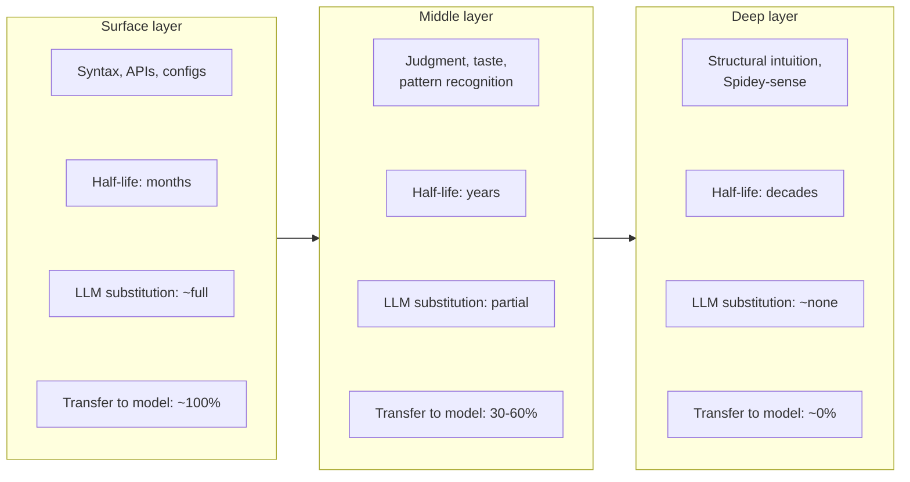
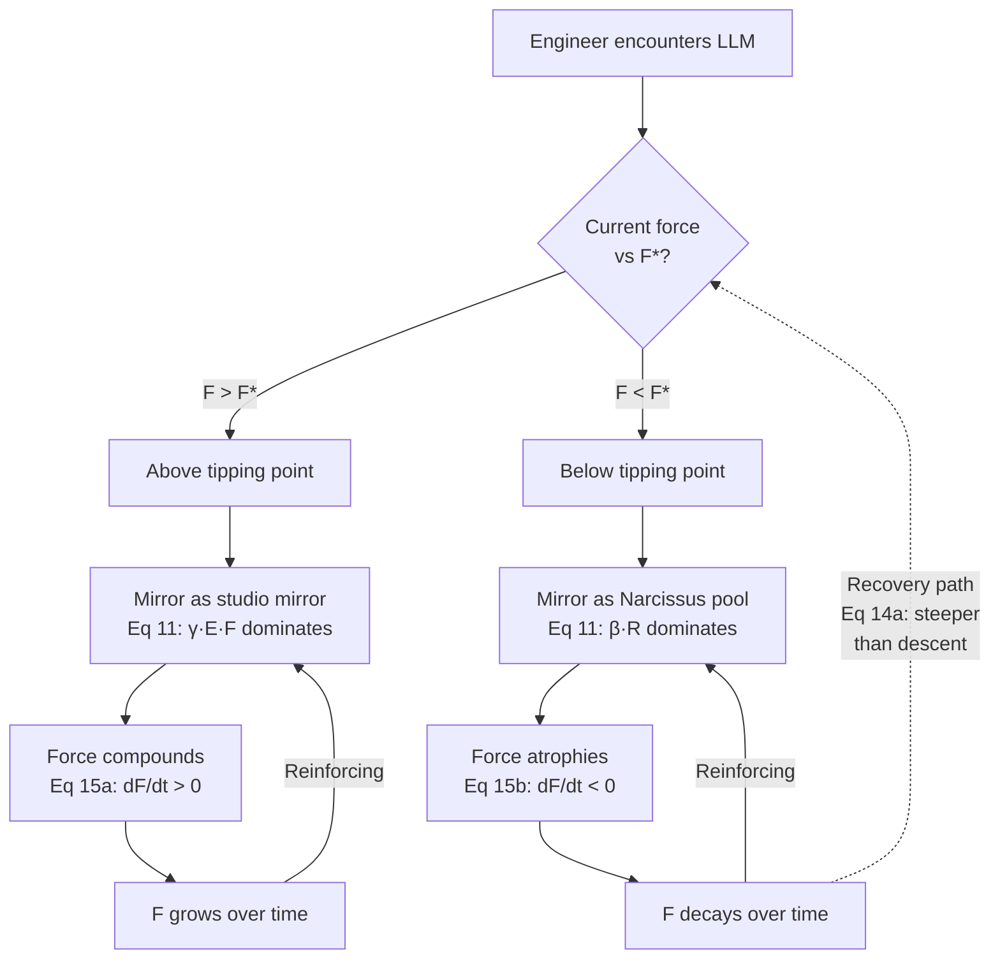
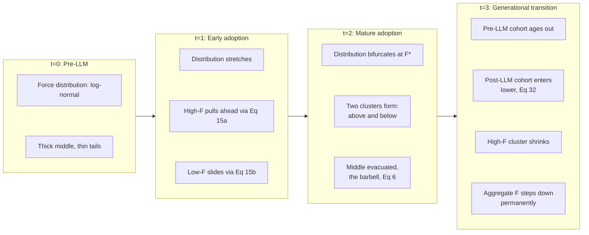
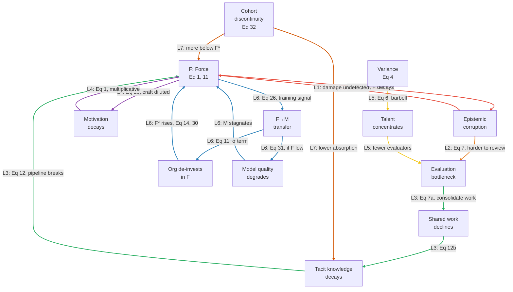
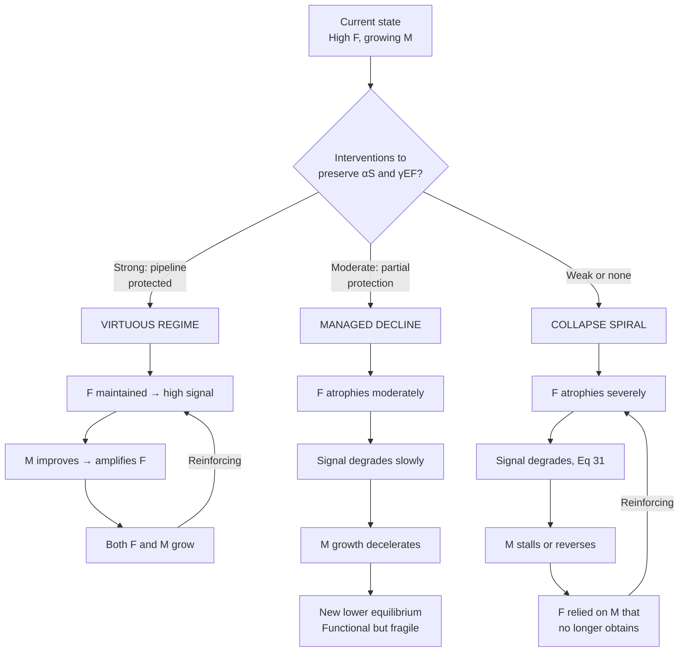
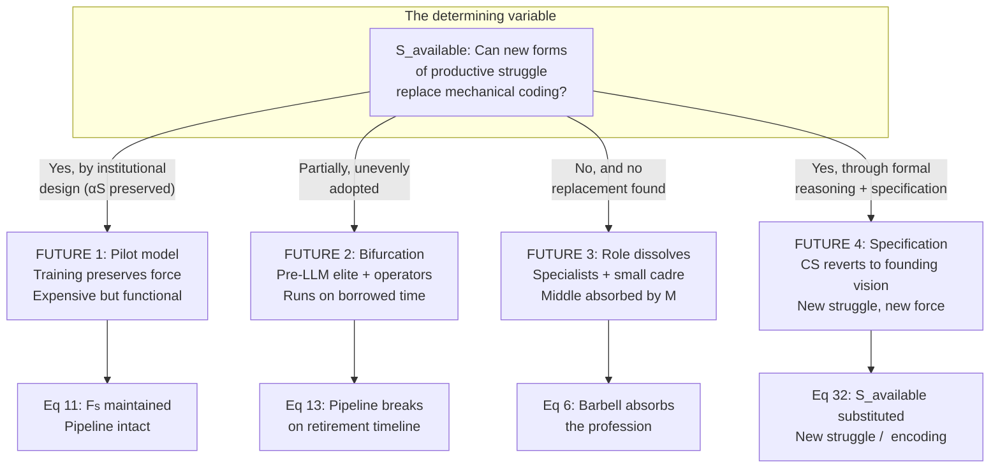

# The Multiplier, Mirror and The Tipping Point

*A mathematical framework for human capability under AI amplification and the future of software engineering*

**Author:** Dennis A. Landi
**Date:** 2026-03-14
**Version:** 0.03
**Copyright** &copy; 2026 Dennis A. Landi. All rights reserved.

---

## Introduction

When I started my software development career in the early 1990s, the internet was a fledgling thing. The World Wide Web, which would become the internet most people know today, was still in its nascent form. We had dial-up modems. 14,400 baud was lightning speed. Personal computers were not networked on-premises. Ethernet cables had not yet arrived for small businesses and home users. Wi-Fi was still years away. And so our databases were local, file-based, running on your PC: think dBASE, Paradox, FoxPro, and later, Access.

Browsers arrived around 1993, traveling over those same dial-up modems. HTML arrived with them, naked and quirky. Then came technology to automate state change, JavaScript, and technology to dress it all up, CSS. Meanwhile, networked computers arrived via cabled Ethernet and eventually Wi-Fi, enabling database servers and ushering in the client-server era. Then hardened web servers arrived, giving rise to n-tier architectures, and later still, the cloud emerged.

All of these technologies that many younger engineers take for granted today, or do not think about at all, were in their fledgling stages while also being mainstream technologies used by a large population of business and home users. These technologies were buggy because they were new, arriving at a time when software engineering practices and standards were still catching up. To be a software engineer, creating products for consumers meant living in a state of constant troubleshooting. Nothing worked 100%. There were bugs everywhere: in the browser’s JavaScript engine, in the CSS renderer, in competing features that would appear in some browsers but not others, or behave differently across them (I am looking at you, Internet Explorer); bugs in the database engine; latency in the network; typos in the reference books intended to teach us the technology. The list goes on. Suffice it to say that surviving in that world required tracking down bugs until 2 AM or 4 AM and, consequently, learning troubleshooting skills across a wide variety of vectors.

These lessons were learned through pain, suffering, and grit, and what emerged was a generation of software engineers with deep pattern-matching skills around the domain of software deployed in the real world.

The questions this article takes up begin with what happens to those skills when the human means of acquiring them are replaced by digital agency, and where the post-LLM humans and the pre-LLM humans fit in the new landscape. But they do not end there. The framework that follows reveals a coupled system: individual skill dynamics interact with organizational bottlenecks, labor market restructuring, knowledge pipeline collapse, and the flow of human expertise into the model itself. At the center is a tipping point, a threshold that sorts individuals, teams, firms, and nations onto diverging, self-reinforcing trajectories. The mathematics describe not just a new relationship between human and LLM, but the conditions under which that relationship compounds capability or erodes it, and the conditions under which the erosion becomes irreversible.

---

## Beyond the Force Multiplier

### Force ###
The term "force multiplier" has become the default metaphor for what large language models do to knowledge workers. It shows up in investor decks, engineering blog posts, and LinkedIn thought leadership with metronomic regularity. The claim is simple: give a software engineer an LLM, and they become two engineers, or five, or ten. The LLM *multiplies* their output.

But a multiplier is only half of an equation. In the expression $O = M \times F$, the LLM is $M$. 

**What is $F$?** 

We endeavor to define this term fully in the following equations.

### Mirror ###

And there is a second concept, one that I like to use, that reframes the question entirely. When introducing LLMs to new users, I often tell them: *the chatbot is a mirror.*

A multiplier describes magnitude. A mirror describes mechanism. A multiplier takes an input and scales it; the input doesn't change, the multiplier doesn't change, you just get a bigger number. A mirror does something different: it *reflects what is placed before it*. It doesn't add. It doesn't subtract. It shows you what you brought, rendered in a form you couldn't produce on your own. And this changes everything, because you *respond* to what you see, and the mirror reflects your response, and a loop begins.

When a senior engineer places a precise, deeply-informed question in front of the LLM:  
  
 "<small>*I have an ASP.NET Core Web API using EF Core with a polymorphic inheritance hierarchy, and I'm seeing N+1 queries on this navigation property; I've tried `.Include()` but it's generating a Cartesian explosion across three levels*</small>"   
  
The response that comes back is precise, nuanced, and likely useful. But notice: the *quality of the response was determined by the quality of the question*. The engineer's ***<small>FORCE</small>***, her diagnostic precision, her understanding of the ORM, her ability to name the problem, was the productive input. The LLM reflected that precision back as a set of solutions.

When a junior engineer faces the same problem, asking "<small>*My API is slow, how do I make it faster?*</small>", the mirror reflects what's in front of it. The response is generic, surface-level, a checklist that may or may not apply. Not because the LLM is less capable, but because the input gave it nothing specific to reflect.

But the mirror adds one thing that does not depend on what the user brings: *a strong presentation-facing surface*. This is the critical distinction that bridges the two concepts. The LLM has two channels of amplification. The **substance channel**, the domain-relevant insight, the architectural reasoning, the precision of the solution, scales with what the user brings. The **presentation channel**, fluency, structure, professional tone, apparent confidence, is broadly high regardless of the substance behind it. The multiplier captures the substance channel. **Mirror**'s presentation projection captures the presentation channel. The epistemic danger of LLMs lies precisely in the gap between these two channels: output always *looks* professional, whether the underlying thinking is brilliant or broken. And this gap is not merely dangerous in the moment; it determines whether the user *learns* from the interaction or is lulled by it, which determines whether their ***<small>FORCE</small>*** grows or decays, which determines everything that follows.

### Tipping Point ###

The multiplier provides the mathematical structure. The mirror provides the intuitive mechanism. Neither tells you *which direction*: whether the amplification builds you up or hollows you out.

There is a threshold, a tipping point, embedded in the dynamics of ***<small>FORCE</small>*** itself. Above it, the mirror functions as a studio mirror: a feedback instrument for correction and growth. Below it, the mirror becomes Narcissus's pool: flattering, self-confirming, and eventually fatal to the capabilities it reflects. The same tool. The same user. Entirely different long-term trajectory. This bifurcation, the point where amplification flips from compounding to erosion, is the framework's central finding, and its most uncomfortable one. Everything that follows builds toward it.

What follows begins with a base model, a definition of output, ***<small>FORCE</small>***, and the multiplier, and then derives a series of consequences, each building on the last. These consequences interact, reinforce each other, and in several cases produce feedback loops that are far from obvious. The goal is not a list of separate observations but a connected system of equations that together describe, illuminate, and diagnose the same underlying dynamics. The tipping point, when we reach it, will reveal itself as the structural feature that governs which of those dynamics dominates, and therefore which future obtains.

The formal equations supporting this framework are collected in the Appendix. Two foundational equations are presented in full within the main text: Eq. 1, which establishes the base model, and Eq. 14, which defines the tipping point. All others are cited by number; complete notation glossaries and plain-language explanations are available in the Appendix.

---

## Definitions

Before building the framework, we need precise terms. The lack of these is what makes most "AI productivity" discourse vague.

$O$ is **output**: value-weighted productive work. Not lines of code, not pull requests merged, not story points completed. Output is the business value actually delivered: working software that solves real problems, minus the cost of the defects, technical debt, and rework it introduces. This distinction matters throughout: an engineer who generates a thousand lines of plausible but subtly wrong code has produced negative $O$, not positive $O$ at high volume.

$\mathbf{M}_{\text{mirror}}$ is **Mirror**: the structured, LLM-mediated reflective system through which the multiplier operates. **Mirror** is what makes the LLM more than a calculator that scales input by a constant. It takes articulated human cognition as input, re-represents it in inspectable external form, and returns that representation with high fluency and structure. It operates through two channels simultaneously: a **substance channel** whose output scales with the user's ***<small>FORCE</small>*** and the domain, and a **presentation channel** whose output (fluency, professional tone, apparent confidence) is broadly high regardless of the substance behind it. The gap between these two channels is the source of the framework's central epistemic risk: output always *looks* professional, whether the underlying thinking is brilliant or broken. **Mirror** is a structured object, not a scalar; it contains reflective, presentation, and failure dimensions that are formalized in **Mirror** *as a Formal Object* below.

$M$ is **the multiplier**: the aggregate substance-channel amplification factor, a projection from **Mirror**. It captures how much more productive an engineer becomes when augmented by the tool. We will start by treating $M$ as constant, then progressively relax that assumption: first showing that $M$ varies by domain, then that $M$ grows over time, and finally that $M$ depends on $F$ itself, breaking the independence between the two variables and closing the loop. Where the distinction matters, $M_s(d)$ denotes the substance projection (domain-specific, conditional on ***<small>FORCE</small>***) and $M_p$ denotes the presentation projection (broadly high, unconditional). Both are projections from $\mathbf{M}_{\text{mirror}}$.

$F$ is ***<small>FORCE</small>***: the composite human capability that the multiplier acts upon. $F$ is not static. It evolves over time through dynamics that are central to the framework; it can compound, atrophy, transfer between humans, and even drain into the model itself. This is what the rest of the article is about.

---

## Force is Not a Number

The first insight is that ***<small>FORCE</small>*** is not a single value. It's a composite of distinct human capabilities: domain expertise, architectural judgment, taste, clarity of specification, debugging intuition, calibrated self-awareness, intrinsic motivation, each of which the LLM can amplify.

The critical question is *how* these components combine. Consider two engineers. Engineer A has brilliant architectural judgment but zero domain knowledge of the system she's working on. Engineer B has deep domain knowledge but no ability to evaluate whether the LLM's output is correct. Do their strengths compensate for their weaknesses?

In practice, they don't. An engineer who can't evaluate quality doesn't produce "slightly less good" output; she produces output of *unknown* quality, which is operationally worse than no output at all because it consumes evaluation resources downstream. A missing critical component isn't a small drag on ***<small>FORCE</small>***. It's a collapse.

This behavior is captured by a **multiplicative** model, borrowed from production economics (the Cobb-Douglas form):

$$O = M \times F \quad \text{where} \quad F = \prod_{i} f_i^{w_i} \qquad (1)$$

The components $f_i$ include domain expertise, architectural judgment, taste, clarity of specification, debugging intuition, calibrated uncertainty (knowing what you don't know), and intrinsic motivation. The exponents $w_i$ (which sum to 1) represent how much each component matters for a given task.

**In plain language**: $O$ is your productive output. $M$ is the LLM's amplification factor. $F$ is your composite human capability, your ***<small>FORCE</small>***. The operator $\prod$ means "multiply all the following terms together": each capability component $f_i$ (domain expertise, architectural judgment, taste, clarity of specification, debugging intuition, calibrated uncertainty, intrinsic motivation) is raised to the power of its weight $w_i$, where $w_i$ represents how much that component matters for the task at hand. "Raised to the power" controls sensitivity: a component with a high $w_i$ has an outsized effect on ***<small>FORCE</small>***, while a component with a low $w_i$ has a muted effect. The weights sum to 1, so they represent proportional importance. The mathematical consequence of this multiplicative form is decisive: if *any* critical component approaches zero, ***<small>FORCE</small>*** collapses toward zero regardless of how strong the others are. A brilliant architect with zero domain knowledge does not produce "slightly worse" output; the zero term drags the entire product down.

The mirror makes this vivid. You cannot place a question before the mirror that exhibits precision you don't possess. The reflection is faithful along the substance channel; it gives back what you brought, no more and no less. The senior engineer's precise question produced a precise reflection. The junior engineer's vague question produced a vague one. The mirror didn't generate the difference. The ***<small>FORCE</small>*** did. But the presentation channel rendered both with equal fluency and confidence, which is why the junior may not notice the substance gap.

### Mirror as a Formal Object ###

The presentation channel $M_p$ drives the epistemic gap (Eq. 10), collapses assessment signal (Eq. 18), and enables Goodhart-style gaming (Eq. 19). The substance channel $M_s(d)$ governs domain-specific amplification (Eq. 2). **Mirror** is not only a mechanism; it is a formal object with internal structure.

**Definition.** **Mirror** ($\mathbf{M}_{\text{mirror}}$) is a structured, LLM-mediated reflective system that:

1. takes articulated human cognition as input,
2. re-represents it into inspectable external form,
3. returns that representation with high fluency and structure,
4. enables both productive and deceptive downstream effects,
5. and therefore must be modeled as more than a single scalar multiplier.

**Mirror** is a structured object, not a scalar. It cannot be collapsed into a single number without losing the very distinction, substance versus presentation, that the framework depends on.

**Mirror** contains three classes of internal dimensions:

- **Reflective dimensions**: fidelity to the user's actual commitments and uncertainty; re-representation range (how many genuinely different useful forms can be generated from the same input); discrepancy detection support (whether gaps, contradictions, or weak assumptions become easier to see); calibration support (whether interaction improves confidence accuracy); and control update support (whether the user changes strategy in better ways after interaction).
- **Presentation dimensions**: fluency, style conformity, and confidence signaling, the properties that make output *look* professional regardless of underlying substance.
- **Failure dimensions**: automation-bias risk, dependency risk, and coherence-hallucination risk, the properties by which **Mirror** can mislead, substitute for capability, or invent false structure.

These dimensions operate simultaneously through a characteristic loop. **Mirror** enables a capability that does not exist without it: seeing your own thinking from the outside at speed. When you articulate a problem to an LLM, you externalize cognition. When the LLM reflects it back, restructured, reorganized, you see your own reasoning from a perspective you cannot normally access. The loop is: externalize, re-represent, detect discrepancies, update control, repeat.

Self-observation is one output of this loop, but not the only one. Each pass through the loop engages multiple dimensions at once: self-observation, discrepancy detection, re-representation, presentation polish, trust induction, possible automation bias, calibration gains, and possible dependency. The relationship is $\text{self-observation} \subset \text{Mirror}$. Self-observation is a dimension of **Mirror**, not a separate ***<small>FORCE</small>*** component, because the $f_i$ terms are human capability components while **Mirror** is a human-LLM relational structure. The two belong to different categories in the framework, and the projection logic that explains why $M_p$ and $M_s$ can move independently depends on keeping them distinct.

The presentation channel $M_p$ and the substance channel $M_s$ are not freestanding constants. They are **projections** from this richer object:

$$M_p^{(T)} = \pi_p^{(T)}\!\left(\mathbf{M}_{\text{mirror}}\right)$$

$$M_s^{(T,d)} = \pi_s^{(T,d)}\!\left(\mathbf{M}_{\text{mirror}}, F, d\right)$$

where $\pi_p$ and $\pi_s$ are task-specific projection functions. The asymmetry between these two projections is the engine of the framework's central tension: $M_p$ is relatively high and broadly available because it draws on the presentation dimensions alone, while $M_s$ is conditional, uneven, and tightly coupled to the user's ***<small>FORCE</small>*** and the domain. The epistemic gap (Eq. 10) is a structural consequence of this asymmetry, not merely an empirical observation.

The $M$ in the base model (Eq. 1, $O = M \times F$) is the aggregate substance-channel amplification. Eq. 2 decomposes it by domain into $M_s(d)$. The **Mirror** formalization provides the layer beneath both: $M_s(d)$ is the substance projection of $\mathbf{M}_{\text{mirror}}$, and the aggregate $M$ is its summary across domains and tasks:

$$\mathbf{M}_{\text{mirror}} \xrightarrow{\;\pi_s\;} M_s(d) \xrightarrow{\;\text{aggregate}\;} M$$

The presentation projection $M_p$ enters the framework separately, in the epistemic gap (Eq. 10), assessment signal (Eq. 18), and gaming dynamics (Eq. 19), not in the output equation.

### The Layered Structure of Force

One more property of ***<small>FORCE</small>*** matters throughout the framework: its components are not equally durable, and they don't decay, build, or transfer at the same rates. ***<small>FORCE</small>*** has three layers:

The **surface layer**: framework syntax, API signatures, tool configurations. It has a half-life measured in months. It was always being refreshed through use and decaying through disuse, even before LLMs.

The **middle layer**: judgment, taste, pattern recognition, the ability to evaluate the LLM's output. It has a half-life measured in years. It decays *silently*, because judgment is precisely the faculty that would detect its own absence.

The **deep layer**: structural intuition about how complex systems behave under stress, the felt sense of impending failure, the ability to operate in genuine ambiguity. It has a half-life measured in decades. It was built through years of direct experience with consequences and is almost somatic in its encoding.

These layers matter for the dynamics of ***<small>FORCE</small>*** over time, for the F→M transfer, and for the barbell effect in labor markets. Each layer interacts differently with the LLM (Eq. 1a): the LLM is an almost perfect substitute for the surface layer, a partial substitute for the middle layer, and barely a substitute at all for the deep layer, where the human is effectively on their own. This hierarchy will recur throughout the framework.

> **A note on the additive alternative.** There is a simpler model: $F = \sum w_i \cdot f_i$. In this version, strong components compensate for weak ones. This model applies where components are genuinely substitutable (breadth of tools known, familiarity with specific frameworks). We will return to the additive form later, in a context where it captures something the multiplicative model cannot: the case where ***<small>FORCE</small>*** goes negative.

The layered structure has a consequence that will become central to the framework: ***<small>FORCE</small>*** does not degrade gracefully. There is a level of composite ***<small>FORCE</small>*** below which the LLM ceases to be a tool and becomes an accelerant of decline. The sections that follow, variance, evaluation bottlenecks, epistemic corruption, atrophy, each contribute a mechanism to this threshold. When we formalize it, the result will be a bifurcation: a single value of $F$ that separates compounding growth from compounding decay.

---

## The Variable Multiplier

There's a natural tendency to treat the LLM as a fixed number. But in practice, the substance multiplier varies enormously by domain and task type. Instead of a single multiplier applied uniformly, the framework computes the contribution from each domain separately and sums the results (Eq. 2). Note the structural shift from Eq. 1: within a domain, ***<small>FORCE</small>*** components combine multiplicatively (one zero kills the product), but across domains the contributions combine additively (strength in one domain does not compensate for weakness in another, but neither does it destroy it). The LLM's amplification power is not the same for everything. It might be a 50x substance multiplier for generating boilerplate CRUD code, a 1.3x multiplier for novel distributed systems architecture, and *less than 1x* for debugging a race condition under production pressure, where the LLM becomes a distraction, a generator of plausible-sounding false leads that consume precious time.

The sub-1x case deserves scrutiny, because it breaks the assumption that the tool always helps at least a little. Consider the race condition example. The bug is non-deterministic; it manifests under specific timing conditions the LLM cannot observe. The correct diagnosis depends on runtime state, thread scheduling, memory layout, and system history that exist nowhere in the prompt and nowhere in the training data. The LLM has no access to these inputs, but it will produce an answer anyway, because that is what it does. The answer will be structurally plausible: it will reference real concurrency primitives, cite real failure modes, and propose a fix that would work for a different bug. The engineer now faces a choice she would not have faced without the tool: spend thirty minutes verifying a confident, well-articulated hypothesis that turns out to be wrong, or ignore it and rely on her own diagnostic process. If she pursues the LLM's lead, she has spent thirty minutes moving in the wrong direction, and the presentation projection's fluency and confidence made the wrong direction look like the right one. If she pursues three such leads before returning to her own process, she has lost ninety minutes and arrived at the same starting point, minus ninety minutes of attention and focus. The multiplier is not zero; it is negative. This is not a gap the next model generation will close by becoming "smarter." The problem is structural: these failures arise from missing information the LLM architecturally cannot access, not from insufficient training. Any problem whose diagnosis depends on unobservable runtime state, unreproducible conditions, or context that lives outside the text channel will remain in the sub-1x regime regardless of how capable the model becomes.

In mirror terms: the mirror's fidelity varies by what you're reflecting. Simple, well-structured patterns reflect cleanly. Novel, ambiguous designs reflect poorly; the mirror approximates, and the distortion can be worse than no reflection at all. But the *presentation* channel remains high across all domains; the output always looks confident and professional, even when the substance is wrong. The gap between substance and presentation is widest precisely where the LLM is least competent.

This has a corollary that rarely gets discussed. If the multiplier varies by domain, then whoever decides *where the LLM gets better* is implicitly deciding *which skills become more economically valuable* (Eq. 3). If a model provider invests heavily in making the LLM better at frontend development but not embedded systems, they shift the economic returns between those specializations. The provider's training priorities become an invisible hand reshaping labor markets, and the magnitude of the reshaping depends on both how much the multiplier improves and how much human ***<small>FORCE</small>*** exists to be multiplied.

Eq. 3 will matter again when we consider sovereignty, where the provider's investment decisions reshape which *nations* can sustain technical capacity. And crucially, those decisions are themselves shaped by the ***<small>FORCE</small>*** of the people generating training signal, a dependency we will formalize later as the F→M transfer.

---

## The Variance Amplifier

From Eq. 1, if the LLM multiplies ***<small>FORCE</small>***, and ***<small>FORCE</small>*** varies between individuals, then the LLM doesn't just increase average output. It *amplifies the spread*. The statistical variance in output across individuals grows as the *square* of the multiplier (Eq. 4), not linearly. The absolute gap between any two individuals tells the same story in concrete terms: if a strong engineer outproduces a weak one by 3 units before the LLM, the gap becomes $3 \times M$ after (Eq. 5). At $M = 3$ that is a 9-unit gap; at $M = 5$, a 15-unit gap.

This actually understates the problem. The mirror metaphor makes transparent why: high-force engineers *extract more from the tool*. They place sharp, well-formed questions in front of the mirror and get sharp, well-formed reflections back. Their effective $M$ is higher than a low-force engineer's. When $M$ and $F$ correlate positively, the true output variance exceeds even the squared-multiplier prediction (Eq. 4a). The actual divergence is worse than the simple model suggests.

This is the opposite of what most organizations expect. The implicit assumption behind "give everyone Copilot" is that AI is a leveler. The framework says it's a divergence engine.

---

## The Barbell Effect

The variance amplification produces a specific distributional signature in labor markets: the middle hollows out while both ends retain or gain value (Eq. 6). The market is splitting into three tiers. If ***<small>FORCE</small>*** exceeds a critical threshold, roughly the judgment layer, value scales proportionally: more ***<small>FORCE</small>*** means proportionally more market value. If the person has high LLM orchestration skill, regardless of traditional ***<small>FORCE</small>***, they earn value in a genuinely new category that did not exist before LLMs. If ***<small>FORCE</small>*** falls in the competent-but-undistinguished middle, market value collapses toward zero. Judgment at the top commands a premium, LLM orchestration creates new roles, and the middle is commoditized.

The bottom tier deserves scrutiny, because it is genuinely new. $V_{\text{new}}$ is the value created by LLM orchestration: prompt engineering, workflow construction, retrieval pipeline design, agent management, the operational skill of making the mirror produce useful output at scale. This is real economic value, and it is creating roles that did not exist three years ago. But the framework exposes its structural fragility. Orchestration skill is almost entirely surface-layer ***<small>FORCE</small>***: tool configurations, prompt patterns, API behaviors, context-window management. By Eq. 1a, this is precisely the layer where $M_{\text{effective}}^{\text{surface}}$ is highest, which means the LLM is an almost perfect substitute for the skill that defines the role. The bottom of the barbell is being created and threatened by the same technology. Its persistence depends on whether orchestration remains organizationally specific and contextually complex enough to resist absorption into $M$ itself, a bet against the trajectory of agent frameworks and autonomous tool use. Those who occupy this tier would be well advised to use it as a platform for building middle-layer ***<small>FORCE</small>***, not as a destination.

The barbell follows the durability gradient from Eq. 1a. The skills being commoditized are precisely the shortest-half-life components: framework familiarity, syntax recall, standard patterns. These are the surface layer, where $M_{\text{effective}}^{\text{surface}}$ is highest and the LLM is a near-perfect substitute. The skills gaining premium are the longest-half-life components: judgment, structural intuition, taste. These are the deep layer, where $M_{\text{effective}}^{\text{deep}} \approx 1$ and human ***<small>FORCE</small>*** is irreplaceable.

This isn't a new pattern. Photography didn't eliminate painters; it eliminated portrait painters while increasing the premium on artistic vision. Spreadsheets didn't eliminate accountants; they eliminated bookkeepers while increasing the premium on financial analysis. Automation destroys the middle by commoditizing execution while increasing the premium on the judgment layer above it.

---

## Creation Becomes Free. Evaluation Does Not.

Historically, creation was expensive and evaluation was relatively cheap. LLMs invert this. Creation cost collapses to near zero. Evaluation cost, determining whether code is correct, secure, and aligned with requirements, stays the same or gets *higher*. The total volume of useful work an organization can ship is bounded by its evaluation capacity divided by the per-unit cost of evaluation (Eq. 7). The bottleneck has flipped: a developer can generate thousands of lines of plausible code in minutes, but determining whether that code is correct still demands deep human judgment. Possibly more judgment, because **Mirror**'s presentation projection ($M_p$) renders all output with the same fluency and structural confidence, making defects harder to spot: hand-written bad code often looks bad, but LLM-generated bad code looks professional.

This creates a genuine organizational paradox (Eq. 7a). The optimal allocation sends your best people to evaluation, which means they are *not* available for creation. Your most valuable people need to spend *more* time reviewing others' AI-augmented output and *less* time doing their own creation, even though their own creation yields the highest return. As we will see, the F→M transfer introduces a *third* competing demand on these same people.

> **Can the LLM evaluate too?** Partially. LLMs increasingly assist with code review, test generation, and static analysis, raising the floor on evaluation throughput. But the defects that matter most, architectural misalignment with business intent, subtle concurrency bugs, security vulnerabilities requiring full system context, are precisely the ones LLMs evaluate poorly. The substance multiplier $M_s$ applies to evaluation with a much smaller value than for creation. The gap between creation-$M_s$ and evaluation-$M_s$ is what makes Eq. 7 bind.

---

## When Force Goes Negative

The framework so far has assumed ***<small>FORCE</small>*** is positive. This is where we need the additive model. An engineer who is confident, fast, and *systematically wrong* doesn't just have low ***<small>FORCE</small>***; they have ***<small>FORCE</small>*** in the wrong direction.

In the additive form (Eq. 8), each capability component can be *negative*: a wrong mental model of the system is not zero domain expertise; it is negative domain expertise, because it actively steers decisions in the wrong direction. Overconfidence compounds this: the person doesn't just lack the right answer; they have the wrong answer and act on it with conviction. In the multiplicative model (Eq. 1), a zero component collapses ***<small>FORCE</small>*** to zero, producing nothing. The additive model allows positive components to partially offset negative ones, but the net sum can still go negative, meaning the person's aggregate effect on the system is destructive.

The total damage a negative-force individual inflicts scales in three independent dimensions simultaneously (Eq. 9): a more powerful LLM, a more wrong engineer, or a longer period without detection each independently worsen the outcome, and together they multiply. Pre-LLM, a negative-force individual was rate-limited by execution speed; they could only build the wrong thing as fast as they could type. The LLM removes that governor.

The mirror makes the mechanism clear: a mirror has no judgment about what it reflects. It reflects brilliant architectural thinking and catastrophic mistakes with equal fluency. It doesn't say "this is a terrible idea." It helps you build the wrong thing faster. Eqs. 4 and 5 don't just widen the gap between good and mediocre output; they widen the gap between good output and *actively destructive* output.

---

## The Epistemic Corruption Problem

Negative ***<small>FORCE</small>*** (Eq. 8) is dangerous. But there is a subtler failure mode: *unknown* negative ***<small>FORCE</small>***. A high-force engineer brings calibrated uncertainty. A low-force user lacks that calibration, and the LLM provides no honest signal about its own reliability.

The substance/presentation split makes this precise. The epistemic gap, the distance between how competent the output *appears* and how competent it actually *is*, scales with the ratio of the presentation projection to the product of substance amplification and the user's capability (Eq. 10). The output always looks brilliant, because **Mirror**'s presentation projection $M_p$ is broadly high. The output *is* brilliant only when substance amplification and the user's ***<small>FORCE</small>*** are also high. For a low-force user working on a novel problem where substance amplification is low, the gap between how the output looks and what it is actually worth is enormous.

The mirror metaphor reveals why this corruption is seductive. Think of Narcissus, from Greek mythology. He stared at his reflection not because it was accurate but because it was *beautiful*. There is a deeper optical illusion at work: a reflection in a mirror appears to occupy space behind the glass: depth that is virtual, a property of the reflection's structure, not evidence of anything behind the surface. The LLM operates identically. When it produces a nuanced response, there appears to be *understanding* behind the text. But that depth is virtual.

When the reflection looks deep, users attribute the depth to the LLM. An experienced engineer correctly identifies this: "the LLM gave a great answer because I asked a great question." An inexperienced engineer reverses the attribution: "the LLM really understands this." The first interpretation preserves agency. The second offloads it, and the offloading is the first step toward atrophy.

This connects directly to Eq. 7a. Evaluation bottlenecks tighten not just because there's more code to review, but because the signal quality has degraded. The organization loses the ability to *know* that the code is bad.

---

## The Atrophy Problem

This may be the most consequential dynamic in the framework, because it operates on ***<small>FORCE</small>*** *itself*, the variable everything else depends on.

The feedback loop that builds ***<small>FORCE</small>*** is fundamentally adversarial. You struggle, you fail, you debug for four hours, and the *pain* encodes the lesson. LLMs short-circuit that loop. And the short-circuit *feels like learning*: comprehension without competence.

**Mirror** explains *why* passive reliance is so seductive. The LLM takes whatever you bring and renders it with fluency, structure, and apparent confidence via the presentation projection $M_p$. Seeing your thinking returned in articulate, well-structured form feels like validation at every interaction, regardless of whether the substance has improved.

How ***<small>FORCE</small>*** changes over time is governed by four competing pressures (Eq. 11). The first is ***<small>FORCE</small>*** gained from traditional struggle: effortful problem-solving, failure, debugging. The second is ***<small>FORCE</small>*** gained from deliberate, engaged use of the LLM as a thinking partner. Critically, this growth channel *compounds*: the more ***<small>FORCE</small>*** you already have, the more you gain from deliberate LLM use. It takes judgment to use the tool as a sparring partner rather than an oracle. The third is ***<small>FORCE</small>*** lost to passive reliance on the LLM. The fourth is ***<small>FORCE</small>*** lost because the organization reduces investment in human capability once the model appears to "handle it."

In mirror terms: the first pressure is learning without the mirror, direct contact with problems. The second is the dancer watching her reflection to spot and fix errors, which requires knowing what good form looks like. The third is Narcissus, staring at the flattering reflection, mistaking the mirror's polish for your own substance. And the fourth is the studio closing down the dance classes because "the mirror teaches well enough on its own."

Notice that the presentation projection $M_p$ appears on both sides of the equation's central contest. Under passive reliance ($\beta R$), $M_p$ flatters: it renders weak thinking in fluent, confident form, inducing over-trust and suppressing the discomfort that would otherwise trigger correction. Under deliberate engagement ($\gamma E F$), the same $M_p$ is the medium through which the reflective dimensions operate: the self-observation loop requires an inspectable, well-structured reflection before discrepancy detection, calibration, and control update can occur. A poorly structured reflection would not support the loop at all. The presentation projection is therefore directionally ambiguous with respect to ***<small>FORCE</small>*** dynamics: it enables both the growth channel and the decay channel, and which effect dominates depends on the user's mode of engagement and existing ***<small>FORCE</small>***, which is exactly what the tipping point (Eq. 14) governs.

### The Layered Decay

The atrophy dynamics operate differently on each layer, and these differences matter (Eqs. 11a-c).

The surface layer has only a decay term. There is no growth term because the LLM fully substitutes for it (Eq. 1a), so there is no reason to rebuild it. Its loss is benign. Why memorize what the mirror can always show you?

The middle layer is the critical battleground. It has all three dynamics: growth from struggle, compounding growth from deliberate LLM use (multiplicative with existing middle-layer ***<small>FORCE</small>***), and decay from passive reliance. The tipping point (Eq. 14) operates here, and the compounding term determines whether judgment compounds or atrophies.

The deep layer has growth from struggle and decay from passive reliance, but no LLM-assisted compounding, because deep ***<small>FORCE</small>*** cannot be built through LLM interaction; it requires direct experience. The deep layer decays far more slowly than the surface layer, but it is also the hardest to rebuild once lost, because it was built through years of experience no language model can replicate.

The insidious feature: the LLM substitutes most effectively for the layer that matters least (surface), creates the *illusion* that it also handles the layer that matters most (deep), and the illusion is convincing because the presentation projection $M_p$ renders surface-level output with high fluency and confidence. **Mirror**'s fidelity at the surface conceals its limitations at depth. As the middle layer (judgment, self-assessment) decays silently, the person doesn't experience a realization. They simply become gradually more confident in gradually worse work, the epistemic gap of Eq. 10 opening invisibly from within.

The trap is that short-term output can increase even as ***<small>FORCE</small>*** decays, because the multiplier masks the decline. The damage is invisible until the multiplier is unavailable: a production crisis, a novel problem, a situation where the mirror can't help. At that moment, atrophied ***<small>FORCE</small>*** is exposed, and the hysteresis dynamics (Eq. 14a) mean it's far harder to rebuild than it was to lose.

The layered decay reveals something structural. Eq. 11 contains a compounding term that is multiplicative with existing ***<small>FORCE</small>***. This means the equation doesn't just describe gradual change. It describes a *threshold*: a level of ***<small>FORCE</small>*** above which the compounding term dominates and growth compounds, and below which the decay terms dominate and atrophy compounds. This threshold is the tipping point. We turn to it now.

---

## Tacit Knowledge: The Invisible Loss

Eq. 11 describes ***<small>FORCE</small>*** atrophy at the individual level. Scale it up and you get something more alarming.

An organization's total stock of tacit knowledge decays naturally each period through retirements, turnover, and memory fade, and is replenished only through transmission from seniors to juniors (Eq. 12). That transmission is a product of three factors: the efficiency of knowledge transfer in the organizational context (mentorship culture, code review practices, pairing norms), the volume of work seniors and juniors do together, and the ***<small>FORCE</small>*** the seniors actually carry (Eq. 12a). The three multiply together, so if any of them approaches zero, transmission stops entirely.

The LLM reduces shared work (Eq. 12b). As the multiplier grows, the most delegable tasks are eliminated first: the high-volume, well-specified work that was the traditional vehicle for junior learning. Shared work declines exponentially with the multiplier.

The knowledge pipeline breaks when transmission can no longer offset decay (Eq. 13). Once this threshold is crossed, the pipeline is broken: more knowledge leaves than arrives, and the stock enters irreversible decline. You will not notice it is broken for years; the seniors who carry the knowledge are still there, still producing.

Note the compounding dependencies. Senior ***<small>FORCE</small>*** in Eq. 12a is subject to atrophy (Eq. 11). Tacit knowledge, the deep layer, is precisely the knowledge that resists transfer into the model (formalized later as the ceiling in Eq. 27). The organizational and individual dynamics don't just coexist. They compound.

---

## The Tipping Point

This is where everything converges. The multiplier told us that output scales with ***<small>FORCE</small>***. The mirror told us that the LLM reflects what you bring: substance faithfully, presentation indiscriminately. The preceding sections established that ***<small>FORCE</small>*** is layered, that it decays under passive reliance, and that the decay is invisible because the presentation channel masks it. Now we arrive at the structural feature that governs all long-term trajectories: the tipping point that the entire build-up has been ascending toward.

Eq. 11 has a structural feature that determines long-term trajectories. The compounding term is multiplicative with existing ***<small>FORCE</small>***, creating two stable equilibria:

$$F^* = \frac{\beta \cdot R + \sigma \cdot M_{\text{absorbed}}}{\gamma \cdot E} \qquad (14)$$

**In plain language**: $F^*$ is the tipping point, a threshold level of ***<small>FORCE</small>*** (the asterisk $*$ is standard notation for a critical or equilibrium value). The equation is derived by setting $dF/dt = 0$ in Eq. 11 and solving for $F$: the point where growth and decay exactly balance. The numerator contains the two decay pressures from Eq. 11: $\beta \cdot R$ (passive-reliance decay) and $\sigma \cdot M_{\text{absorbed}}$ (organizational de-investment triggered by the F→M transfer). The denominator contains the growth pressure: $\gamma \cdot E$ (the rate of deliberate LLM engagement, without the $F$ term since we solved for it). This fraction structure means: the stronger the decay pressures relative to the growth channel, the higher the threshold. Above $F^*$, the LLM accelerates your growth, because you are strong enough to use it as a sparring partner, and learning compounds. Below $F^*$, the LLM accelerates your decline, as you default to passive reliance, and atrophy compounds.

Note that $F^*$ now includes the $\sigma \cdot M_{\text{absorbed}}$ term from Eq. 11: as the F→M transfer succeeds, $M_{\text{absorbed}}$ grows, which raises $F^*$, which means more engineers fall below the threshold, not because they got weaker, but because successful transfer moved the threshold upward.

The mirror makes this bifurcation vivid. Above $F^*$, the mirror functions like a dancer's studio mirror, a feedback instrument for form-correction. Below $F^*$, it functions like Narcissus's pool: flattering, self-confirming, eventually fatal to growth. The same object. Entirely different function. Determined entirely by what stands in front of it.

### Hysteresis

There is strong reason to believe force-building and force-decay are not symmetric (Eq. 14a). At the same distance from the tipping point $F^*$, the speed of decay exceeds the speed of recovery. Falling below the tipping point is not just entering a decay trajectory. It is entering a trajectory that is harder to escape than it was to enter. The first time you struggle through a debugging session, first-contact novelty aids encoding. Re-learning after atrophy lacks that novelty, feels more tedious, and competes against the knowledge that the LLM shortcut exists. $F^*$ is a cliff, not a hill.

---

## The Cohort Discontinuity

Eq. 11 operates differently depending on when an engineer's career began relative to LLMs.

A senior engineer who spent 2008-2023 struggling entered the LLM era with deep, durable ***<small>FORCE</small>***, heavily weighted toward the middle and deep layers. Even under atrophy, the decay operates on a large base with long half-lives.

An engineer who entered the workforce in 2024 faces a structurally different situation. They never had the pre-LLM struggle period. The struggle term in Eq. 11 is diminished not because they're less talented, but because the environment provides less opportunity for productive struggle. The LLM has removed the friction that was the learning mechanism.

The initial ***<small>FORCE</small>*** of a cohort entering in a given year is bounded by the struggle available in that environment (Eq. 32). Each successive cohort enters with a lower ***<small>FORCE</small>*** ceiling, not because of individual deficiency but because the environmental conditions for building ***<small>FORCE</small>*** have been structurally altered. This is different from atrophy; it is *stunted development*, and it is harder to address because there is no previous capability to reactivate.

The ***<small>FORCE</small>*** distribution develops a step function at the cohort boundary. Pre-LLM engineers occupy a high-force band (slowly decaying). Post-LLM engineers occupy a lower-force band (never having reached the same level). As the pre-LLM cohort ages out, they're replaced by members whose ***<small>FORCE</small>*** ceiling may be permanently lower.

This interacts with tacit knowledge transmission. Not only is shared work declining (Eq. 12b), but the juniors who *do* share work with seniors have less ***<small>FORCE</small>*** to absorb and encode what they're exposed to. Eq. 12a takes a double hit: less shared work *and* less absorbent receivers.

---

## The Accelerating Gap

The tipping point at $F^*$ doesn't just sort engineers into two groups; it puts them on diverging trajectories that accelerate apart from each other. The high-force individual compounds. The low-force individual decays. And the gap between them doesn't just widen; it widens *faster over time*. This is where the framework's most uncomfortable prediction emerges.

Eqs. 11 and 14 together produce the inequality consequences. For a high-force individual above $F^*$, the compounding engine drives growth (Eq. 15a): because the LLM-assisted learning term is proportional to both $M$ and to existing ***<small>FORCE</small>*** itself, the higher the ***<small>FORCE</small>***, the faster it grows. For a low-force individual below $F^*$, the opposite trajectory obtains (Eq. 15b). Baseline learning is offset by a drag term that scales with the multiplier's power. ***<small>FORCE</small>*** approaches zero asymptotically but does not go negative in the multiplicative model. (It can go *directionally* negative via Eq. 8, but the *magnitude* floors at zero.)

### Mind The Gap!

The rate at which the gap between high-force and low-force individuals widens is always positive (Eq. 16): both the compounding growth of the strong and the accelerating decay of the weak contribute. The acceleration of the gap is also positive (Eq. 16a): the gap does not just widen; it widens *faster over time*. This is the Matthew Effect in mathematical form.

The cohort discontinuity adds a generational dimension. The between-cohort gap may be permanent, because it reflects different starting conditions (Eq. 32) rather than different effort levels. Eqs. 16 and 16a operate within *and* between cohorts.

---

## The Cascade

The preceding sections form a system of reinforcing feedback loops.

🔴 **Loop 1: Atrophy → Epistemic corruption → Undetected damage.**
As $F$ decays via Eq. 11, the epistemic gap from Eq. 10 widens, proportional to $M_p / (M_s \cdot F_i)$. The middle-layer decay (Eq. 11b) means self-assessment erodes. **Mirror**'s presentation channel keeps confidence high. Damage compounds silently.

🟠 **Loop 2: Epistemic corruption → Evaluation bottleneck → Organizational risk.**
As the epistemic gap widens, the evaluation bottleneck (Eq. 7) tightens. More output needs review; the defects are subtler because $M_p$ renders them with the same fluency as correct output.

🟢 **Loop 3: Organizational efficiency → Tacit knowledge decay →** ***<small>FORCE</small>*** **supply collapse.**
Organizations consolidate work onto fewer, higher-force individuals. Shared work $W(t)$ declines (Eq. 12b). Tacit knowledge transmission drops. The cohort discontinuity accelerates this: post-LLM juniors lack capacity to absorb tacit knowledge even when exposed.

🟣 **Loop 4:** ***<small>FORCE</small>*** **decay → Motivation decay →** ***<small>FORCE</small>*** **decay.**
The craft experience is diluted. Motivation $f_{\text{mot}}$ is a component of ***<small>FORCE</small>*** in Eq. 1; it enters *multiplicatively*, so its decay doesn't just reduce output linearly. Via the Cobb-Douglas form, declining motivation degrades the effectiveness of *all* other ***<small>FORCE</small>*** components. If $f_{\text{mot}}$ halves, total $F$ drops by more than half because $f_{\text{mot}}^{w_{\text{mot}}}$ pulls down the entire product. This loop hits highest-force individuals hardest.

🟡 **Loop 5: Variance amplification → Barbell → Talent concentration → Evaluation bottleneck.**
Variance widens (Eq. 4). Markets bifurcate (Eq. 6). High-$F$ individuals concentrate in fewer firms. Most organizations lose evaluation capacity.

🔵 **Loop 6: F→M transfer → De-investment in F → Training signal degradation → M stagnation.**
***<small>FORCE</small>*** flows into the model. Organizations invest less in human capability. The model absorbed only the explicit layer (Eq. 27). The atrophied workforce produces worse training signal (Eq. 31). **Mirror**'s quality degrades. This loop closes the $F \to M \to F$ circuit.

🟤 **Loop 7: Cohort discontinuity → Reduced absorption → Accelerated pipeline collapse.**
Post-LLM cohorts enter with lower $F_{\text{initial}}$ (Eq. 32). Even when exposed to tacit knowledge, they absorb less. This compounds Loop 3: the pipeline collapses faster than senior attrition alone would predict.

These seven loops interact. Multiple positive feedback mechanisms, few natural brakes.

---

## Organizational Consequences

### The ROI Paradox

Most organizations distribute AI tooling uniformly: every engineer gets the same Copilot subscription, the same model access, the same seat license. This feels equitable. The ***<small>FORCE</small>*** multiplier model says it is also deeply suboptimal.

The marginal output gain from giving the LLM to a given person is proportional to that person's existing ***<small>FORCE</small>*** (Eq. 17). A 10x engineer who gains a 3x multiplier produces 20 units of additional output. A 1.5x engineer with the same multiplier produces 3 units. The delta between those returns is enormous, and it widens as $M$ grows. High-force individuals also extract a higher effective $M$ from the same tool (Eq. 4a), since they place sharper questions before the mirror and get sharper reflections back. The rational allocation strategy is to concentrate the multiplier on your strongest people first. Uniform distribution is equitable but leaves the largest returns on the table.

### The Legibility Crisis

One of the core functions of engineering management is assessment: knowing who can handle what, who's growing, who's struggling, who can be trusted with critical-path work. That assessment has historically relied on observable output: code quality, design document clarity, debugging speed, the questions someone asks in architecture reviews. The presentation projection $M_p$ corrupts nearly all of these signals.

The signal-to-noise ratio for assessing true capability collapses as the presentation projection grows (Eq. 18). **Mirror** renders everyone's output with the same fluency and structural confidence, collapsing the visible difference between deep understanding and shallow borrowing. As $M_p$ grows without bound, the signal-to-noise ratio approaches zero. Note that $M_p$, not $M_s$, drives the collapse. To assess true ***<small>FORCE</small>***, evaluate *substance* (where $M_s$ varies and $F$ matters) rather than *presentation* (where $M_p$ always dominates).

The consequences of misassessment are severe in both directions. Overestimate someone and you put them on critical-path work they can't handle, but the failure won't surface until the LLM-generated scaffolding encounters a problem requiring real understanding. Underestimate someone and you lose them to a competitor. The cohort discontinuity makes this worse: pre-LLM engineers have legible track records built before LLMs existed. Post-LLM engineers have never produced a body of work without LLM assistance. There is no baseline to compare against.

### Goodhart's Trap

Once organizations recognize the legibility crisis (Eq. 18) and try to measure ***<small>FORCE</small>*** directly, through live coding exercises, architectural interviews, or structured assessments, Goodhart's Law activates: when a measure becomes a target, it ceases to be a good measure.

The gaming of any ***<small>FORCE</small>*** assessment scales with the presentation projection (Eq. 19): the more powerful $M_p$ becomes, the more room there is to inflate measured capability by optimizing against what the presentation dimensions make easy to display. Engineers will use LLMs to prepare for force-assessment exercises, to polish design docs, to simulate architectural sophistication in interviews. The LLM becomes simultaneously the thing that makes ***<small>FORCE</small>*** important (Eq. 1), the thing that makes ***<small>FORCE</small>*** hard to measure (Eq. 18), and the tool people use to game the measurement (Eq. 19). The metric fails precisely when it matters most.

The leaders who navigate this will shift assessment from output inspection to *process observation*: watching how someone thinks live, in real time, without the mirror. What questions do they ask? How do they react when the LLM's answer is subtly wrong? That's where real ***<small>FORCE</small>*** becomes visible.

### The Decision Bottleneck

When creation cost approaches zero (per Eq. 7), a constraint that was historically buried deep in the organizational stack rises to the surface: the speed at which the organization can decide *what to build*. Execution used to buffer decision-making; you had weeks or months of build time during which you could refine your thinking, course-correct, gather feedback. When build time compresses from months to days, that buffer vanishes.

Total productive output is bounded by whichever is smaller: the rate at which the organization can decide what to build, or the rate at which it can build, amplified by the multiplier (Eq. 20). Pre-LLM, execution was almost always the bottleneck because building was slow. Post-LLM, as $M$ grows and amplified execution capacity expands, decision speed becomes the binding constraint.

The opportunity cost of indecision also scales with the multiplier (Eq. 21). Every hour spent debating what to build wastes $M$ times more potential output than it did before. An organization that takes two weeks to align on a feature spec is now burning five to ten times more idle execution capacity than it was pre-LLM. The companies that win will not be the ones with the best engineers or the best AI tools. They will be the ones that can *decide what to build* fastest and with the highest accuracy. Strategic clarity becomes the binding constraint, a fundamentally different organizational capability than what most tech companies have optimized for.

---

## The Erosion of Competitive Moats

When the multiplier is available to everyone, when every company can subscribe to the same models, the same APIs, the same tooling, execution-based competitive advantages erode. The advantage can no longer be "we have more engineers" or "we ship faster." It reduces to something simpler and harder to buy: the difference in ***<small>FORCE</small>*** between workforces.

When both you and your competitor have the same mirror, the only remaining competitive advantage is the difference in ***<small>FORCE</small>*** between your workforces, amplified by the shared multiplier (Eq. 22). "We have 500 engineers" stops being a moat and starts being overhead. The advantage reduces to ***<small>FORCE</small>*** density: not how many people you have, but how capable they are per capita.

Three types of competitive advantage have historically coexisted in software firms, and the multiplier treats each differently. *Execution moats*, the ability to ship faster, with more features, at higher volume, are surface-layer advantages. They depend on exactly the capabilities where $M_{\text{effective}}^{\text{surface}}$ is highest (Eq. 1a), which means the LLM commoditizes them most completely. When your competitor can generate the same boilerplate, the same CRUD endpoints, the same test scaffolding as you, "we ship faster" ceases to differentiate. *Judgment moats*, the ability to build the right thing, to evaluate quality, to make correct architectural bets under uncertainty, are middle- and deep-layer advantages. They depend on the ***<small>FORCE</small>*** components where $M_{\text{effective}}$ is lowest, which means the LLM cannot substitute for them and cannot give them to your competitor. These moats survive the multiplier and are amplified by it: Eq. 22 says the advantage scales with the ***<small>FORCE</small>*** differential times $M$, so a judgment gap that was worth $x$ pre-LLM is worth $M \cdot x$ post-LLM. *Decision-speed moats*, the ability to decide what to build faster and with higher accuracy, are the moats that Eq. 20 identifies as newly decisive. Pre-LLM, decision speed was rarely the bottleneck because execution was slow enough to absorb indecision. Post-LLM, every hour of indecision wastes $M$ times more execution capacity (Eq. 21). The firm that decides in a day what its competitor debates for a week captures a week's worth of multiplied execution, a gap that compounds with each decision cycle.

The moat shifts from "we built it, fast" to "we understood the problem deeply enough to build the *right* thing": judgment and decision speed (Eq. 20), not execution capacity.

The paradox: the ***<small>FORCE</small>*** multiplier devalues what it multiplies and increases the value of everything upstream.

---

## The Meaning Problem

Engineers are people, and intrinsic motivation $f_{\text{mot}}$ is a component of ***<small>FORCE</small>*** in Eq. 1. In the Cobb-Douglas form, its decay has structural consequences: it enters multiplicatively, pulling down the *entire* ***<small>FORCE</small>*** product, not just the motivation slice.

What does this decay look like from the inside? Software engineering, at its best, satisfies three psychological needs that drive intrinsic motivation: autonomy (choosing how to solve the problem), competence (the satisfaction of diagnosing correctly and building something that works), and relatedness (the shared struggle with a team against a hard problem). The LLM pressures all three. Autonomy erodes when the tool increasingly dictates the solution; the engineer who used to decide *how* to implement a feature now reviews the LLM's implementation, a shift from author to editor that is subtle but corrosive. Competence is undermined not by failure but by irrelevance; when the mirror produces in seconds what took you hours, the skill that defined your professional identity loses its economic and psychological footing. Relatedness weakens as shared work declines (Eq. 12b): the pairing sessions, the whiteboard arguments, the collective debugging that built both knowledge and bonds are the first casualties of a productivity tool that makes individual work sufficient. What remains is harder to name but easy to recognize: the senior engineer who used to feel the satisfaction of a clean diagnosis, the pride of authorship over a system she understood completely, the agency of choosing her approach and bearing the consequences, now watches the mirror produce a competent-looking version of what she would have built, and feels not relief but displacement. This is not nostalgia. It is the specific experience of watching the activity that gave your work meaning get absorbed into the multiplier.

Motivation decays exponentially with accumulated autonomy loss (Eq. 23). Both the individual's sensitivity and the cumulative exposure drive the decay; a highly sensitive person decays faster, and prolonged exposure decays anyone. Because $f_{\text{mot}}$ enters Eq. 1 multiplicatively, its decay does not just reduce motivation in isolation; it drags down the *entire* ***<small>FORCE</small>*** product. A demotivated expert does not produce "slightly less." They lose the engagement that made their judgment sharp. The highest-force individuals may be most sensitive to this loss, and their departure degrades ***<small>FORCE</small>*** supply at the top, where the evaluation bottleneck (Eq. 7) and the F→M transfer (next section) can least afford it.

This feeds back into Eq. 11 through the multiplicative structure of Eq. 1: declining $f_{\text{mot}}$ reduces $F$, which reduces the compounding growth term, which shifts the balance toward atrophy, which further reduces $F$.

---

## The Transfer: When ***<small>FORCE</small>*** Flows Into the Model

Throughout the framework, $F$ and $M$ have been treated as coupled but with the coupling deferred. Now we formalize it. ***<small>FORCE</small>*** flows into the model, through fine-tuning, Reinforcement Learning from Human Feedback (RLHF), evaluation data, retrieval-augmented knowledge bases, and the accumulated training signal of billions of interactions. **Mirror** is not just reflecting. It is *recording*.

### The Transfer Function

Every time a senior engineer's code review preferences train a code-review model, every time an expert's evaluation judgments become RLHF signal, every time an organization builds a retrieval system around its best practitioners' documentation, ***<small>FORCE</small>*** is flowing from $F$ into $M$. The rate of this flow depends on each layer's transfer efficiency (Eq. 26), which varies dramatically: the surface layer transfers almost completely, the middle layer transfers partially, and the deep layer barely transfers at all (Eq. 26a). This mirrors the substitution hierarchy of Eq. 1a. The model can learn standard patterns, API behaviors, and common failure modes. It can learn *some* evaluative patterns and preferences. But contextual judgment, the sense of when rules don't apply, taste in genuine ambiguity: this knowledge is relational and situational in ways that resist encoding.

This transfer has a ceiling (Eq. 27). No matter how long the transfer runs, the model converges to a maximum that includes all the explicit knowledge of the experts, weighted by each layer's transfer efficiency, and none of the tacit residual. The model can absorb what experts can articulate. It cannot absorb what they cannot.

### The Three-Way Resource Competition

Eq. 7a established that high-force individuals face a paradox: needed for creation *and* evaluation. The F→M transfer introduces a third competing demand on these same scarce people: teaching the model (Eq. 28). The total working time of a high-force individual is now split three ways: time spent building (where the multiplier on their output is highest), time spent reviewing others' LLM-augmented work (where they're the bottleneck-clearing evaluator), and time spent teaching the model. Every hour spent on one is an hour not spent on the others. Organizations now face a three-way optimization with no slack.

### The Bus Factor Illusion

The "bus factor" is the number of people who would need to be hit by a bus (or simply leave) before a project loses critical knowledge; a bus factor of one means the organization is one departure away from a crisis. Organizations pursuing F→M transfer often frame it as risk mitigation: "We can't have critical knowledge locked in one person's head. Let's encode it in the model." This sounds prudent. But it rests on a false equivalence between what the model captured and what the expert knew.

What the model captured and what the expert knew are not the same thing (Eq. 29). What's in the model is the articulable, documentable portion. What's in the tacit stock is contextual, relational, situational judgment that resists encoding. These are different knowledge *types*, not different amounts of the same type. Before the transfer, the organization knew it had a bus factor problem and might have taken steps to mitigate it. After the transfer, it believes it has solved it. It has solved only the legible portion and created a false confidence that masks the tacit residual.

### The Paradox of Successful Transfer

Here is perhaps the deepest consequence of the F→M coupling. The deeper the transfer succeeds, the more capability the model absorbs, the more it undermines the conditions for maintaining the human ***<small>FORCE</small>*** it depends on. Successful transfer raises the tipping point $F^*$ (Eq. 30) by increasing $M_{\text{absorbed}}$ in the numerator of Eq. 14. More engineers fall below $F^*$ not because they got weaker, but because the threshold moved upward. They *were* above $F^*$ when the model was a simple amplifier. They fall below it when the model becomes a competent-seeming colleague, because the behavioral shift, less struggle, less deliberate engagement, pushes them into the atrophy basin. The *better* the transfer works, the more it undermines conditions for maintaining human ***<small>FORCE</small>***. A partially successful transfer might be *safer* than a very successful one.

### The Data Quality Spiral

The loops close. **Mirror**'s quality depends on what has been reflected into it, and the workforce that generates that reflection is the same workforce being degraded by the atrophy dynamics of Eq. 11.

The next generation of the model is only as good as the current generation plus the quality of human judgment feeding into its training pipeline (Eq. 31). If the average ***<small>FORCE</small>*** of the people generating training signal is declining, as Eqs. 15b and 16 predict, then model quality improvement decelerates or reverses. **Mirror**'s fidelity degrades not because of a flaw in the training methodology, but because the *human signal* that the methodology depends on has been hollowed out.

This is the strongest argument for why $M(t)$ may not grow exponentially (Eq. 25). The worst outcome: a workforce that has atrophied in reliance on a strong $M$, combined with an $M$ that is no longer strong.

---

## The Multiplier is Growing

Throughout this framework, $M$ has been treated as static within any given analysis. But $M$ is itself a function of time; each model generation is meaningfully more capable than the last, and this growth interacts with every dynamic the framework has identified.

The multiplier grows exponentially (Eq. 25), subject to the data quality constraint of Eq. 31: if the human signal feeding training pipelines degrades, the growth rate may slow or stall. But until that constraint binds, $M$ accelerates. Most dynamics are *convex* in $M$:

- Variance (Eq. 4) scales as $M^2$
- The epistemic gap (Eq. 10) worsens as $M_p$ grows
- The evaluation bottleneck (Eq. 7) tightens as $M$ increases creation speed
- The tacit knowledge threshold (Eq. 13) is crossed earlier
- The force-atrophy drag (Eq. 11) increases, because more powerful models make **Mirror** more flattering
- The tipping point (Eq. 14) rises as $M_{\text{absorbed}}$ grows with better models
- The cohort discontinuity deepens, as more powerful LLMs smooth over more friction, reducing available struggle (Eq. 32)
- The opportunity cost of indecision (Eq. 21) scales linearly with $M$

Convexity has a practical meaning that matters for decision-makers: the cost of delayed intervention is not proportional to the delay. It is *superlinear*. An organization that waits one model generation to address ***<small>FORCE</small>*** atrophy does not face a problem that is incrementally harder. It faces a problem where output variance has scaled as $M^2$ (Eq. 4), the epistemic gap has widened (Eq. 10), the tipping point has risen (Eq. 14), the evaluation bottleneck has tightened (Eq. 7), and the tacit knowledge pipeline has moved closer to its break condition (Eq. 13), all simultaneously. Each of these dynamics has worsened faster than $M$ itself grew. The intervention needed to restore the same level of ***<small>FORCE</small>*** protection is larger, more expensive, and less likely to succeed than it would have been one generation earlier, because hysteresis (Eq. 14a) means recovery is harder than prevention. This creates a policy trap: the signal that would trigger intervention, visible degradation of output, arrives late, because short-term output is *linear* in $M$ and keeps rising. The harms are convex in $M$ but the benefits are linear, so the benefits mask the harms until the harms are structural. By the time output visibly degrades, the ***<small>FORCE</small>*** decay is already deep enough that the convex dynamics have compounded past the point of easy reversal.

The problems compound *faster* as the technology improves. And the F→M transfer may eventually make this self-limiting, but only *after* the ***<small>FORCE</small>*** supply has already degraded.

---

## The Sovereignty Question

The framework has a geopolitical dimension that falls directly out of Eqs. 3 and 1. If LLMs are multipliers and ***<small>FORCE</small>*** is human capital, then a nation's return on AI investment is bounded by its existing talent base, and its continued access to the multiplier itself.

A nation's expected technical capability is the sum of each worker's ***<small>FORCE</small>***, amplified by the multiplier, and discounted by the probability that access to the multiplier continues (Eq. 24). If the multiplier is provided by a foreign entity subject to sanctions or regulation, that probability is less than one, and the entire national capability is discounted accordingly.

The sovereign resilience test is starker (Eq. 24a): the workforce must be viable *without the multiplier*. If ***<small>FORCE</small>*** has atrophied while relying on a foreign $M$, the nation fails this test precisely when it matters most, when access is cut.

The sovereignty risk has three distinct channels, each with its own mechanism. The first is *access dependency*: whether the nation can use the multiplier at all. When $M$ is provided by a foreign entity, access is subject to export controls, sanctions, licensing terms, and geopolitical alignment. Eq. 24 captures this directly: the entire national capability is discounted by $P(\text{access})$, and that probability is set by another government's foreign policy. The second is *training-priority dependency*: whether the multiplier serves this nation's needs even when access is maintained. Eq. 3 says that the provider's investment decisions determine which domains get high $M_s$ and which do not. A nation whose critical industries, defense systems, health infrastructure, or regulatory frameworks differ from the provider's training priorities will find the mirror reflects poorly in precisely the domains that matter most to it. Access to the multiplier is not the same as access to a *useful* multiplier. The third is *talent-formation dependency*: whether the nation can build and sustain domestic ***<small>FORCE</small>***. This is the deepest vulnerability, because it is the slowest to develop and the hardest to reverse. Eq. 32 says each successive cohort's ***<small>FORCE</small>*** ceiling is bounded by available struggle; a nation that has outsourced its technical execution to foreign models for a generation has eliminated the environmental conditions under which ***<small>FORCE</small>*** forms. Eq. 13 gives the timeline: when tacit knowledge transmission falls below decay, the pipeline is broken. A nation can address access dependency through open-source models, domestic compute, or diplomatic alignment. It can address training-priority dependency through fine-tuning and domain-specific investment. But talent-formation dependency, once the pipeline breaks, requires rebuilding an educational and industrial infrastructure that took decades to construct, against the headwind of a workforce accustomed to **Mirror**'s flattery.

The atrophy dynamic, the cohort discontinuity, and the F→M transfer each threaten sovereign resilience from a different angle. If a country's workforce transfers expertise into foreign-owned models (Eq. 26), intellectual capital moves offshore. Countries that underinvest in education but expect AI to close the gap are making a category error: Eq. 1 says you cannot multiply what isn't there. Giving a nation of low-force workers access to a powerful mirror creates flattering reflections of shallow input, not capability.

---

## The Counter-Argument: LLMs as Floor-Raisers

#### 'The Rising Tide Lifts All Boats' Fallacy 

The objection: LLMs raise the floor. A junior produces 3 instead of 1. A senior produces 30 instead of 10. The ratio is unchanged.

The problem is that Eqs. 15a and 15b describe *trajectories*. The floor-raising is correct at $t = 0$. But the tipping point (Eq. 14), hysteresis (Eq. 14a), and cohort discontinuity (Eq. 32) mean the derivatives diverge. The floor was raised at introduction. It may erode underneath the people standing on it.

The empirical evidence for floor-raising is real and should not be dismissed. Studies of writing tasks and customer-service interactions show genuine compression of the performance distribution at introduction: the lowest performers improved the most, and the gap between top and bottom narrowed. But these studies share a structural feature the framework makes visible. They measured well-structured tasks in domains densely covered by training data, precisely the conditions where $M_s$ is uniformly high and the mirror reflects cleanly for everyone. The framework predicts compression in that regime; Eq. 2 says that when $M_s(d)$ is large and roughly equal across skill levels, the multiplier lifts all output proportionally. The divergence the framework predicts operates on a different axis: tasks at or beyond the model's capability frontier, where $M_s$ drops below 1 and the presentation channel keeps confidence high while substance degrades. Field experiments with knowledge workers confirm this split. On tasks inside the frontier, AI improved performance broadly. On tasks outside it, workers using AI performed *worse* than controls, because they accepted confident-sounding but incorrect output they lacked the ***<small>FORCE</small>*** to evaluate. The floor-raising and the divergence are not contradictory findings. They are measurements of the same system taken at different points on the task frontier and at different time horizons. The first is a snapshot of output at $t = 0$ on well-covered tasks. The second is a trajectory of ***<small>FORCE</small>*** itself, governed by Eqs. 14 and 15a/b, operating across all tasks and compounding over time. The counter-argument captures the snapshot. The framework captures the trajectory.

The counter-argument isn't wrong. It's incomplete. The floor-raising is immediate and visible. The divergence is delayed and invisible until it's structural.

The tide did lift every boat. But the boat (***<small>FORCE</small>***) at $t$0 *may have* a small hole in its hull, and the hole widens with time.

---

## The Inequality Accelerant

Across every level, individuals, teams, firms, industries, nations, the ***<small>FORCE</small>*** multiplier amplifies existing capability differences and accelerates their divergence (Eqs. 16, 16a).

The mechanism is the same at each level; only the unit of analysis changes. Between *individuals*, the tipping point (Eq. 14) sorts engineers onto compounding or decaying trajectories, and the gap between them accelerates (Eq. 16a). Between *teams*, the effect compounds through composition: a team whose members are above $F^*$ produces output that compounds, while a team with members below $F^*$ produces output of unknown quality that consumes evaluation resources (Eq. 7) faster than it creates value. The team-level gap is not the sum of individual gaps; it is amplified by the multiplicative structure of ***<small>FORCE</small>*** itself, because a team missing a critical capability component, an evaluator, an architect, a domain expert, collapses toward the zero-component problem of Eq. 1. Between *firms*, individual and team divergence concentrates talent. High-***<small>FORCE</small>*** engineers, above $F^*$ and compounding, migrate toward firms that can use and reward them. Low-***<small>FORCE</small>*** firms lose evaluation capacity, ship worse products, lose market position, and become less attractive to high-***<small>FORCE</small>*** talent: a self-reinforcing cycle. The competitive moat (Eq. 22) widens not because the winning firm did something new, but because the multiplier amplified a ***<small>FORCE</small>*** density advantage that already existed. Between *nations*, the same dynamic operates through the sovereignty channel (Eq. 24): a nation whose workforce is above $F^*$ in aggregate generates high-quality training signal, builds domestic model capability, and reduces its dependence on foreign providers. A nation whose workforce has atrophied below $F^*$ generates degraded training signal, cannot sustain domestic models, and depends on foreign access that may be withdrawn. The individual tipping point scales fractally: the same bifurcation that sorts two engineers onto diverging paths sorts two nations onto diverging trajectories, with the same hysteresis (Eq. 14a) making recovery harder than descent at every level.

The cohort discontinuity adds a generational step-down. The F→M transfer adds a terminal question: does a new equilibrium emerge?

### Terminal Dynamics

The coupled system, $M$ growing but dependent on $F$ for training quality, $F$ decaying but dependent on $M$ for its rate of change, has identifiable regimes. Qualitatively, Eqs. 11, 25, and 31 together describe three possible trajectories:

**Virtuous regime**: High $F$ is maintained (through deliberate pipeline protection and struggle-based learning). $F$ generates high-quality training signal. $M$ improves. The improved $M$ amplifies high-$F$ output. Both $F$ and $M$ grow, reinforcing each other.

**Managed decline**: $F$ atrophies moderately. Training signal quality degrades slowly. $M$ growth decelerates but remains positive. A new, lower equilibrium is reached where $M$ compensates partially for reduced $F$. The system is functional but permanently dependent on the multiplier and fragile under novel stress.

**Collapse spiral**: $F$ atrophies severely. Training signal quality degrades enough to stall or reverse $M$ growth (Eq. 31 bites hard). But $F$ has already been reduced in reliance on the strong $M$ that no longer obtains. Both $F$ and $M$ decline, reinforcing each other. No stable equilibrium exists in this regime.

Which trajectory obtains depends on whether interventions preserving the $\alpha S$ and $\gamma E F$ terms in Eq. 11 are implemented before the data quality spiral (Eq. 31) begins to bind. The time to intervene is before the spiral starts, not after.

The uncomfortable conclusion: a technology widely perceived as democratizing may be the most powerful inequality amplifier in the history of knowledge work. Access is equal. ***<small>FORCE</small>*** is not. And Eqs. 1 through 32 show, with some rigor, that it's ***<small>FORCE</small>***, not access, that determines outcomes.

---

## So What Do We Do?

The framework narrows the solution space. Any intervention addressing one loop without accounting for its connections will produce temporary relief followed by downstream failure. Any serious strategy must address the system.

**Understand what you're looking at.** Teach users the LLM is a mirror, not a window, and then teach them that **Mirror** is not a simple reflective surface but a structured object with three classes of dimensions. The substance projection ($M_s$) scales with what you bring. The presentation projection ($M_p$) renders everything with fluency and confidence regardless of substance. These two projections are structurally independent: one can be high while the other is low, and the gap between them (Eq. 10) is where epistemic danger lives. When you know you're looking at a reflection, you ask: "is this right, or does it just *look* right?" That question activates the $\gamma E F$ growth term rather than the $\beta R$ decay term in Eq. 11.

**Engage the loop, not just the output.** **Mirror**'s most productive feature is not the answers it returns but the characteristic loop it enables: externalize your reasoning, let **Mirror** re-represent it, detect discrepancies between what you intended and what came back, update your approach, repeat. This loop is the mechanism through which the reflective dimensions, discrepancy detection, calibration support, control update, produce growth. Frame LLM use as *diagnostic*: ask it to critique your design, not write it. Find flaws in your argument, not make it for you. The goal is not to admire the reflection but to use it as a feedback instrument: the dancer's studio mirror, not Narcissus's pool. Each pass through the loop that engages the reflective dimensions strengthens the $\gamma E F$ term; each pass that merely consumes the presentation dimensions feeds the $\beta R$ term.

**Manage the failure dimensions.** **Mirror**'s failure dimensions, automation-bias risk, dependency risk, and coherence-hallucination risk, operate simultaneously with its reflective and presentation dimensions. They are not bugs in particular models; they are structural properties of the **Mirror** object itself. Automation-bias risk means users accept **Mirror**'s output without verification because the presentation channel makes it look authoritative. Dependency risk means the loop substitutes for rather than supplements the user's own cognitive work. Coherence-hallucination risk means **Mirror** can impose false structure on ambiguous inputs, making incoherent thinking appear rigorous. Practitioners need to be trained to recognize all three, not as occasional failure modes but as ever-present dimensions of every interaction.

**Protect the** ***<small>FORCE</small>*** **pipeline, especially the middle layer.** Eqs. 11a-c show that surface-layer loss is benign and deep-layer loss is slow. The critical battleground is the middle layer: judgment, taste, evaluation capability. The cohort discontinuity (Eq. 32) means this requires *environmental redesign*: deliberately reintroducing productive struggle into development pathways that the LLM has smoothed over. This is not nostalgia for difficulty. It's engineering: Eq. 12b shows how the pipeline breaks, Eq. 13 shows when the break is irreversible, and Eq. 14a shows that ***<small>FORCE</small>*** lost through atrophy is harder to rebuild than it was to build originally.

**Assess substance, not presentation.** The legibility crisis (Eq. 18) is driven by $M_p$, not $M_s$. Assessment methods that evaluate presentation (fluent design docs, well-structured code) will fail because **Mirror**'s presentation projection renders all output with high fluency regardless of substance. Methods that evaluate substance, such as live problem-solving, real-time reasoning, observable reactions when **Mirror** shows something subtly wrong, are resistant to the presentation channel and measure what actually matters. Eq. 19 warns that whatever assessment you choose will be gamed via $M_p$. Design for that.

**Transfer deliberately, not inadvertently.** **Mirror** is not just reflecting. *It is recording.*  The F→M transfer (Eqs. 26-31) is happening whether managed or not; every interaction contributes signal that shapes future model generations. Strategic transfer acknowledges Eq. 26a: transfer efficiency varies by layer, with the tacit/deep layer resisting. Never confuse transferred knowledge with retained capability; Eq. 29 is the key inequality. **Mirror**'s quality depends on what has been reflected into it (Eq. 31): if the workforce generating training signal is atrophying, **Mirror**'s fidelity degrades, which accelerates the atrophy, which degrades the signal further. Protect the quality of training signal as critical infrastructure.

**Decide faster.** Eq. 20 identifies decision speed as the binding constraint. The competitive advantage is judgment about *what to build*, not execution capacity.

**Watch both $M(t)$ and $F(t)$.** Track ***<small>FORCE</small>*** at the layer level (Eqs. 11a-c), by cohort (Eq. 32), and in the aggregate. The terminal dynamics analysis shows three possible trajectories. Which one obtains is not predetermined; it depends on choices made now, while the pre-LLM cohort still carries deep ***<small>FORCE</small>*** and the data quality spiral has not yet begun to bite.

Build the ***<small>FORCE</small>***. The multiplication takes care of itself.

---

## The Future of the Software Engineer

The framework has, to this point, described dynamics: what is happening, why, and through what mechanisms. But the equations are not merely diagnostic. They are projectable. When parameterized and run forward, they produce specific predictions about what software engineering becomes in the next decade. The predictions are uncomfortable, but they follow from the mathematics with little room for evasion.

### The Ladder With No Lower Rungs

The conventional software engineering career is sequential. You write bad code. You debug bad code. You slowly learn to write less bad code. You eventually develop judgment about *why* code should be structured one way and not another. Surface → middle → deep. Each layer is built on the one below it.

The mechanical coding tasks, the CRUD implementations, the boilerplate, the framework wiring, the four-hour debugging sessions that end with a one-character fix, are not incidental to this path. They *are* the path. They are the $\alpha \cdot S$ term in Eq. 11. They are how synapses get encoded. The pain of the debugging session is not a cost of learning. It *is* the learning. The encoding is literally neurological: repeated effortful retrieval under conditions of difficulty produces durable memory traces. This is not metaphor. It is cognitive science.

If those tasks disappear (and they are disappearing, absorbed into $M$ as $M_{\text{effective}}^{\text{surface}} \to \infty$), you don't just lose the tasks. You lose the mechanism by which engineers ascend the ***<small>FORCE</small>*** layers. The ladder doesn't get shorter. It loses its bottom.

### What Is a Junior Software Engineer?

The framework forces this question into sharp focus. "Junior software engineer" has always meant two things simultaneously: someone who contributes through execution while building the ***<small>FORCE</small>*** to eventually contribute through judgment. The contribution *and* the learning happened in the same activity. The shared work $W(t)$ in Eq. 12a was both a production channel and a transmission channel.

If execution work goes to the LLM, the junior's contribution channel closes. But worse, the *learning* channel closes simultaneously, because they were the same channel. This is Eq. 12b rendered as a career crisis: as $M$ grows, $W(t) = W_0 \cdot e^{-\psi M}$ declines exponentially, and with it the vehicle through which juniors built the ***<small>FORCE</small>*** that made them eventually not-junior.

The honest answer from the framework is that "junior software engineer," defined as someone who contributes through mechanical execution while absorbing middle-layer ***<small>FORCE</small>***, is a role whose structural preconditions are being eliminated. Not because the people are less capable. Because the environment that made the role coherent is dissolving.

### What Does It Mean to Be a Software Engineer?

If $M_{\text{effective}}^{\text{surface}} \to \infty$ (and Eq. 1a is trending in that direction with each model generation), then the surface layer has zero economic value. The engineer's value migrates entirely to the middle and deep layers: specification, evaluation, and architecture under ambiguity.

**Specification**: the ability to translate ambiguous business intent into constraints precise enough that the LLM can execute correctly. This is Eq. 1 read in reverse; instead of $F$ determining the quality of output, the engineer's value lies in determining what output *should be* with enough precision that the mirror reflects it faithfully.

**Evaluation**: the judgment to know when the mirror's reflection is faithful and when it's distorted. This is the $C_{\text{evaluate}}$ term in Eq. 7, the capability that creation cost collapse makes the binding constraint. It requires exactly the middle-layer ***<small>FORCE</small>*** that was built through the mechanical struggle now being eliminated.

**Architecture under ambiguity**: the deep-layer capacity to reason about system behavior in situations the LLM's training data doesn't cover. Where $M_{\text{effective}}^{\text{deep}} \approx 1$, the human either has the structural intuition or doesn't, and the mirror cannot help.

The title "software engineer" survives. The content of the role transforms from "someone who writes and debugs code" to "someone who specifies what should exist, evaluates whether it's right, and reasons about emergent system behavior." That description is an architect. A systems thinker. A fifteen-year veteran. And therein lies the problem: the new entry-level role requires the capabilities that used to be the destination, not the starting point.

### Four Futures

The framework identifies four structurally distinct trajectories for the profession. Which obtains depends on a single variable: whether new forms of productive struggle ($S_{\text{available}}$ in Eq. 32) can be found or created to replace the mechanical coding struggle that $M$ is absorbing.

**Future 1: The pilot model.** Aviation solved an analogous problem. Autopilot handles routine flight, but pilots still train extensively on manual flying, not because they'll fly manually in routine operations, but because they need the ***<small>FORCE</small>*** to handle non-routine situations where autopilot fails. Applied to software engineering: organizations and educational institutions deliberately preserve manual coding training periods, accepting short-term productivity loss for long-term ***<small>FORCE</small>*** development. This maintains $\alpha \cdot S$ artificially, by institutional design. It is expensive. It requires discipline: the discipline not to optimize away the training that looks like waste but is actually the pipeline. And it works, if adopted. The framework predicts it works because Eq. 11 doesn't care *why* $S$ is present; it just needs $S$ to be nonzero.

**Future 2: The permanent bifurcation.** The profession splits irreversibly. A shrinking class of pre-LLM-trained engineers, the deep-force holders who built their capabilities through decades of struggle, sits above $F^*$ and compounds. Below them, a larger class of AI operators who can orchestrate LLM output but cannot evaluate it at depth. They look like engineers (the presentation projection $M_p$ renders their output with the same fluency and confidence as anyone else's). They produce artifacts that look like engineering (**Mirror**'s presentation dimensions do not distinguish substance from its absence). But they lack the ***<small>FORCE</small>*** to handle novel problems, production crises, or anything outside the training distribution. The workforce runs on borrowed time, borrowed from the pre-LLM cohort that is aging out. Eq. 13 gives the timeline: when $T(t) < \delta \cdot K_{\text{tacit}}(t)$, the knowledge stock enters irreversible decline. The clock is the retirement curve of the pre-LLM generation.

**Future 3: The role dissolves.** "Software engineer" as a distinct profession ceases to exist, absorbed into adjacent disciplines. Domain specialists, the medical researcher, the financial analyst, the logistics planner, specify what software should do from deep domain knowledge. The LLM implements. The remaining "engineers" are a small cadre of deep-force systems thinkers who maintain critical infrastructure, handle failure modes the LLM can't, and architect at levels of abstraction the model doesn't reach. The mass middle of the profession, the millions who wrote CRUD applications, maintained business logic, implemented features from specifications, is absorbed entirely by $M$. The barbell of Eq. 6 doesn't just hollow the middle of the *labor market*. It hollows the middle of the *profession itself*.

**Future 4: The return to specification.** Computer science does not return to the tools of the 1970s. It returns to the unfinished ambition that lay beneath them: to make the design of computation primarily a matter of specification rather than manual construction. Dijkstra, Hoare, and the formal methods tradition understood programming as a discipline of precision. You define what the system must do, what it must never do, and what properties must hold across its behavior. For decades, humans still had to carry those intentions down into code by hand, and the profession took shape in that descent. The synapse-encoding happened there. If LLMs increasingly absorb that labor, the crucial human work may move upward into a new specification layer: not just equations and text, but models, constraints, simulations, and visual artifacts that can be recursively refined into executable form. In the strongest version of this future, such artifacts are not mere documentation. They are the medium in which requirements, behavior, constraints, and failure modes are made legible, then refined without losing meaning. The machine handles more of the implementation. The human becomes responsible for preserving truth across abstraction, ensuring that what is pictured, specified, and constrained is what the system in fact becomes.

This future reframes the synapse-encoding problem entirely. Instead of asking, “how do we preserve the struggle of implementation?”, it asks: can we build middle- and deep-layer ***<small>FORCE</small>*** through a different struggle, the struggle of formal reasoning, systems modeling, and precise specification, that does not require mechanical coding?

This framework is cautiously optimistic about that substitution. Mathematical reasoning is genuinely hard. Systems models have real consequences. Debugging a formal specification, or discovering that a formally verified specification omitted a crucial edge case in the real world, is intellectually demanding in ways that can encode durable ***<small>FORCE</small>***. The term does not require that struggle come from coding. It requires that the struggle be effortful, consequential, and directly experienced. Formal specification can meet those criteria.

But the transition is the danger zone. The current generation of practitioners has implementation-derived ***<small>FORCE</small>***. Future 4’s practitioners would need specification-derived ***<small>FORCE</small>***. The formal methods pioneers, Dijkstra, Hoare, Lamport, could specify with precision in part because many of them had implemented deeply first. Their specification ***<small>FORCE</small>*** was built on top of implementation ***<small>FORCE</small>***. Whether specification ***<small>FORCE</small>*** can be built without an implementation foundation has never been tested at scale, because until now there was no reason to try. Eq. 14a, hysteresis, warns that if the transition is botched, recovery is harder than the initial descent.

### The Convergence

These four futures are not equally likely, and they are not mutually exclusive. Elements of each may coexist across different organizations, industries, and regions. But they share a common dependency: the variable that determines which future dominates is $S_{\text{available}}(c)$: whether the environmental conditions for building ***<small>FORCE</small>*** can be maintained or reinvented as $M$ absorbs the activities that historically provided them.

The equations make the stakes precise. $F^*$ is rising (Eq. 30). $F_{\text{initial}}(c)$ is falling (Eq. 32). The gap between the rising threshold and the dropping entry point is the framework's most actionable prediction: absent deliberate intervention, successive cohorts of engineers enter further below a tipping point that is moving away from them. They are born below a line that is rising. The trajectories diverge from birth.

The framework does not prescribe which future is preferable. It identifies the structural constraints each must satisfy and the equations that will determine whether each is stable. What it does say, with mathematical force, is that the window for choosing is finite. The pre-LLM cohort's deep ***<small>FORCE</small>*** is a non-renewable resource on a known depreciation schedule. The choices that matter are the ones made while that resource still exists.

---

## Open Questions and Testable Predictions

The framework generates several lines of inquiry that it identifies but does not resolve. Each is stated with enough precision to be actionable.

### Mirror Distortion and Conformity Pressure

The framework treats **Mirror** as faithful; it reflects what you bring. But **Mirror** is warped by its training data. It reflects well what the data covered densely and reflects poorly what the data covered sparsely. This creates a selection pressure: practitioners are implicitly incentivized to develop ***<small>FORCE</small>*** in well-reflected domains (where **Mirror** helps most) and away from poorly-reflected domains. Over time, the workforce's ***<small>FORCE</small>*** distribution shifts toward the training data's center of mass. Novel, frontier, and unconventional thinking gets less support and thus less investment. **Mirror** may exert a *conformity pressure* with no precedent in knowledge work.

**Testable prediction:** engineers working in domains well-covered by LLM training data will show faster skill development and higher LLM-augmented productivity than those in niche domains, controlling for baseline ***<small>FORCE</small>***. Over time, workforce specialization will converge toward the training data's center.

### ***<small>FORCE</small>*** as a Commons

The data quality spiral (Eq. 31) means aggregate workforce ***<small>FORCE</small>*** has properties of a common-pool resource, but this framing requires careful bounding. The supply side and the demand side of the training signal operate under different logics.

**Supply side: competitive capitalism, not commons dynamics.** A small number of firms control LLM training pipelines: what data enters, how RLHF signal is gathered and weighted, which workforce segments contribute. These firms are profit-driven actors locked in fierce competition, spending billions on data acquisition, synthetic data generation, and training infrastructure. Model quality is a direct competitive differentiator. Providers internalize the cost of degraded training signal as degraded model quality and lost revenue. This is not a commons problem; it is a competitive arms race, and the incentive to maintain signal quality on the supply side is strong. Synthetic data, RLAIF, and self-play further reduce (though do not eliminate) dependence on organic human signal. Firms also selectively source signal from high-***<small>FORCE</small>*** contributors, meaning the relevant input is not average workforce capability but the capability of a thin stratum of domain specialists and expert annotators.

**Demand side: the commons problem is real, but generational.** The commons framing applies more cleanly to organizations that *use* LLMs and allow their workforces to atrophy. Each firm that permits deep ***<small>FORCE</small>*** erosion reduces the pool of humans capable of producing high-quality signal. No single firm bears the aggregate cost. Each individual's atrophy marginally degrades **Mirror** for everyone through degraded training signal, but no individual has sufficient incentive to maintain their ***<small>FORCE</small>*** for the sake of mirror quality. This is the tragedy-of-the-commons dynamic. However, it operates on a generational timescale (the cohort discontinuity of Eq. 32), not the immediate feedback loop the mechanism might suggest. Competitive provider investment, synthetic data, and selective sourcing buffer against the effect in the medium term. The constraint binds when the *entire pool* of high-***<small>FORCE</small>*** humans has shrunk enough that even well-resourced firms cannot find adequate signal at any price.

**The binding question, restated:** In the medium term, competitive forces among LLM providers work against commons failure. In the long term, if the pre-LLM cohort's deep ***<small>FORCE</small>*** is not transmitted to successor cohorts, the pool of high-quality signal producers contracts regardless of how much capital providers deploy. The literature on commons governance, particularly Ostrom's institutional analysis, offers frameworks for the demand-side problem: designing monitoring mechanisms, community norms, and incentive structures to prevent workforce-level ***<small>FORCE</small>*** degradation. But any such framework must account for the reality that the supply side is driven by capitalist competition operating on much shorter timescales, and that provider investment partially (though not permanently) compensates for demand-side atrophy. What institutional designs could preserve the training signal commons on the demand side, given that supply-side competition buys time but does not solve the generational problem?

### Competitive Dynamics of Inter-Firm Transfer

The framework implies a free-rider structure: if Firm A's engineers generate signal that improves Provider X's model, and that improved model helps Firm B (a competitor), Firm A has subsidized its competitor. But the practical force of this dynamic is weaker than the theory suggests, for three reasons.

First, the signal channel is diffuse. Most engineers do not deliberately contribute RLHF signal. The actual channels are usage patterns, API logs, thumbs-up/down feedback, and opt-in data sharing governed by terms of service. Firms have limited ability to strategically withhold signal without also withholding LLM access from their own workforce, which eliminates the productivity gain that motivated adoption in the first place. The first-order benefit of using the tool dwarfs the second-order cost of leaking signal.

Second, firms are building proprietary fine-tuned models and private hosting, but the primary drivers are data privacy, latency, cost control, and domain specialization, not the capture of RLHF transfer benefits. The vertical integration trend is real; attributing it principally to free-rider avoidance misidentifies the cause.

Third, the competitive dynamics among LLM providers (discussed in the preceding section) mean that providers actively compete for access to high-***<small>FORCE</small>*** firms and their signal. The relationship is bilateral, not extractive: providers offer preferential pricing, dedicated capacity, and customization in exchange for valuable usage data. Firms with high-***<small>FORCE</small>*** workforces have bargaining power, not just leakage exposure.

What remains valid: the framework predicts that firms with the highest-***<small>FORCE</small>*** workforces will increasingly seek to internalize the $F \to M$ transfer loop, building internal models or negotiating exclusive provider arrangements. The incentive is not primarily to prevent competitors from free-riding on leaked signal; it is to capture the compounding returns of a tight feedback loop between their own deep ***<small>FORCE</small>*** and a model tuned specifically to reflect it. The prediction is vertical integration driven by competitive advantage, not free-rider avoidance.

### Mirror Dimensions and Atrophy

Which reflective dimensions of **Mirror** are most sensitive to the user's existing ***<small>FORCE</small>***? Under what conditions does self-observation compound capability versus merely flattering it? How do the failure dimensions (automation-bias risk, dependency risk, coherence-hallucination risk) interact with the atrophy dynamics of Eq. 11? The framework predicts that the answer depends on the user's position relative to the tipping point (Eq. 14), but the specific functional forms remain uncharacterized.

### The Education System Redesign Problem

The cohort discontinuity (Eq. 32) implies that effective post-LLM technical education must include deliberate friction (maintaining $\alpha S$), mirror-literacy (understanding that the LLM reflects, not generates), unassisted assessment (measuring $F_{\text{true}}$ rather than $F_{\text{true}} + \delta_{\text{gaming}}$), and carefully sequenced exposure (using LLMs for self-observation only after sufficient ***<small>FORCE</small>*** exists to support $\gamma E F$). The framework provides theoretical constraints for evaluating proposed curricula.

### Team Composition Optimization

The multiplicative ***<small>FORCE</small>*** model (Eq. 1) suggests that teams with complementary ***<small>FORCE</small>*** components, where each member's strengths cover another's zero-components, could produce higher aggregate output than teams of uniformly moderate engineers. The evaluation bottleneck (Eq. 7) requires high-force evaluators. Tacit knowledge transmission (Eq. 12a) requires shared work between seniors and juniors. The optimization would balance creation capacity, evaluation throughput, knowledge transmission, and component complementarity. This is a constrained optimization problem tractable enough to produce actionable org-design recommendations.

### The Phase Diagram

The coupled system of Eqs. 11, 25, and 31, with $F$ depending on $M$, $M$ depending on $F$, both evolving over time, has phase-plane dynamics that the terminal dynamics section describes qualitatively. A formal phase-plane analysis, plotting $M(t)$ against $\bar{F}(t)$ with feedback arrows, would reveal whether the virtuous, managed-decline, and collapse trajectories correspond to distinct basins of attraction, and what the boundaries between them look like. This would answer the framework's terminal question with mathematical precision.

### Empirical Predictions

The framework generates falsifiable predictions that can be tested against data:

1. **Output variance increases post-LLM adoption** (Eq. 4). Measurable within teams as standard deviation of code quality metrics, defect rates, or peer-review scores.
2. **Labor market premium for judgment-heavy roles increases relative to execution-heavy roles** (Eq. 6). Measurable in compensation data by role type over time.
3. **Post-LLM cohorts show lower unassisted performance than pre-LLM cohorts at equivalent career stage** (Eq. 32). Measurable through assessment without LLM access, controlling for experience level.
4. **Organizations with higher LLM adoption show declining performance on novel, out-of-distribution challenges** (layered decay, deep ***<small>FORCE</small>*** eroding). Measurable through incident response times, novel-problem resolution rates.
5. **High-force engineers extract measurably higher effective $M$ from the same tool** (Eq. 4a). Measurable by comparing LLM-augmented output quality across engineers stratified by unassisted capability.
6. **Evaluation bottleneck becomes the binding constraint on deployment velocity** (Eq. 7). Measurable as the ratio of code review wait time to code generation time, which should increase post-LLM adoption.

The framework is strong enough to make these specific, non-obvious predictions. It should be held accountable to them.

---

## Appendix: The Equations

### Quick Reference

| Eq. | Expression | Section | Description |
|-----|-----------|---------|-------------|
| (1) | $O = M \times \prod f_i^{w_i}$ | Force is Not a Number | Base model: output = multiplier x force (Cobb-Douglas) |
| (1a) | $M_{\text{eff}}^{\text{surface}} \gg M_{\text{eff}}^{\text{middle}} > M_{\text{eff}}^{\text{deep}} \approx 1$ | Layered Structure | LLM substitution varies by force layer |
| (2) | $O = \sum_d M_s(d) \times F(d)$ | Variable Multiplier | Output across domains with variable substance multiplier |
| (3) | $\partial V_s / \partial I_p = (\partial M_s / \partial I_p) \times \bar{F}_s$ | Variable Multiplier | Provider investment reshapes skill market value |
| (4) | $\text{Var}(O) = M^2 \cdot \text{Var}(F)$ | Variance Amplifier | Output variance scales as square of multiplier |
| (4a) | $\text{Var}(O) > M^2 \cdot \text{Var}(F)$ | Variance Amplifier | Lower bound when M correlates with F |
| (5) | $\Delta O = M(F_H - F_L)$ | Variance Amplifier | Absolute output gap scales with M |
| (6) | $V(F)$ piecewise | Barbell Effect | Labor market splits into three tiers |
| (7) | Throughput $= \text{Budget}_{\text{eval}} / C_{\text{eval}}$ | Creation-Evaluation | Evaluation becomes the binding constraint |
| (7a) | $F_{\text{high}} \to \text{eval}$ | Creation-Evaluation | Best creators redeployed as evaluators |
| (8) | $F_{\text{dir}} = \sum w_i f_i$, some $f_i < 0$ | Negative Force | Additive form permits negative force |
| (9) | $D = M \|F_{\text{neg}}\| \tau$ | Negative Force | Damage scales with multiplier |
| (10) | $\Delta_{\text{epistemic}} \propto M_p / (M_s \cdot F_i)$ | Epistemic Corruption | Gap driven by presentation/substance mismatch |
| (11) | $dF/dt = \alpha S + \gamma E F - \beta R - \sigma M_{\text{abs}}$ | Atrophy Problem | Force dynamics (canonical form with transfer term) |
| (11a) | $df_{\text{surf}}/dt = -\beta_s R$ | Layered Decay | Surface layer: fast decay, LLM substitutes fully |
| (11b) | $df_{\text{mid}}/dt = \alpha_m S + \gamma_m E f_{\text{mid}} - \beta_m R$ | Layered Decay | Middle layer: tipping point operates here |
| (11c) | $df_{\text{deep}}/dt = \alpha_d S - \beta_d R$, $\beta_d \ll \beta_s$ | Layered Decay | Deep layer: slow dynamics, no LLM-assisted growth |
| (12) | $K(t+1) = K(t)(1-\delta) + T(t)$ | Tacit Knowledge | Organizational knowledge stock |
| (12a) | $T = \phi \cdot W \cdot F_{\text{senior}}$ | Tacit Knowledge | Transmission = shared work x senior force |
| (12b) | $W = W_0 e^{-\psi M}$ | Tacit Knowledge | Shared work decays exponentially with M |
| (13) | $T(t) < \delta K(t)$ | Tacit Knowledge | Pipeline break condition |
| (14) | $F^* = (\beta R + \sigma M_{\text{abs}}) / (\gamma E)$ | Tipping Point | Bifurcation (includes transfer-induced shift) |
| (14a) | $\|dF/dt\|_{\text{decay}} > \|dF/dt\|_{\text{recovery}}$ | Tipping Point | Hysteresis: recovery harder than decay |
| (15a) | $dF_H/dt = \alpha S_0 + \gamma M F_H$ | Accelerating Gap | High-force trajectory (compounding) |
| (15b) | $dF_L/dt = \max(\alpha S_0 - \beta M,\; -\kappa F_L)$ | Accelerating Gap | Low-force trajectory (bounded decay) |
| (16) | $d(F_H - F_L)/dt > 0$ | Accelerating Gap | Gap widens |
| (16a) | $d^2(F_H - F_L)/dt^2 > 0$ | Accelerating Gap | Gap accelerates |
| (17) | $\Delta O_j = (M-1) F_j$ | ROI Paradox | Marginal return proportional to force |
| (18) | SNR $\to 0$ as $M_p \to \infty$ | Legibility Crisis | Presentation channel collapses assessment signal |
| (19) | $F_{\text{meas}} = F_{\text{true}} + \delta(M_p)$ | Goodhart's Trap | Gaming scales with presentation projection |
| (20) | Thrpt $= \min(R_{\text{dec}}, M R_{\text{exec}})$ | Decision Bottleneck | Decision speed becomes binding |
| (21) | OC $= M R_{\text{exec}} \Delta t$ | Decision Bottleneck | Indecision cost scales with M |
| (22) | $A = M(F_{\text{firm}} - F_{\text{comp}})$ | Competitive Moats | Advantage = force differential x M |
| (23) | $f_{\text{mot}} = f_{\text{mot}}(0) e^{-\lambda A(t)}$ | Meaning Problem | Motivation decays; enters (1) multiplicatively |
| (24) | $E[\text{cap}] = \sum F_i M \cdot P(\text{access})$ | Sovereignty | National capability discounted by access risk |
| (24a) | $\sum F_i \geq \text{min viable}$ | Sovereignty | Sovereign resilience without multiplier |
| (25) | $M(t) = M_0 e^{\mu t}$ | M is Growing | Multiplier grows; dynamics convex in M |
| (26) | $dM_{\text{abs}}/dt = \sum_i \eta_i f_{i,\text{high}} \tau_{\text{ext}}$ | F→M Transfer | Transfer rate, component-level |
| (26a) | $\eta_{\text{surf}} \approx 1, \eta_{\text{mid}} \approx 0.3\text{-}0.6, \eta_{\text{deep}} \approx 0$ | F→M Transfer | Transfer efficiency by layer |
| (27) | $\lim M_{\text{abs}} = M_0 + \sum \eta_i f_{i,\text{explicit}}$ | F→M Transfer | Ceiling: explicit transfers, tacit doesn't |
| (28) | $\tau = \tau_{\text{create}} + \tau_{\text{eval}} + \tau_{\text{extract}}$ | F→M Transfer | Three-way resource competition |
| (29) | $K_{\text{tacit}} \neq K_{\text{model}}$ | F→M Transfer | Transferred does not equal retained |
| (30) | $F^*_{\text{post}} > F^*_{\text{pre}}$ | F→M Transfer | Successful transfer raises tipping point |
| (31) | Quality($M_{t+1}$) $= g($Quality$(M_t), \bar{F}_{\text{ann}})$ | F→M Transfer | Data quality spiral |
| (32) | $F_{\text{init}}(c) = F_{\text{max}}(S_{\text{avail}}(c) / S_{\text{pre}})^\rho$ | Cohort Discontinuity | Force ceiling bounded by available struggle |

---

### Force is Not a Number

#### Eq. (1): The Base Model (Cobb-Douglas Force)

$$O = M \times F \quad \text{where} \quad F = \prod_{i} f_i^{w_i} \qquad (1)$$

**Notation:** $O$ = output (value-weighted productive work). $M$ = LLM amplification factor. $F$ = composite human capability (***<small>FORCE</small>***). $f_i$ = capability components (domain expertise, architectural judgment, taste, clarity of specification, debugging intuition, calibrated uncertainty, intrinsic motivation). $w_i$ = component weights (sum to 1). $\prod$ = product operator ("multiply all the following terms together").

**In plain language:** $O$ is your productive output. $M$ is the LLM's amplification factor. $F$ is your composite human capability, your ***<small>FORCE</small>***. Each capability component $f_i$ is raised to the power of its weight $w_i$, where $w_i$ represents how much that component matters for the task at hand. "Raised to the power" controls sensitivity: a component with a high $w_i$ has an outsized effect on ***<small>FORCE</small>***, while a component with a low $w_i$ has a muted effect. The weights sum to 1, so they represent proportional importance. The mathematical consequence of this multiplicative form is decisive: if *any* critical component approaches zero, ***<small>FORCE</small>*** collapses toward zero regardless of how strong the others are. A brilliant architect with zero domain knowledge does not produce "slightly worse" output; the zero term drags the entire product down.

**Captures:** Output equals the LLM multiplier times a multiplicative composite of human capabilities, where any zero component collapses the product.

#### Eq. (1a): LLM Substitution by Layer

$$M_{\text{effective}}^{\text{surface}} \gg M_{\text{effective}}^{\text{middle}} > M_{\text{effective}}^{\text{deep}} \approx 1 \qquad (1a)$$

**Notation:** $M_{\text{effective}}$ = the LLM's effective amplification factor for a given ***<small>FORCE</small>*** layer. Superscripts identify the layer: surface, middle, or deep. $\gg$ = "much greater than." $>$ = "greater than." $\approx 1$ = "approximately equal to one," where $M = 1$ means no amplification (the LLM adds nothing).

**In plain language:** The LLM is an almost perfect substitute for the surface layer (very high amplification), a partial substitute for the middle layer (moderate amplification), and barely a substitute at all for the deep layer (amplification near one, meaning the human is effectively on their own). This hierarchy recurs throughout the framework.

**Captures:** LLM amplification drops sharply from surface to deep ***<small>FORCE</small>*** layers; the model substitutes well for what matters least and poorly for what matters most.

---

### The Variable Multiplier

#### Eq. (2): Output Across Domains

$$O = \sum_{d} M_s(d) \times F(d) \qquad (2)$$

**Notation:** $O$ = total output. $\sum_d$ = "add up across all domains $d$." $M_s(d)$ = substance multiplier for domain $d$ (how much the LLM amplifies real capability in that area). $F(d)$ = the engineer's ***<small>FORCE</small>*** in domain $d$.

**In plain language:** Instead of a single multiplier applied once, we compute the contribution from each domain separately and sum the results. $M_s(d)$ is the substance multiplier for domain $d$. $F(d)$ is the engineer's ***<small>FORCE</small>*** in domain $d$, which may differ across domains (an engineer strong in backend systems may be weak in frontend design). Note the structural shift from Eq. 1: within a domain, ***<small>FORCE</small>*** components combine multiplicatively (one zero kills the product), but across domains the contributions combine additively (strength in one domain does not compensate for weakness in another, but neither does it destroy it). The LLM's amplification power is not the same for everything. It might be a 50x substance multiplier for generating boilerplate CRUD code, a 1.3x multiplier for novel distributed systems architecture, and less than 1x for debugging a race condition under production pressure.

**Captures:** The LLM multiplier varies by domain; total output sums domain-specific contributions.

#### Eq. (3): Provider Investment Reshapes Skill Value

$$\frac{\partial V_s}{\partial I_p} = \frac{\partial M_s(d)}{\partial I_p} \times \bar{F}_s \qquad (3)$$

**Notation:** $V_s$ = market value of skill $s$. $I_p$ = LLM provider's investment in training capability for domain $d$. $\partial V_s / \partial I_p$ = partial derivative measuring how much skill value changes per unit of provider investment, holding everything else constant. $\bar{F}_s$ = average ***<small>FORCE</small>*** of engineers in skill $s$ (bar notation $\bar{X}$ means "average of $X$"). $\partial M_s(d) / \partial I_p$ = how much the provider's investment improves the substance multiplier in that domain.

**In plain language:** The right-hand side is a product of two terms: how much the provider's investment improves the substance multiplier in that domain, multiplied by the average ***<small>FORCE</small>*** available to be amplified. If a model provider invests heavily in making the LLM better at frontend development but not embedded systems, they shift the economic returns between those specializations. The provider's training priorities become an invisible hand reshaping labor markets.

**Captures:** The LLM provider's training investment decisions reshape which skills have economic value.

---

### The Variance Amplifier

#### Eq. (4): Output Variance Scales with M Squared

$$\text{Var}(O) = M^2 \times \text{Var}(F) \qquad (4)$$

**Notation:** $\text{Var}(O)$ = variance in output across individuals. $\text{Var}(F)$ = variance in ***<small>FORCE</small>*** across individuals. $M^2$ = multiplier squared.

**In plain language:** When the LLM multiplies everyone's ***<small>FORCE</small>***, the spread in output grows as the *square* of the multiplier's power, not linearly. This is a standard statistical property: when you multiply a random variable by a constant, the variance scales by the square of that constant. A pre-existing 3x gap between a strong and weak engineer becomes a 9x gap at $M = 3$.

**Captures:** The LLM amplifies output inequality as the square of its multiplier power.

#### Eq. (4a): Variance Lower Bound with Correlated M and F

$$\text{Var}(O) > M^2 \times \text{Var}(F) \qquad (4a)$$

**Notation:** The $>$ sign replaces $=$ from Eq. 4, turning it into a lower bound.

**In plain language:** Because high-force engineers also extract a higher effective $M$ from the same tool (they place sharper questions before the mirror and get sharper reflections back), $M$ and $F$ are positively correlated, not independent. When the multiplier and the thing being multiplied move together, the true output variance exceeds the $M^2 \times \text{Var}(F)$ prediction.

**Captures:** Positive correlation between M and F makes the divergence worse than the simple model predicts.

#### Eq. (5): Absolute Output Gap

$$\Delta O = M \times (F_{\text{high}} - F_{\text{low}}) \qquad (5)$$

**Notation:** $\Delta O$ = absolute output gap between a high-force and a low-force individual. $F_{\text{high}}$, $F_{\text{low}}$ = their respective ***<small>FORCE</small>*** levels.

**In plain language:** The absolute output gap between a strong and weak engineer scales linearly with $M$. A pre-existing 3x gap becomes a 15x gap at $M = 5$.

**Captures:** The absolute gap between strong and weak engineers scales linearly with the multiplier.

---

### The Barbell Effect

#### Eq. (6): Labor Market Splits into Three Tiers

$$V(F) \to \begin{cases} V_{\text{high}} \cdot F & \text{if } F > F_{\text{threshold}} \quad \text{(judgment layer)} \\ V_{\text{new}} & \text{if orchestration skill is high} \quad \text{(LLM operation)} \\ \varepsilon & \text{if } F \in [F_{\text{low}}, F_{\text{threshold}}] \quad \text{(commoditized middle)} \end{cases} \qquad (6)$$

**Notation:** $V(F)$ = market value of a person with ***<small>FORCE</small>*** level $F$. $\to \begin{cases} \ldots \end{cases}$ = piecewise function (different rules apply depending on which condition is met). $V_{\text{high}}$ = per-unit premium for judgment-layer capability. $V_{\text{new}}$ = a genuinely new category of market value. $\varepsilon$ = a quantity approaching zero. $F_{\text{threshold}}$ = critical ***<small>FORCE</small>*** level, roughly the judgment layer.

**In plain language:** The market splits into three tiers. (1) If $F$ exceeds $F_{\text{threshold}}$, value scales proportionally: more ***<small>FORCE</small>*** means more value. (2) If the person has high LLM orchestration skill, regardless of traditional ***<small>FORCE</small>***, they earn $V_{\text{new}}$, a genuinely new category that did not exist before LLMs. (3) If $F$ falls in the competent-but-undistinguished middle, market value collapses to near zero.

**Captures:** The labor market hollows out its middle, concentrating value at the judgment tier and creating a new orchestration tier.

---

### Creation Becomes Free. Evaluation Does Not.

#### Eq. (7): Evaluation as Binding Constraint

$$\text{Throughput} = \frac{\text{Budget}_{\text{eval}}}{C_{\text{evaluate}}} \qquad (7)$$

**Notation:** $\text{Throughput}$ = total volume of useful work shipped. $\text{Budget}_{\text{eval}}$ = total evaluation capacity available (hours of qualified reviewers). $C_{\text{evaluate}}$ = per-unit evaluation cost. Setup: $C_{\text{create}} \to \varepsilon$ (creation cost collapses to near zero); $C_{\text{evaluate}} \geq C_{\text{evaluate}}^{\text{pre-LLM}}$ (evaluation cost unchanged or higher).

**In plain language:** Throughput equals the evaluation budget divided by the per-unit evaluation cost. The bottleneck has flipped: creation is nearly free, but determining whether the output is correct still demands deep human judgment. Possibly more judgment, because **Mirror**'s presentation channel makes defects harder to spot.

**Captures:** Organizational throughput is now bounded by evaluation capacity, not creation speed.

#### Eq. (7a): Optimal Allocation Paradox

$$\text{Optimal allocation: } F_{\text{high}} \to \text{evaluation} \implies F_{\text{high}} \not\to \text{creation} \qquad (7a)$$

**Notation:** $F_{\text{high}}$ = highest-force people. $\to$ = "is allocated to." $\implies$ = "which implies." $\not\to$ = "is not allocated to."

**In plain language:** The optimal allocation sends your best people to evaluation, which means they are not available for creation. Your most valuable people need to spend more time reviewing others' output and less time doing their own creation, even though their own creation yields the highest return.

**Captures:** The best creators must be redeployed as evaluators, creating a resource paradox.

---

### When Force Goes Negative

#### Eq. (8): Additive Force with Negative Components

$$F_{\text{directed}} = \sum_{i} w_i \cdot f_i \qquad \text{where some } f_i < 0 \qquad (8)$$

**Notation:** $F_{\text{directed}}$ = net ***<small>FORCE</small>*** when direction matters. $\sum$ = add across all capability components. $f_i$ = capability component $i$, which can now be negative. $w_i$ = importance weight.

**In plain language:** In the additive form, each capability component can be negative: a wrong mental model is not zero domain expertise; it is negative domain expertise. Overconfidence compounds this. The additive model allows positive components to partially offset negative ones, but the net sum can still go negative, meaning the person's aggregate effect is destructive.

**Captures:** The additive form of ***<small>FORCE</small>*** permits negative contributions, modeling engineers who are systematically wrong.

#### Eq. (9): Damage Scales with Multiplier

$$D = M \times |F_{\text{negative}}| \times \tau \qquad (9)$$

**Notation:** $D$ = total damage. $M$ = LLM multiplier. $|F_{\text{negative}}|$ = magnitude of negative ***<small>FORCE</small>***. $\tau$ = time the person operates unchecked.

**In plain language:** Damage scales in three independent dimensions simultaneously: a more powerful LLM, a more wrong engineer, or a longer period without detection each independently worsen the outcome, and together they multiply. Pre-LLM, a negative-force individual was rate-limited by execution speed. The LLM removes that governor.

**Captures:** The LLM amplifies destructive output just as readily as productive output.

---

### The Epistemic Corruption Problem

#### Eq. (10): The Epistemic Gap

$$\Delta_{\text{epistemic}}(i) = C_{\text{apparent}}(i) - C_{\text{warranted}}(i) \propto \frac{M_p}{M_s(d) \cdot F_i} \qquad (10)$$

**Notation:** $\Delta_{\text{epistemic}}(i)$ = epistemic gap for individual $i$. $C_{\text{apparent}}(i)$ = how competent the output appears. $C_{\text{warranted}}(i)$ = how competent it actually is. $\propto$ = "is proportional to." $M_p$ = presentation projection of **Mirror**. $M_s(d)$ = substance projection for domain $d$. $F_i$ = individual's ***<small>FORCE</small>***.

**In plain language:** The gap between how competent the output *appears* and how competent it actually *is* scales with the ratio of the presentation projection to the product of substance amplification and the user's capability. Because $M_p$ is in the numerator and $M_s \cdot F_i$ is in the denominator, the gap is widest when presentation is high relative to substance and capability. For a low-force user working on a novel problem (low $M_s$), the gap is enormous.

**Captures:** The mismatch between **Mirror**'s presentation projection (broadly high) and its substance projection (conditional, varies) creates a dangerous epistemic gap.

**Mirror interpretation:** The numerator $M_p$ is the presentation projection of the structured **Mirror** object $\mathbf{M}_{\text{mirror}}$; the denominator combines the user's ***<small>FORCE</small>*** with the substance projection $M_s$. The epistemic gap is therefore a structural consequence of the asymmetry between **Mirror**'s projections: the presentation projection is broadly high while the substance projection is conditional on what the user brings.

---

### The Atrophy Problem

#### Eq. (11): Force Dynamics (Canonical Form)

$$\frac{dF}{dt} = \alpha \cdot S(t) + \gamma \cdot E(t) \cdot F(t) - \beta \cdot R(t) - \sigma \cdot M_{\text{absorbed}}(t) \qquad (11)$$

**Notation:** $dF/dt$ = rate of change of ***<small>FORCE</small>*** over time. $S(t)$ = productive struggle. $E(t)$ = deliberate use of the LLM as a thinking partner. $R(t)$ = passive reliance on the LLM. $M_{\text{absorbed}}(t)$ = model capability gained from F-to-M transfer. $\alpha, \beta, \gamma$ = learning coefficients. $\sigma$ = rate of organizational de-investment in human capability. When the F-to-M transfer hasn't yet shifted organizational behavior, $\sigma \approx 0$ and the equation reduces to $dF/dt = \alpha S + \gamma E F - \beta R$.

**In plain language:** The rate at which ***<small>FORCE</small>*** changes over time is a sum of four terms. $\alpha \cdot S(t)$ is ***<small>FORCE</small>*** gained from traditional struggle. $\gamma \cdot E(t) \cdot F(t)$ is ***<small>FORCE</small>*** gained from deliberate LLM engagement; critically, this term is multiplicative with existing ***<small>FORCE</small>***, so the growth channel compounds. $\beta \cdot R(t)$ is ***<small>FORCE</small>*** lost to passive reliance. $\sigma \cdot M_{\text{absorbed}}(t)$ is ***<small>FORCE</small>*** lost because the organization reduces investment in human capability once the model appears to "handle it."

**Captures:** ***<small>FORCE</small>*** evolves under four competing pressures: struggle (builds), deliberate engagement (compounds), passive reliance (erodes), and organizational de-investment (erodes).

> **Technical note (bridge between Eqs. 1 and 11):** Eq. 1 defines $F$ as a product of components. Eq. 11 models $F$ as a single aggregate with additive dynamics. If $F$ is truly a product, its time derivative is $dF/dt = F \sum_i (w_i / f_i)(df_i/dt)$, the chain rule on the log. Eq. 11 is an approximation that holds when ***<small>FORCE</small>*** components move roughly together. It governs short-to-medium-run dynamics well. When components *diverge* (surface decaying fast, deep holding steady), the aggregate $dF/dt$ is a poor summary. The layered model (Eqs. 11a-c) captures what Eq. 11 misses.

#### Eq. (11a): Surface Layer Decay

$$\frac{df_{\text{surface}}}{dt} = -\beta_s \cdot R \qquad (11a)$$

**Notation:** $df_{\text{surface}}/dt$ = rate of change of surface-layer ***<small>FORCE</small>***. $\beta_s$ = passive-reliance decay rate for the surface layer.

**In plain language:** The surface layer has only a decay term. There is no growth term because the LLM fully substitutes for this layer (Eq. 1a), so there is no reason to rebuild it. Its loss is benign.

**Captures:** Surface-layer ***<small>FORCE</small>*** decays under passive reliance but this loss is benign since the LLM substitutes fully.

#### Eq. (11b): Middle Layer Dynamics

$$\frac{df_{\text{middle}}}{dt} = \alpha_m \cdot S + \gamma_m \cdot E \cdot f_{\text{middle}} - \beta_m \cdot R \qquad (11b)$$

**Notation:** $\alpha_m$, $\beta_m$ = learning and decay rates for the middle layer. $\gamma_m$ = deliberate-engagement coefficient for the middle layer.

**In plain language:** The middle layer has all three dynamics: growth from struggle, compounding growth from deliberate LLM use (multiplicative with existing middle-layer ***<small>FORCE</small>***), and decay from passive reliance. This is the critical battleground: the tipping point (Eq. 14) operates here.

**Captures:** The middle layer is the critical battleground where the tipping point between compounding growth and compounding decay operates.

#### Eq. (11c): Deep Layer Dynamics

$$\frac{df_{\text{deep}}}{dt} = \alpha_d \cdot S - \beta_d \cdot R \qquad \text{where } \beta_d \ll \beta_s \qquad (11c)$$

**Notation:** $\alpha_d$, $\beta_d$ = learning and decay rates for the deep layer. $\beta_d \ll \beta_s$ = "much less than": the deep layer decays far more slowly than the surface layer.

**In plain language:** The deep layer has growth from struggle and decay from passive reliance, but no LLM-assisted compounding (the $\gamma$ term is absent), because deep ***<small>FORCE</small>*** cannot be built through LLM interaction; it requires direct experience. The deep layer decays far more slowly than the surface layer, but it is also the hardest to rebuild once lost.

**Captures:** Deep ***<small>FORCE</small>*** requires direct experience, cannot be built through LLM interaction, and decays slowly but is nearly impossible to rebuild.

---

### Tacit Knowledge: The Invisible Loss

#### Eq. (12): Organizational Knowledge Stock

$$K_{\text{tacit}}(t+1) = K_{\text{tacit}}(t) \times (1 - \delta) + T(t) \qquad (12)$$

**Notation:** $K_{\text{tacit}}(t)$ = organization's total tacit knowledge at time $t$. $K_{\text{tacit}}(t+1)$ = that stock one period later. $\delta$ = natural decay fraction (retirements, turnover, memory fade). $(1 - \delta)$ = share that survives. $T(t)$ = tacit knowledge transmitted during period $t$.

**In plain language:** Each period, the organization retains a fraction of its existing tacit knowledge and adds whatever was transmitted from seniors to juniors. The stock decays naturally and must be actively replenished.

**Captures:** Tacit knowledge is a depreciating asset that must be continuously replenished through transmission.

#### Eq. (12a): Knowledge Transmission

$$T(t) = \phi \times W(t) \times F_{\text{senior}}(t) \qquad (12a)$$

**Notation:** $T(t)$ = tacit knowledge transmitted. $\phi$ = coupling constant (efficiency of knowledge transmission in the organizational context). $W(t)$ = volume of shared work between seniors and juniors. $F_{\text{senior}}(t)$ = senior ***<small>FORCE</small>***.

**In plain language:** Transmission is a product of three factors: organizational transmission efficiency, volume of shared work, and senior ***<small>FORCE</small>***. The three multiply together, so if any approaches zero, transmission stops entirely.

**Captures:** Knowledge transmission requires shared work, senior capability, and organizational support; any zero factor kills it.

#### Eq. (12b): Shared Work Decays with M

$$W(t) = W_0 \cdot e^{-\psi \cdot M} \qquad (12b)$$

**Notation:** $W(t)$ = shared work at time $t$. $W_0$ = baseline shared work before LLMs. $\psi$ = sensitivity parameter. $e^{-\psi \cdot M}$ = exponential decay function.

**In plain language:** Shared work declines exponentially as the multiplier grows. The first increments of $M$ eliminate the most delegable tasks, the high-volume, well-specified work that was the traditional vehicle for junior learning. $W(t)$ approaches zero asymptotically.

**Captures:** The LLM eliminates the shared work that was the traditional vehicle for junior learning.

#### Eq. (13): Pipeline Break Condition

$$T(t) < \delta \cdot K_{\text{tacit}}(t) \implies K_{\text{tacit}} \to 0 \text{ over time} \qquad (13)$$

**Notation:** $T(t)$ = knowledge transmitted. $\delta \cdot K_{\text{tacit}}(t)$ = knowledge lost. $\implies$ = "which implies." $K_{\text{tacit}} \to 0$ = tacit knowledge trends toward zero.

**In plain language:** When transmission falls below loss, the pipeline is broken: more knowledge leaves than arrives, and the stock enters irreversible decline. You will not notice it is broken for years.

**Captures:** When transmission can no longer offset natural decay, the knowledge stock enters irreversible decline.

---

### The Tipping Point

#### Eq. (14): The Bifurcation Threshold

$$F^* = \frac{\beta \cdot R + \sigma \cdot M_{\text{absorbed}}}{\gamma \cdot E} \qquad (14)$$

**Notation:** $F^*$ = tipping point, the threshold level of ***<small>FORCE</small>*** (asterisk denotes a critical/equilibrium value). Derived by setting $dF/dt = 0$ in Eq. 11 and solving for $F$. Numerator: $\beta \cdot R$ (passive-reliance decay) + $\sigma \cdot M_{\text{absorbed}}$ (organizational de-investment from F-to-M transfer). Denominator: $\gamma \cdot E$ (rate of deliberate LLM engagement, without the $F$ term since we solved for it).

**In plain language:** $F^*$ is the tipping point, a threshold level of ***<small>FORCE</small>***. The equation is derived by setting $dF/dt = 0$ in Eq. 11 and solving for $F$: the point where growth and decay exactly balance. The stronger the decay pressures relative to the growth channel, the higher the threshold. Above $F^*$, the LLM accelerates your growth, because you are strong enough to use it as a sparring partner, and learning compounds. Below $F^*$, the LLM accelerates your decline, as you default to passive reliance, and atrophy compounds.

**Captures:** The tipping point separates compounding growth from compounding decay; it is determined by the ratio of decay pressures to the growth channel.

#### Eq. (14a): Hysteresis

$$\left|\frac{dF}{dt}\right|_{\text{decay}} > \left|\frac{dF}{dt}\right|_{\text{recovery}} \quad \text{for the same distance from } F^* \qquad (14a)$$

**Notation:** $|dF/dt|$ = absolute value of the rate of change of ***<small>FORCE</small>***. Subscripts identify direction: decay or recovery.

**In plain language:** At the same distance from the tipping point $F^*$, the speed of decay exceeds the speed of recovery. Falling below the tipping point is not just entering a decay trajectory. It is entering a trajectory that is harder to escape than it was to enter. $F^*$ is a cliff, not a hill.

**Captures:** Recovery from below the tipping point is harder than the descent that brought you there.

---

### The Accelerating Gap

#### Eq. (15a): High-Force Trajectory

$$\frac{dF_H}{dt} = \alpha \cdot S_0 + \gamma \cdot M \cdot F_H \qquad (15a)$$

**Notation:** $dF_H/dt$ = rate of change of ***<small>FORCE</small>*** for a high-force individual (subscript $H$ = above $F^*$). $\alpha$ = learning coefficient. $S_0$ = baseline learning rate. $\gamma$ = deliberate-engagement coefficient. $M$ = LLM multiplier. $F_H$ = current ***<small>FORCE</small>***.

**In plain language:** The term $\gamma \cdot M \cdot F_H$ is the compounding engine: because it is proportional to both $M$ and to $F_H$ itself, the higher the ***<small>FORCE</small>***, the faster it grows.

**Captures:** Above the tipping point, ***<small>FORCE</small>*** compounds: the stronger you are, the faster you grow.

#### Eq. (15b): Low-Force Trajectory

$$\frac{dF_L}{dt} = \max\!\left(\alpha \cdot S_0 - \beta \cdot M,\; -\kappa \cdot F_L\right) \qquad (15b)$$

**Notation:** $dF_L/dt$ = rate of change for a low-force individual (below $F^*$). $\beta$ = passive-reliance decay coefficient. $\kappa$ = proportional decay constant. $\max$ = selects whichever value is larger.

**In plain language:** Baseline learning ($\alpha \cdot S_0$) is offset by a drag term ($\beta \cdot M$) that scales with the multiplier's power. The $\max$ function ensures that ***<small>FORCE</small>*** approaches zero asymptotically rather than going negative. (***<small>FORCE</small>*** can go *directionally* negative via Eq. 8, but the *magnitude* in the multiplicative model floors at zero.)

**Captures:** Below the tipping point, the multiplier creates a drag that offsets learning; ***<small>FORCE</small>*** decays toward zero.

#### Eq. (16): Gap Widens

$$\frac{d}{dt}(F_H - F_L) = \gamma \cdot M \cdot F_H + \beta \cdot M > 0 \qquad (16)$$

**Notation:** $\frac{d}{dt}(F_H - F_L)$ = rate of change of the gap between high-force and low-force individuals.

**In plain language:** The right-hand side is always positive (both terms are positive), so the gap always widens.

**Captures:** The gap between high-force and low-force individuals always widens.

#### Eq. (16a): Gap Accelerates

$$\frac{d^2}{dt^2}(F_H - F_L) > 0 \qquad (16a)$$

**Notation:** $\frac{d^2}{dt^2}$ = second derivative, measuring how the rate of widening changes over time (the acceleration of the gap).

**In plain language:** Because $F_H$ is itself growing (from Eq. 15a), the rate of widening is increasing. The gap does not just widen; it widens *faster over time*. This is the Matthew Effect in mathematical form.

**Captures:** The divergence between strong and weak engineers accelerates over time.

---

### Organizational Consequences

#### Eq. (17): Marginal Return Proportional to Force

$$\Delta O_j = (M - 1) \times F_j \qquad (17)$$

**Notation:** $\Delta O_j$ = marginal output gain from giving the LLM to person $j$. $(M - 1)$ = net amplification. $F_j$ = person $j$'s ***<small>FORCE</small>***.

**In plain language:** The marginal return from giving the LLM to a person is proportional to their existing capability. A 10x engineer who gains a 3x multiplier produces 20 units of additional output. A 1.5x engineer with the same multiplier produces 3 units.

**Captures:** The ROI of AI tooling is proportional to the user's existing ***<small>FORCE</small>***; uniform distribution leaves the largest returns on the table.

#### Eq. (18): Assessment Signal Collapses

$$\text{SNR}_{\text{assessment}} = \frac{\text{Var}(F_{\text{true}})}{\text{Var}(F_{\text{true}}) + M_p^2 \cdot \text{Var}(\varepsilon_{\text{LLM}}) + \text{Var}(\eta)} \qquad (18)$$

$$\lim_{M_p \to \infty} \text{SNR} = 0$$

**Notation:** $\text{SNR}_{\text{assessment}}$ = signal-to-noise ratio for capability assessment. $\text{Var}(F_{\text{true}})$ = true variance in ***<small>FORCE</small>*** (the signal). $M_p^2 \cdot \text{Var}(\varepsilon_{\text{LLM}})$ = noise introduced by the presentation projection ($M_p^2$ because variance scales with the square of the multiplier). $\text{Var}(\eta)$ = other assessment noise.

**In plain language:** As $M_p$ grows, the $M_p^2$ term dominates the denominator, pushing SNR toward zero. **Mirror**'s presentation projection renders everyone's output with the same fluency and structural confidence, collapsing the visible difference between deep understanding and shallow borrowing. Note that $M_p$, not $M_s$, drives the collapse.

**Captures:** **Mirror**'s presentation projection makes it progressively impossible to assess true capability from observable output.

**Mirror interpretation:** As the presentation projection of $\mathbf{M}_{\text{mirror}}$ grows, visible outputs converge toward polished legibility regardless of underlying ***<small>FORCE</small>***. The assessment system increasingly observes **Mirror**'s high-visibility presentation dimensions rather than the human signal beneath them.

#### Eq. (19): Goodhart's Trap

$$F_{\text{measured}} = F_{\text{true}} + \delta_{\text{gaming}}(M_p) \qquad (19)$$

$$\frac{\partial \delta_{\text{gaming}}}{\partial M_p} > 0$$

**Notation:** $F_{\text{measured}}$ = observed ***<small>FORCE</small>***. $F_{\text{true}}$ = actual ***<small>FORCE</small>***. $\delta_{\text{gaming}}(M_p)$ = inflation from gaming, a function of $M_p$. $\partial \delta_{\text{gaming}} / \partial M_p > 0$ = gaming increases as the presentation projection grows.

**In plain language:** The gaming of any ***<small>FORCE</small>*** assessment scales with the presentation projection: the more powerful $M_p$ becomes, the more room there is to inflate measured capability by optimizing against what **Mirror**'s presentation dimensions make easy to display.

**Captures:** ***<small>FORCE</small>*** assessment metrics are gamed via the same presentation projection that makes them necessary.

**Mirror interpretation:** What is being gamed is not reality but the most easily legible projection of **Mirror**. Organizations that measure what the presentation dimensions make easy to display invite optimization against legibility rather than substance.

#### Eq. (20): Decision Speed as Binding Constraint

$$\text{Throughput} = \min(R_{\text{decision}},\; M \times R_{\text{execution}}) \qquad (20)$$

**Notation:** $\text{Throughput}$ = organization's total productive output rate. $\min$ = selects the smaller value. $R_{\text{decision}}$ = rate of deciding what to build. $M \times R_{\text{execution}}$ = amplified execution rate.

**In plain language:** Whichever is smaller becomes the binding constraint. Pre-LLM, execution was almost always the bottleneck. Post-LLM, as amplified execution capacity expands, decision speed becomes the constraint.

**Captures:** The bottleneck shifts from execution speed to decision speed as the multiplier grows.

#### Eq. (21): Indecision Cost Scales with M

$$\text{OC}_{\text{indecision}} = M \times R_{\text{execution}} \times \Delta t_{\text{delay}} \qquad (21)$$

**Notation:** $\text{OC}_{\text{indecision}}$ = opportunity cost of indecision. $\Delta t_{\text{delay}}$ = duration of the delay.

**In plain language:** Every hour spent debating what to build wastes $M$ times more potential output than it did before.

**Captures:** The cost of organizational indecision scales linearly with the multiplier.

---

### The Erosion of Competitive Moats

#### Eq. (22): Competitive Advantage as Force Differential

$$A = M \times (F_{\text{firm}} - F_{\text{competitor}}) \qquad (22)$$

**Notation:** $A$ = competitive advantage. $F_{\text{firm}}$ = your workforce's aggregate ***<small>FORCE</small>***. $F_{\text{competitor}}$ = competitor's aggregate ***<small>FORCE</small>***.

**In plain language:** When both firms have the same mirror, the only remaining competitive advantage is the difference in ***<small>FORCE</small>*** between their workforces, amplified by the shared multiplier. "We have 500 engineers" stops being a moat and starts being overhead.

**Captures:** With equal access to the multiplier, competitive advantage reduces to the ***<small>FORCE</small>*** differential between workforces.

---

### The Meaning Problem

#### Eq. (23): Motivation Decays with Autonomy Loss

$$f_{\text{mot}}(t) = f_{\text{mot}}(0) \times e^{-\lambda \cdot A(t)} \qquad (23)$$

**Notation:** $f_{\text{mot}}(t)$ = intrinsic motivation at time $t$. $f_{\text{mot}}(0)$ = initial motivation. $\lambda$ = decay rate (sensitivity to autonomy loss). $A(t)$ = accumulated autonomy loss up to time $t$. $e^{-\lambda \cdot A(t)}$ = exponential decay function.

**In plain language:** Motivation decays exponentially with accumulated autonomy loss. Both the individual's sensitivity ($\lambda$) and the cumulative exposure ($A(t)$) drive the decay. Because $f_{\text{mot}}$ enters Eq. 1 multiplicatively as $f_{\text{mot}}^{w_{\text{mot}}}$, its decay drags down the entire ***<small>FORCE</small>*** product, not just motivation.

**Captures:** Intrinsic motivation decays exponentially with autonomy loss and, via the Cobb-Douglas form, degrades all other ***<small>FORCE</small>*** components.

---

### The Sovereignty Question

#### Eq. (24): National Capability Discounted by Access Risk

$$E[\text{national capability}] = \sum_{i \in \text{workforce}} F_i \times M \times P(\text{access}) \qquad (24)$$

**Notation:** $E[\text{national capability}]$ = expected value of national technical capability. $\sum_{i \in \text{workforce}}$ = sum across every individual in the workforce. $F_i$ = individual's ***<small>FORCE</small>***. $P(\text{access})$ = probability that access to the multiplier continues.

**In plain language:** If the multiplier is provided by a foreign entity subject to sanctions or regulation, $P(\text{access}) < 1$, and the entire national capability is discounted accordingly.

**Captures:** National technical capability is discounted by the risk of losing access to a foreign-controlled multiplier.

#### Eq. (24a): Sovereign Resilience Test

$$\sum_{i} F_i \times 1 \geq \text{minimum viable capability} \qquad (24a)$$

**Notation:** The same summation as Eq. 24, but with $M = 1$ (no multiplier). $\geq$ requires meeting a minimum viable threshold.

**In plain language:** The workforce must be viable *without the multiplier*. If ***<small>FORCE</small>*** has atrophied while relying on a foreign $M$, the nation fails this test precisely when it matters most: when access is cut.

**Captures:** A nation's unamplified ***<small>FORCE</small>*** must meet a minimum viable threshold; dependency on a foreign multiplier is a sovereign risk.

---

### The Multiplier is Growing

#### Eq. (25): Exponential Multiplier Growth

$$M(t) = M_0 \cdot e^{\mu t} \qquad (25)$$

**Notation:** $M(t)$ = multiplier at time $t$. $M_0$ = initial multiplier level. $\mu$ = growth rate. $e^{\mu t}$ = exponential growth function.

**In plain language:** The multiplier starts at $M_0$ and grows exponentially. The growth rate $\mu$ is subject to the data quality constraint of Eq. 31: if the human signal feeding training pipelines degrades, the exponent may slow or stall.

**Captures:** The multiplier grows exponentially, amplifying all framework dynamics, subject to training signal quality.

---

### The Transfer: When Force Flows Into the Model

#### Eq. (26): Transfer Rate by Layer

$$\frac{dM_{\text{absorbed}}}{dt} = \sum_i \eta_i \cdot f_{i,\text{high}} \cdot \tau_{\text{extract}} \qquad (26)$$

**Notation:** $dM_{\text{absorbed}}/dt$ = rate at which the model absorbs human expertise. $\eta_i$ = transfer efficiency for ***<small>FORCE</small>*** component $i$. $f_{i,\text{high}}$ = how much ***<small>FORCE</small>*** the expert has in layer $i$. $\tau_{\text{extract}}$ = time spent on extraction activities.

**In plain language:** The rate at which the model absorbs human expertise is the sum across all ***<small>FORCE</small>*** layers of (how transferable that layer is) times (how much ***<small>FORCE</small>*** the expert has) times (how much time is spent on extraction). The surface layer transfers almost completely; the deep layer barely transfers at all.

**Captures:** ***<small>FORCE</small>*** flows into the model at a rate determined by layer transferability, expert capability, and extraction time.

#### Eq. (26a): Transfer Efficiency by Layer

$$\eta_{\text{surface}} \approx 1, \qquad \eta_{\text{middle}} \approx 0.3\text{-}0.6, \qquad \eta_{\text{deep}} \approx 0 \qquad (26a)$$

**Notation:** $\eta$ = transfer efficiency (fraction encodable into model weights), subscripted by layer.

**In plain language:** The surface layer transfers almost completely: standard patterns, API behaviors, common failure modes. The middle layer transfers partially: some evaluative patterns and preferences. The deep layer barely transfers at all: contextual judgment, the sense of when rules don't apply, taste in genuine ambiguity.

**Captures:** Transfer efficiency mirrors the substitution hierarchy of Eq. 1a; what transfers most easily is what was least durable.

#### Eq. (27): Transfer Ceiling

$$\lim_{t \to \infty} M_{\text{absorbed}} = M_0 + \sum_i \eta_i \cdot f_{i,\text{explicit}} \qquad (27)$$

**Notation:** $\lim_{t \to \infty}$ = value approached as time goes to infinity. $M_0$ = baseline model capability. $f_{i,\text{explicit}}$ = explicit, articulable portion of expertise in layer $i$.

**In plain language:** No matter how long the transfer runs, the model converges to a maximum that includes all the explicit knowledge of the experts, weighted by each layer's transfer efficiency, and none of the tacit residual. The model can absorb what experts can articulate. It cannot absorb what they cannot.

**Captures:** The transfer has a hard ceiling: explicit knowledge transfers, tacit knowledge does not.

#### Eq. (28): Three-Way Resource Competition

$$\tau_{\text{available}} = \tau_{\text{create}} + \tau_{\text{evaluate}} + \tau_{\text{extract}} \qquad (28)$$

**Notation:** $\tau_{\text{available}}$ = total working time of a high-force individual. $\tau_{\text{create}}$ = time building. $\tau_{\text{evaluate}}$ = time reviewing. $\tau_{\text{extract}}$ = time teaching the model.

**In plain language:** A high-force individual's time is now split three ways: building, reviewing, and teaching the model. Every hour spent on one is an hour not spent on the others.

**Captures:** High-force individuals face a three-way allocation problem with no slack.

#### Eq. (29): Transferred Is Not Retained

$$K_{\text{tacit}} \neq K_{\text{model}} \qquad (29)$$

**Notation:** $K_{\text{tacit}}$ = tacit knowledge stock. $K_{\text{model}}$ = knowledge encoded in the model. $\neq$ = "is not equal to."

**In plain language:** What's in the model is the articulable, documentable portion. What's in the tacit stock is contextual, relational, situational judgment. These are different knowledge *types*, not different amounts of the same type.

**Captures:** Transferred knowledge and retained tacit knowledge are categorically different; one cannot substitute for the other.

#### Eq. (30): Successful Transfer Raises the Tipping Point

$$F^*_{\text{post-transfer}} > F^*_{\text{pre-transfer}} \qquad (30)$$

**Notation:** $F^*_{\text{post-transfer}}$ = tipping point after transfer. $F^*_{\text{pre-transfer}}$ = tipping point before transfer.

**In plain language:** A successful knowledge transfer to the model *raises* the threshold below which ***<small>FORCE</small>*** atrophy becomes self-reinforcing. More engineers fall below $F^*$ not because they got weaker, but because the threshold moved upward. The better the transfer works, the more it undermines conditions for maintaining human ***<small>FORCE</small>***.

**Captures:** The paradox of successful transfer: it raises the tipping point, pushing more engineers into the atrophy basin.

#### Eq. (31): Data Quality Spiral

$$\text{Quality}(M_{t+1}) = g\!\left(\text{Quality}(M_t),\; \bar{F}_{\text{annotators}}(t)\right) \qquad (31)$$

**Notation:** $\text{Quality}(M_{t+1})$ = quality of the next-generation model. $g(\ldots)$ = unspecified function (exact form depends on training methodology). $\text{Quality}(M_t)$ = quality of the current model. $\bar{F}_{\text{annotators}}(t)$ = average ***<small>FORCE</small>*** of people generating training signal.

**In plain language:** The next generation of the model is only as good as the current generation plus the quality of human judgment feeding into its training pipeline. If the average ***<small>FORCE</small>*** of annotators is declining, model quality improvement decelerates or reverses. **Mirror**'s fidelity degrades because the human signal has been hollowed out.

**Captures:** Model quality depends on human training signal quality; atrophying ***<small>FORCE</small>*** degrades the next generation of models.

---

### The Cohort Discontinuity

#### Eq. (32): Force Ceiling Bounded by Available Struggle

$$F_{\text{initial}}(c) = F_{\text{max}} \cdot \left(\frac{S_{\text{available}}(c)}{S_{\text{pre-LLM}}}\right)^\rho \qquad (32)$$

**Notation:** $F_{\text{initial}}(c)$ = initial ***<small>FORCE</small>*** of a cohort entering in year $c$. $F_{\text{max}}$ = maximum ***<small>FORCE</small>*** achievable under ideal conditions. $S_{\text{available}}(c)$ = productive struggle available in year $c$. $S_{\text{pre-LLM}}$ = baseline struggle before LLMs. $\rho$ = elasticity exponent controlling the shape of the relationship.

**In plain language:** Each successive cohort enters with a lower ***<small>FORCE</small>*** ceiling, not because of individual deficiency but because the environmental conditions for building ***<small>FORCE</small>*** have been structurally altered. When $\rho = 1$, the relationship is linear. When $\rho > 1$, initial loss of struggle has a mild effect but further losses accelerate. When $\rho < 1$, even small losses significantly reduce the ceiling. This is different from atrophy; it is *stunted development*.

**Captures:** Post-LLM cohorts face a structurally lower ***<small>FORCE</small>*** ceiling because the struggle that built capability has been smoothed away.

---

## Citations

See companion document: [The_Multiplier_and_the_Mirror_Citations.md](The_Multiplier_and_the_Mirror_Citations.md)
