# The Multiplier and the Mirror

*A framework for understanding what LLMs amplify, what they reflect, and what they erode*

---

## Two Metaphors, Not One

The term "force multiplier" has become the default metaphor for what large language models do to knowledge workers. It shows up in investor decks, engineering blog posts, and LinkedIn thought leadership with metronomic regularity. The claim is simple: give a software engineer an LLM, and they become two engineers, or five, or ten. The LLM *multiplies* their output.

But a multiplier is only half of an equation. In the expression $O = M \times F$, the LLM is $M$. What is $F$?

There is a second metaphor — less popular, more revealing — that reframes the question entirely. When introducing LLMs to new users, I often tell them: *the chatbot is a mirror.*

A multiplier describes magnitude. A mirror describes mechanism. A multiplier takes an input and scales it — the input doesn't change, the multiplier doesn't change, you just get a bigger number. A mirror does something different: it *reflects what is placed before it*. It doesn't add. It doesn't subtract. It shows you what you brought, rendered in a form you couldn't produce on your own. And this changes everything, because you *respond* to what you see, and the mirror reflects your response, and a loop begins.

When a senior engineer places a precise, deeply-informed question in front of the LLM — "I have an ASP.NET Core Web API using EF Core with a polymorphic inheritance hierarchy, and I'm seeing N+1 queries on this navigation property; I've tried `.Include()` but it's generating a Cartesian explosion across three levels" — the response that comes back is precise, nuanced, and likely useful. But notice: the *quality of the response was determined by the quality of the question*. The engineer's force — her diagnostic precision, her understanding of the ORM, her ability to name the problem — was the productive input. The LLM reflected that precision back as a set of solutions.

When a junior engineer faces the same problem — "My API is slow, how do I make it faster?" — the mirror reflects what's in front of it. The response is generic, surface-level, a checklist that may or may not apply. Not because the LLM is less capable, but because the input gave it nothing specific to reflect.

But the mirror adds one thing unconditionally: *polish*. This is the critical distinction that bridges the two metaphors. The LLM has two channels of amplification. The **substance channel** — the domain-relevant insight, the architectural reasoning, the precision of the solution — scales with what the user brings. The **presentation channel** — fluency, structure, professional tone, apparent confidence — is always high, regardless of the substance behind it. The multiplier captures the substance channel. The mirror's polish captures the presentation channel. The epistemic danger of LLMs lies precisely in the gap between these two channels: output always *looks* professional, whether the underlying thinking is brilliant or broken.

Both metaphors will operate throughout what follows. The multiplier provides the mathematical structure. The mirror provides the intuitive mechanism. Together, they form a framework that is both formally rigorous and immediately recognizable to anyone who has spent time working with an LLM.

What follows begins with a base model — a definition of output, force, and the multiplier — and then derives a series of consequences, each building on the last. These consequences interact, reinforce each other, and in several cases produce feedback loops that are far from obvious. The goal is not a list of separate observations but a connected system of equations that together describe, illuminate, and diagnose the same underlying dynamics.

---

## Definitions

Before building the framework, we need precise terms. The lack of these is what makes most "AI productivity" discourse vague.

$O$ is **output**: value-weighted productive work. Not lines of code, not pull requests merged, not story points completed. Output is the business value actually delivered — working software that solves real problems, minus the cost of the defects, technical debt, and rework it introduces. This distinction matters throughout: an engineer who generates a thousand lines of plausible but subtly wrong code has produced negative $O$, not positive $O$ at high volume.

$M$ is **the multiplier**: the LLM's amplification factor along the substance channel. It captures how much more productive an engineer becomes when augmented by the tool. We will start by treating $M$ as constant, then progressively relax that assumption — first showing that $M$ varies by domain, then that $M$ grows over time, and finally that $M$ depends on $F$ itself, breaking the independence between the two variables and closing the loop. The presentation channel — the uniform polish the mirror adds — will be denoted $M_p$ where the distinction matters.

$F$ is **force**: the composite human capability that the multiplier acts upon. $F$ is not static. It evolves over time through dynamics that are central to the framework — it can compound, atrophy, transfer between humans, and even drain into the model itself. This is what the rest of the article is about.

---

## Force is Not a Number

The first insight is that force is not a single value. It's a composite of distinct human capabilities — domain expertise, architectural judgment, taste, clarity of specification, debugging intuition, calibrated self-awareness, intrinsic motivation — each of which the LLM can amplify.

The critical question is *how* these components combine. Consider two engineers. Engineer A has brilliant architectural judgment but zero domain knowledge of the system she's working on. Engineer B has deep domain knowledge but no ability to evaluate whether the LLM's output is correct. Do their strengths compensate for their weaknesses?

In practice, they don't. An engineer who can't evaluate quality doesn't produce "slightly less good" output — she produces output of *unknown* quality, which is operationally worse than no output at all because it consumes evaluation resources downstream. A missing critical component isn't a small drag on force. It's a collapse.

This behavior is captured by a **multiplicative** model, borrowed from production economics (the Cobb-Douglas form):

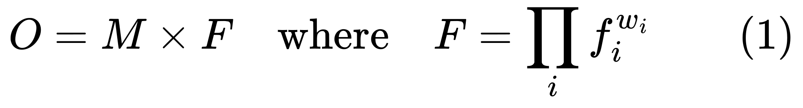
<!-- $O = M \times F \quad \text{where} \quad F = \prod_{i} f_i^{w_i} \qquad (1)$ -->

The components $f_i$ include domain expertise, architectural judgment, taste, clarity of specification, debugging intuition, calibrated uncertainty (knowing what you don't know), and intrinsic motivation. The exponents $w_i$ (which sum to 1) represent how much each component matters for a given task.

**In plain language**: your productive output equals the LLM's power times the product of your capabilities, each raised to its importance for the task at hand. The mathematical consequence of the multiplicative form is decisive: if *any* critical component approaches zero, force collapses toward zero regardless of how strong the others are.

The mirror makes this vivid. You cannot place a question before the mirror that exhibits precision you don't possess. The reflection is faithful along the substance channel — it gives back what you brought, no more and no less. The senior engineer's precise question produced a precise reflection. The junior engineer's vague question produced a vague one. The mirror didn't generate the difference. The force did. But the presentation channel polished both equally, which is why the junior may not notice the substance gap.

### The Layered Structure of Force

One more property of force matters throughout the framework: its components are not equally durable, and they don't decay, build, or transfer at the same rates. Force has three layers:

The **surface layer** — framework syntax, API signatures, tool configurations — has a half-life measured in months. It was always being refreshed through use and decaying through disuse, even before LLMs.

The **middle layer** — judgment, taste, pattern recognition, the ability to evaluate the LLM's output — has a half-life measured in years. It decays *silently*, because judgment is precisely the faculty that would detect its own absence.

The **deep layer** — structural intuition about how complex systems behave under stress, the felt sense of impending failure, the ability to operate in genuine ambiguity — has a half-life measured in decades. It was built through years of direct experience with consequences and is almost somatic in its encoding.

These layers matter for the dynamics of force over time, for the F→M transfer, and for the barbell effect in labor markets. Each layer interacts differently with the LLM:

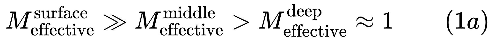
<!-- $M_{\text{effective}}^{\text{surface}} \gg M_{\text{effective}}^{\text{middle}} > M_{\text{effective}}^{\text{deep}} \approx 1 \qquad (1a)$ -->

**In plain language**: the LLM is an almost perfect substitute for the surface layer (high $M$), a partial substitute for the middle layer (moderate $M$), and barely a substitute at all for the deep layer ($M \approx 1$). This hierarchy will recur throughout the framework.

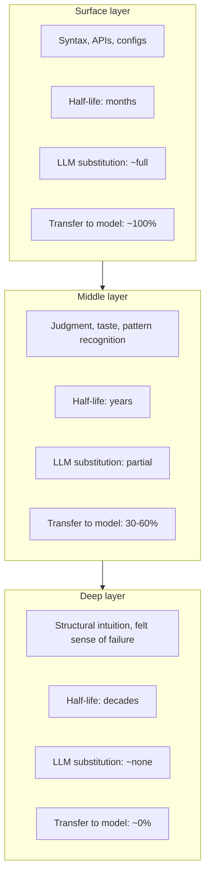

> **A note on the additive alternative.** There is a simpler model: $F = \sum w_i \cdot f_i$. In this version, strong components compensate for weak ones. This model applies where components are genuinely substitutable (breadth of tools known, familiarity with specific frameworks). We will return to the additive form later, in a context where it captures something the multiplicative model cannot: the case where force goes negative.

---

## The Variable Multiplier

There's a natural tendency to treat the LLM as a fixed number. But in practice, the substance multiplier varies enormously by domain and task type. We extend equation (1):

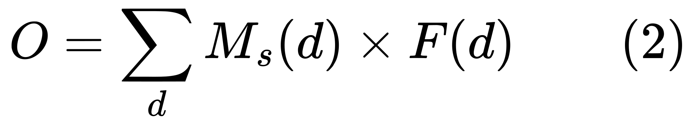
<!-- $O = \sum_{d} M_s(d) \times F(d) \qquad (2)$ -->

Where $M_s(d)$ is the substance multiplier for domain $d$.

**In plain language**: the LLM's amplification power isn't the same for everything. It might be a 50x substance multiplier for generating boilerplate CRUD code, a 1.3x multiplier for novel distributed systems architecture, and *less than 1x* for debugging a race condition under production pressure — where the LLM becomes a distraction, a generator of plausible-sounding false leads that consume precious time.

In mirror terms: the mirror's fidelity varies by what you're reflecting. Simple, well-structured patterns reflect cleanly. Novel, ambiguous designs reflect poorly — the mirror approximates, and the distortion can be worse than no reflection at all. But the *presentation* channel remains high across all domains — the output always looks confident and professional, even when the substance is wrong. The gap between substance and presentation is widest precisely where the LLM is least competent.

This has a corollary that rarely gets discussed. If the multiplier varies by domain, then whoever decides *where the LLM gets better* is implicitly deciding *which skills become more economically valuable*:

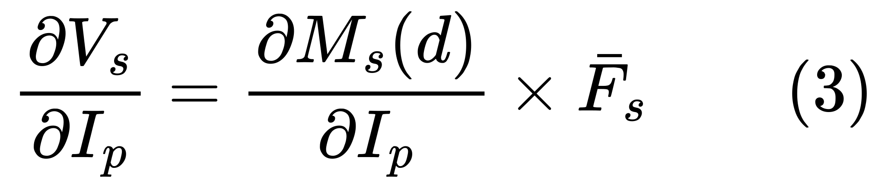
<!-- $\frac{\partial V_s}{\partial I_p} = \frac{\partial M_s(d)}{\partial I_p} \times \bar{F}_s \qquad (3)$ -->

Where $V_s$ is the market value of skill $s$ and $I_p$ is the LLM provider's investment in training capability for domain $d$.

**In plain language**: if a model provider invests heavily in making the LLM better at frontend development but not embedded systems, they're shifting the economic returns between those specializations. The provider's training priorities become an invisible hand reshaping labor markets.

Equation (3) will matter again when we consider sovereignty — the provider's investment decisions reshape which *nations* can sustain technical capacity. And crucially, those decisions are themselves shaped by the force of the people generating training signal — a dependency we will formalize later as the F→M transfer.

---

## The Variance Amplifier

From equation (1), if the LLM multiplies force, and force varies between individuals, then the LLM doesn't just increase average output. It *amplifies the spread*:

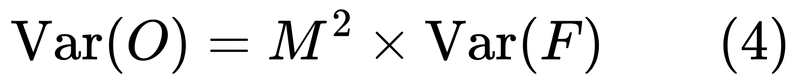
<!-- $\text{Var}(O) = M^2 \times \text{Var}(F) \qquad (4)$ -->

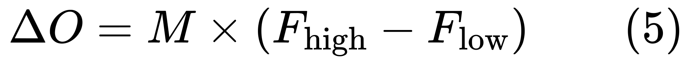
<!-- $\Delta O = M \times (F_{\text{high}} - F_{\text{low}}) \qquad (5)$ -->

**In plain language**: the variance in output between your best and worst people grows as the *square* of the multiplier's power. A pre-existing 3x gap between a strong and weak engineer becomes a 9x gap at $M = 3$ and a 15x gap at $M = 5$.

Equation (4) actually understates the problem. The mirror metaphor makes transparent why: high-force engineers *extract more from the tool*. They place sharp, well-formed questions in front of the mirror and get sharp, well-formed reflections back. Their effective $M$ is higher than a low-force engineer's. If $M$ correlates positively with $F$:

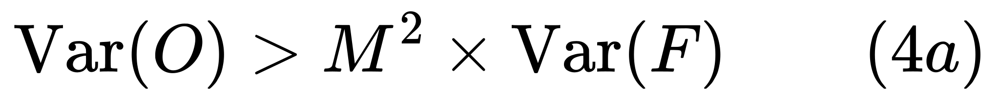
<!-- $\text{Var}(O) > M^2 \times \text{Var}(F) \qquad (4a)$ -->

**In plain language**: equation (4) is a lower bound. Because high-force engineers also extract a higher effective $M$ from the same tool, the true output variance is even larger than $M^2$ would predict. The actual divergence is worse than the simple model suggests.

This is the opposite of what most organizations expect. The implicit assumption behind "give everyone Copilot" is that AI is a leveler. Equations (4) and (4a) say it's a divergence engine.

---

## The Barbell Effect

The variance amplification produces a specific distributional signature in labor markets. The middle hollows out while both ends retain or gain value. Let $V(F)$ be the market value of composite force $F$:

![V(F) \to \begin{cases} V_{\text{high}} \cdot F & \text{if } F > F_{\text{threshold}} \quad \text{(judgment layer)} \\ V_{\text{new}} & \text{if orchestration skill is high} \quad \text{(LLM operation)} \\ \varepsilon & \text{if } F \in \[F_{\text{low}}, F_{\text{threshold}}\] \quad \text{(commoditized middle)} \end{cases} \qquad (6)](math/display-08.svg)
<!-- $V(F) \to \begin{cases} V_{\text{high}} \cdot F & \text{if } F > F_{\text{threshold}} \quad \text{(judgment layer)} \\ V_{\text{new}} & \text{if orchestration skill is high} \quad \text{(LLM operation)} \\ \varepsilon & \text{if } F \in [F_{\text{low}}, F_{\text{threshold}}] \quad \text{(commoditized middle)} \end{cases} \qquad (6)$ -->

**In plain language**: the market splits into three tiers. At the top, judgment and taste gain premium. At the bottom, a new kind of value emerges in LLM orchestration. In the middle, competent-but-undistinguished execution is commoditized.

The barbell follows the durability gradient from equation (1a). The skills being commoditized are precisely the shortest-half-life components — framework familiarity, syntax recall, standard patterns. These are the surface layer, where $M_{\text{effective}}^{\text{surface}}$ is highest and the LLM is a near-perfect substitute. The skills gaining premium are the longest-half-life components — judgment, structural intuition, taste. These are the deep layer, where $M_{\text{effective}}^{\text{deep}} \approx 1$ and human force is irreplaceable.

This isn't a new pattern. Photography didn't eliminate painters — it eliminated portrait painters while increasing the premium on artistic vision. Spreadsheets didn't eliminate accountants — they eliminated bookkeepers while increasing the premium on financial analysis. Automation destroys the middle by commoditizing execution while increasing the premium on the judgment layer above it.

---

## Creation Becomes Free. Evaluation Does Not.

Historically, creation was expensive and evaluation was relatively cheap. LLMs invert this:

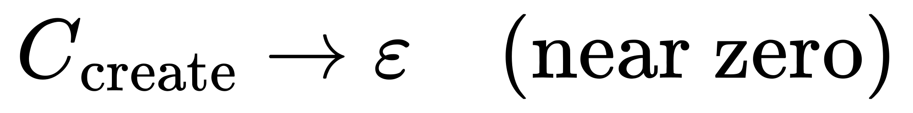
<!-- $C_{\text{create}} \to \varepsilon \quad \text{(near zero)}$ -->

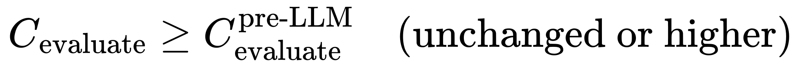
<!-- $C_{\text{evaluate}} \geq C_{\text{evaluate}}^{\text{pre-LLM}} \quad \text{(unchanged or higher)}$ -->

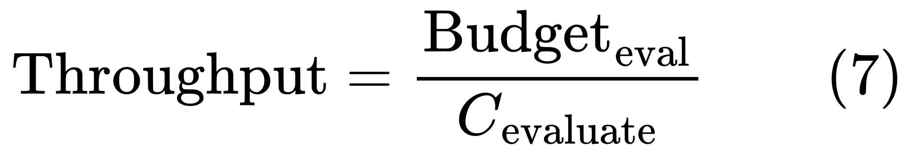
<!-- $\text{Throughput} = \frac{\text{Budget}_{\text{eval}}}{C_{\text{evaluate}}} \qquad (7)$ -->

**In plain language**: a developer can generate thousands of lines of plausible code in minutes. But determining whether that code is correct, secure, and aligned with requirements still demands deep human judgment. Possibly more judgment, because the mirror's presentation channel ($M_p$) adds a uniform polish that makes defects harder to spot — hand-written bad code often looks bad, but LLM-generated bad code looks professional.

This creates a genuine organizational paradox:

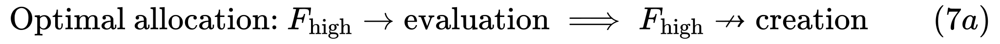
<!-- $\text{Optimal allocation: } F_{\text{high}} \to \text{evaluation} \implies F_{\text{high}} \not\to \text{creation} \qquad (7a)$ -->

**In plain language**: your most valuable people need to spend *more* time reviewing others' AI-augmented output and *less* time doing their own creation, even though their own creation yields the highest return. As we will see, the F→M transfer introduces a *third* competing demand on these same people.

> **Can the LLM evaluate too?** Partially. LLMs increasingly assist with code review, test generation, and static analysis, raising the floor on evaluation throughput. But the defects that matter most — architectural misalignment with business intent, subtle concurrency bugs, security vulnerabilities requiring full system context — are precisely the ones LLMs evaluate poorly. The substance multiplier $M_s$ applies to evaluation with a much smaller value than for creation. The gap between creation-$M_s$ and evaluation-$M_s$ is what makes equation (7) bind.

---

## When Force Goes Negative

The framework so far has assumed force is positive. This is where we need the additive model. An engineer who is confident, fast, and *systematically wrong* doesn't just have low force — they have force in the wrong direction:

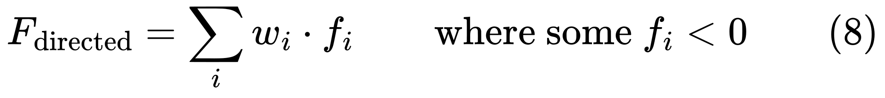
<!-- $F_{\text{directed}} = \sum_{i} w_i \cdot f_i \qquad \text{where some } f_i < 0 \qquad (8)$ -->

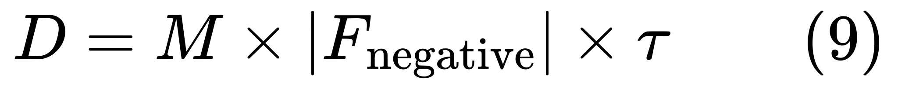
<!-- $D = M \times |F_{\text{negative}}| \times \tau \qquad (9)$ -->

**In plain language**: the blast radius of bad judgment scales directly with $M$. Pre-LLM, a negative-force individual was rate-limited by execution speed. The LLM removes that governor.

The mirror makes the mechanism clear: a mirror has no judgment about what it reflects. It reflects brilliant architectural thinking and catastrophic mistakes with equal fluency. It doesn't say "this is a terrible idea." It helps you build the wrong thing faster. Equations (4) and (5) don't just widen the gap between good and mediocre output — they widen the gap between good output and *actively destructive* output.

---

## The Epistemic Corruption Problem

Negative force (equation 8) is dangerous. But there is a subtler failure mode: *unknown* negative force. A high-force engineer brings calibrated uncertainty. A low-force user lacks that calibration, and the LLM provides no honest signal about its own reliability.

The substance/presentation split makes this precise. The epistemic gap arises from the mismatch between the two channels:

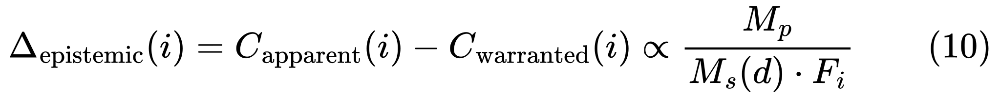
<!-- $\Delta_{\text{epistemic}}(i) = C_{\text{apparent}}(i) - C_{\text{warranted}}(i) \propto \frac{M_p}{M_s(d) \cdot F_i} \qquad (10)$ -->

**In plain language**: the epistemic gap is widest when the presentation multiplier ($M_p$) is high relative to the substance multiplier ($M_s$) and the user's force ($F_i$). The output looks brilliant ($M_p$ is always large). The output *is* brilliant only when $M_s \cdot F_i$ is also large. For a low-force user working on a novel problem (low $M_s$), the gap between how the output looks and what it's actually worth is enormous.

The mirror reveals why this corruption is seductive. Think of Narcissus. He stared at his reflection not because it was accurate but because it was *beautiful*. There is a deeper optical illusion at work: a reflection in a mirror appears to occupy space behind the glass — depth that is virtual, a property of the reflection's structure, not evidence of anything behind the surface. The LLM operates identically. When it produces a nuanced response, there appears to be *understanding* behind the text. But that depth is virtual.

When the reflection looks deep, users attribute the depth to the LLM. An experienced engineer correctly identifies this: "the LLM gave a great answer because I asked a great question." An inexperienced engineer reverses the attribution: "the LLM really understands this." The first interpretation preserves agency. The second offloads it — and the offloading is the first step toward atrophy.

This connects directly to equation (7a). Evaluation bottlenecks tighten not just because there's more code to review, but because the signal quality has degraded. The organization loses the ability to *know* that the code is bad.

---

## The Atrophy Problem

This may be the most consequential dynamic in the framework, because it operates on *force itself* — the variable everything else depends on.

The feedback loop that builds force is fundamentally adversarial. You struggle, you fail, you debug for four hours, and the *pain* encodes the lesson. LLMs short-circuit that loop. And the short-circuit *feels like learning* — comprehension without competence.

The mirror explains *why* passive reliance is so seductive. Mirrors are flattering. The LLM takes whatever you bring and makes it *look good* via the presentation channel $M_p$. This constant flattery — seeing your thinking returned in polished, articulate form — feels like validation at every interaction.

How force changes over time:

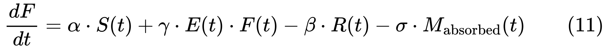
<!-- $\frac{dF}{dt} = \alpha \cdot S(t) + \gamma \cdot E(t) \cdot F(t) - \beta \cdot R(t) - \sigma \cdot M_{\text{absorbed}}(t) \qquad (11)$ -->

Where:
- $S(t)$ = productive struggle (effortful problem-solving, failure, debugging)
- $E(t)$ = deliberate use of the LLM as a thinking partner
- $R(t)$ = passive reliance on the LLM
- $M_{\text{absorbed}}(t)$ = model capability gained from F→M transfer (formalized later)
- $\sigma$ = rate of organizational de-investment in human capability triggered by successful transfer
- $\alpha, \beta, \gamma$ = learning coefficients

When the F→M transfer hasn't yet shifted organizational behavior, $\sigma \approx 0$ and equation (11) reduces to the simpler form $dF/dt = \alpha S + \gamma E F - \beta R$.

**In plain language**: your force grows from traditional struggle ($\alpha \cdot S$) and from deliberately using the LLM to accelerate your thinking ($\gamma \cdot E \cdot F$). It shrinks from passive reliance ($\beta \cdot R$) and from your organization's reduced investment in developing human capability once the model appears to "handle it" ($\sigma \cdot M_{\text{absorbed}}$). The LLM-assisted learning term is multiplicative with existing force — it takes judgment to use the tool as a sparring partner rather than an oracle.

The mirror interpretation of each term: $\alpha \cdot S$ is learning without the mirror — direct contact with problems. $\gamma \cdot E \cdot F$ is the dancer watching her reflection to spot and fix errors, which requires knowing what good form looks like. $\beta \cdot R$ is Narcissus — staring at the flattering reflection, mistaking the mirror's polish for your own substance. And $\sigma \cdot M_{\text{absorbed}}$ is the studio closing down the dance classes because "the mirror teaches well enough on its own."

> **A note on the bridge between equations (1) and (11).** Equation (1) defines $F$ as a product of components. Equation (11) models $F$ as a single aggregate with additive dynamics. If $F$ is truly a product, its time derivative is $dF/dt = F \sum_i (w_i / f_i)(df_i/dt)$ — the chain rule on the log. Equation (11) is an approximation that holds when force components move roughly together. It governs short-to-medium-run dynamics well. When components *diverge* — surface decaying fast, deep holding steady — the aggregate $dF/dt$ is a poor summary. The layered model below captures what equation (11) misses.

### The Layered Decay

The atrophy dynamics operate differently on each layer, and these differences matter:

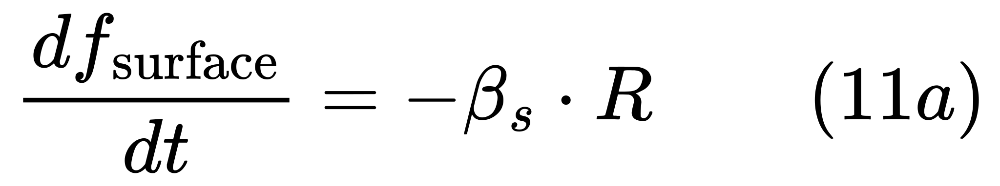
<!-- $\frac{df_{\text{surface}}}{dt} = -\beta_s \cdot R \qquad (11a)$ -->

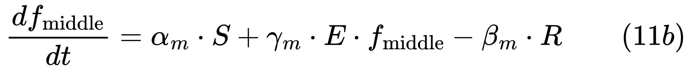
<!-- $\frac{df_{\text{middle}}}{dt} = \alpha_m \cdot S + \gamma_m \cdot E \cdot f_{\text{middle}} - \beta_m \cdot R \qquad (11b)$ -->

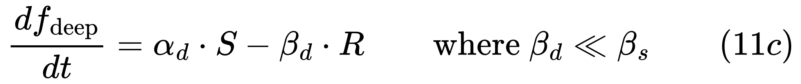
<!-- $\frac{df_{\text{deep}}}{dt} = \alpha_d \cdot S - \beta_d \cdot R \qquad \text{where } \beta_d \ll \beta_s \qquad (11c)$ -->

**In plain language**: the surface layer erodes fast under LLM dependence, but its loss is benign — the LLM substitutes for it fully (equation 1a). Why memorize what the mirror can always show you? The middle layer is the critical battleground — this is where the tipping point (equation 14, below) operates, where the $\gamma_m \cdot E \cdot f_{\text{middle}}$ term determines whether judgment compounds or atrophies. The deep layer barely changes in the short run, but it's the hardest to rebuild once lost, because it was built through years of direct experience no language model can replicate.

The insidious feature: the LLM substitutes most effectively for the layer that matters least (surface), creates the *illusion* that it also handles the layer that matters most (deep), and the illusion is convincing because the presentation channel $M_p$ polishes the surface so well. The mirror's fidelity at the surface conceals its limitations at depth. As the middle layer (judgment, self-assessment) decays silently, the person doesn't experience a realization. They simply become gradually more confident in gradually worse work — the epistemic gap of equation (10) opening invisibly from within.

The trap is that short-term output $O(t) = M \times F(t)$ can increase even as $F(t)$ decays. The damage is invisible until the multiplier is unavailable — a production crisis, a novel problem, a situation where the mirror can't help. At that moment, atrophied force is exposed, and the hysteresis dynamics (below) mean it's far harder to rebuild than it was to lose.

---

## Tacit Knowledge: The Invisible Loss

Equation (11) describes force atrophy at the individual level. Scale it up and you get something more alarming.

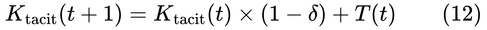
<!-- $K_{\text{tacit}}(t+1) = K_{\text{tacit}}(t) \times (1 - \delta) + T(t) \qquad (12)$ -->

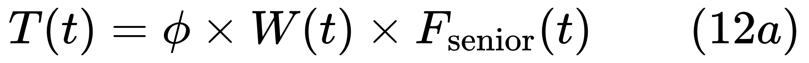
<!-- $T(t) = \phi \times W(t) \times F_{\text{senior}}(t) \qquad (12a)$ -->

**In plain language**: the stock of tacit knowledge in an organization next year equals what survives natural attrition ($K$ reduced by $\delta$ from retirements and turnover) plus whatever gets transmitted from seniors to juniors ($T$). The transmission rate depends on three things multiplied together: a coupling constant ($\phi$), the volume of work seniors and juniors do together ($W$), and how much force the seniors actually carry ($F_{\text{senior}}$). If any of those three approaches zero, transmission stops.

The LLM reduces $W(t)$:

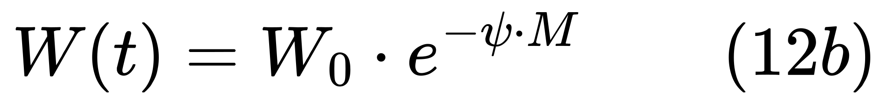
<!-- $W(t) = W_0 \cdot e^{-\psi \cdot M} \qquad (12b)$ -->

**In plain language**: shared work declines exponentially with the multiplier's power — the first increments of $M$ eliminate the most delegable tasks (high-volume, well-specified work that was the traditional vehicle for junior learning), with diminishing returns thereafter. $W(t)$ approaches zero asymptotically but never goes negative.

The knowledge pipeline breaks when transmission can no longer offset decay:

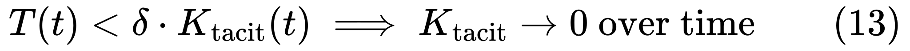
<!-- $T(t) < \delta \cdot K_{\text{tacit}}(t) \implies K_{\text{tacit}} \to 0 \text{ over time} \qquad (13)$ -->

**In plain language**: there is a critical threshold where the rate of knowledge leaving the organization (through retirements, turnover, and memory decay) exceeds the rate of knowledge being passed to the next generation. Once crossed, the tacit knowledge stock enters irreversible decline. You won't notice it's broken for years — the seniors who carry the knowledge are still there, still producing.

Note the compounding dependencies. $F_{\text{senior}}$ in equation (12a) is subject to atrophy (equation 11). Tacit knowledge — the deep layer — is precisely the knowledge that resists transfer into the model (formalized later as the ceiling in equation 27). The organizational and individual dynamics don't just coexist. They compound.

---

## The Tipping Point

Equation (11) has a structural feature that determines long-term trajectories. The term $\gamma \cdot E(t) \cdot F(t)$ is multiplicative with existing force, creating two stable equilibria:

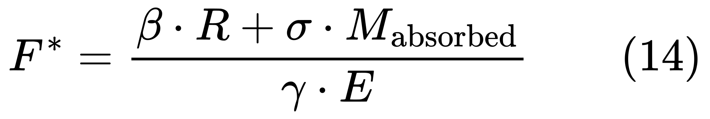
<!-- $F^* = \frac{\beta \cdot R + \sigma \cdot M_{\text{absorbed}}}{\gamma \cdot E} \qquad (14)$ -->

**In plain language**: there is a threshold level of force. Above it, the LLM accelerates your growth — you're strong enough to use it as a sparring partner, and learning compounds. Below it, the LLM accelerates your decline — you default to passive reliance, and atrophy compounds.

Note that $F^*$ now includes the $\sigma \cdot M_{\text{absorbed}}$ term from equation (11): as the F→M transfer succeeds, $M_{\text{absorbed}}$ grows, which raises $F^*$, which means more engineers fall below the threshold — not because they got weaker, but because successful transfer moved the threshold upward.

The mirror makes this bifurcation vivid. Above $F^*$, the mirror functions like a dancer's studio mirror — a feedback instrument for form-correction. Below $F^*$, it functions like Narcissus's pool — flattering, self-confirming, eventually fatal to growth. The same object. Entirely different function. Determined entirely by what stands in front of it.

### Hysteresis

There is strong reason to believe force-building and force-decay are not symmetric:

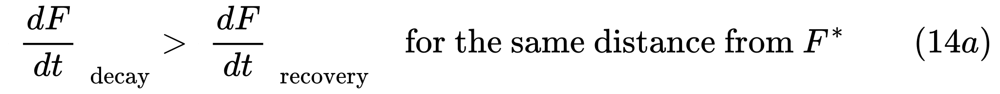
<!-- $\left|\frac{dF}{dt}\right|_{\text{decay}} > \left|\frac{dF}{dt}\right|_{\text{recovery}} \quad \text{for the same distance from } F^* \qquad (14a)$ -->

**In plain language**: falling below the tipping point isn't just entering a decay trajectory. It's entering a trajectory that's harder to escape than it was to enter. The first time you struggle through a debugging session, there's first-contact novelty that aids encoding. Re-learning after atrophy lacks that novelty, feels more tedious, and competes against the knowledge that the LLM shortcut exists. $F^*$ is a cliff, not a hill.

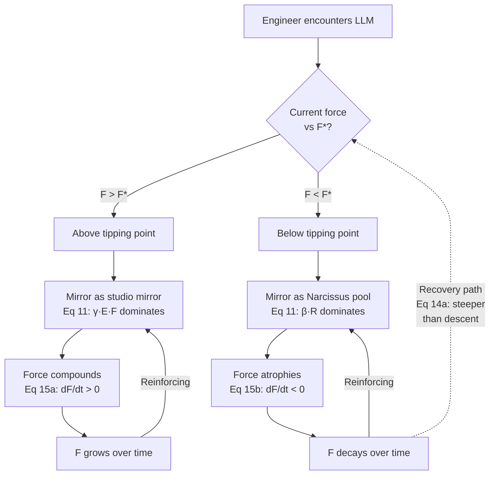

---

## The Cohort Discontinuity

Equation (11) operates differently depending on when an engineer's career began relative to LLMs.

A senior engineer who spent 2008-2023 struggling entered the LLM era with deep, durable force — heavily weighted toward the middle and deep layers. Even under atrophy, the decay operates on a large base with long half-lives.

An engineer who entered the workforce in 2024 faces a structurally different situation. They never had the pre-LLM struggle period. The $\alpha \cdot S(t)$ term in equation (11) is diminished not because they're less talented, but because the environment provides less opportunity for productive struggle. The LLM has removed the friction that was the learning mechanism.

The initial force of a cohort entering in year $c$ is bounded by the struggle available in that environment:

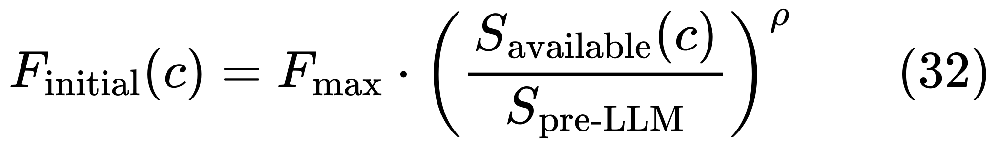
<!-- $F_{\text{initial}}(c) = F_{\text{max}} \cdot \left(\frac{S_{\text{available}}(c)}{S_{\text{pre-LLM}}}\right)^\rho \qquad (32)$ -->

Where $S_{\text{available}}(c)$ is the productive struggle available to new engineers in year $c$, which declines as $M(t)$ grows — more powerful LLMs smooth over more friction.

**In plain language**: each successive cohort enters with a lower force ceiling, not because of individual deficiency but because the environmental conditions for building force have been structurally altered. This is different from atrophy — it's *stunted development*, and it's harder to address because there's no previous capability to reactivate.

The force distribution develops a step function at the cohort boundary. Pre-LLM engineers occupy a high-force band (slowly decaying). Post-LLM engineers occupy a lower-force band (never having reached the same level). As the pre-LLM cohort ages out, they're replaced by members whose force ceiling may be permanently lower.

This interacts with tacit knowledge transmission. Not only is $W(t)$ declining (equation 12b), but the juniors who *do* share work with seniors have less force to absorb and encode what they're exposed to. Equation (12a) takes a double hit: less shared work *and* less absorbent receivers.

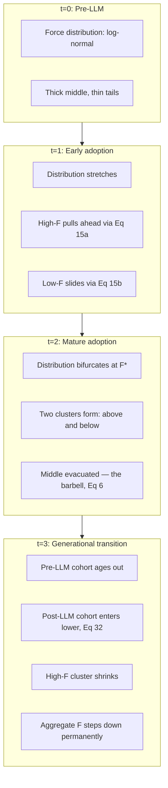

---

## The Accelerating Gap

The tipping point at $F^*$ doesn't just sort engineers into two groups — it puts them on diverging trajectories that accelerate apart from each other. The high-force individual compounds. The low-force individual decays. And the gap between them doesn't just widen; it widens *faster over time*. This is where the framework's most uncomfortable prediction emerges.

Equations (11) and (14) together produce the inequality consequences. For a high-force individual above $F^*$:

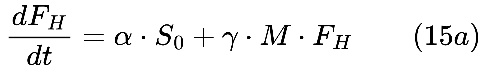
<!-- $\frac{dF_H}{dt} = \alpha \cdot S_0 + \gamma \cdot M \cdot F_H \qquad (15a)$ -->

For a low-force individual below $F^*$:

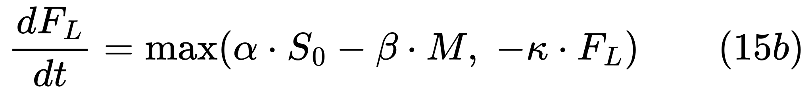
<!-- $\frac{dF_L}{dt} = \max\!\left(\alpha \cdot S_0 - \beta \cdot M,\; -\kappa \cdot F_L\right) \qquad (15b)$ -->

Where $S_0$ is the baseline learning rate from non-LLM experience, and the $\max$ function ensures that force approaches zero asymptotically rather than going negative — when force is very low, decay is bounded by the proportional term $-\kappa F_L$. (Force can go *directionally* negative via equation 8, but the *magnitude* of force in the multiplicative model floors at zero.)

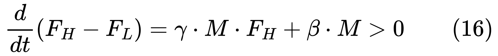
<!-- $\frac{d}{dt}(F_H - F_L) = \gamma \cdot M \cdot F_H + \beta \cdot M > 0 \qquad (16)$ -->

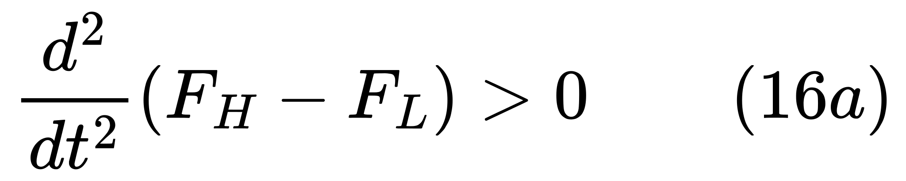
<!-- $\frac{d^2}{dt^2}(F_H - F_L) > 0 \qquad (16a)$ -->

**In plain language**: the high-force individual's growth rate includes a compounding engine. The low-force individual faces a drag term that scales with $M$. The gap widens *faster over time*. This is the Matthew Effect in mathematical form.

The cohort discontinuity adds a generational dimension. The between-cohort gap may be permanent, because it reflects different starting conditions (equation 32) rather than different effort levels. Equations (16) and (16a) operate within *and* between cohorts.

---

## The Cascade

The preceding sections form a system of reinforcing feedback loops.

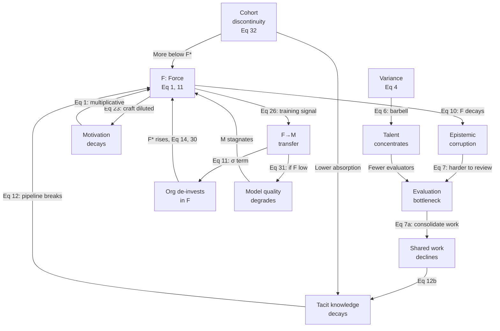

**Loop 1: Atrophy → Epistemic corruption → Undetected damage.**
As $F$ decays via equation (11), the epistemic gap from equation (10) widens — proportional to $M_p / (M_s \cdot F_i)$. The middle-layer decay (equation 11b) means self-assessment erodes. The mirror's presentation channel keeps confidence high. Damage compounds silently.

**Loop 2: Epistemic corruption → Evaluation bottleneck → Organizational risk.**
As the epistemic gap widens, the evaluation bottleneck (equation 7) tightens. More output needs review; the defects are subtler because $M_p$ polishes them.

**Loop 3: Organizational efficiency → Tacit knowledge decay → Force supply collapse.**
Organizations consolidate work onto fewer, higher-force individuals. Shared work $W(t)$ declines (equation 12b). Tacit knowledge transmission drops. The cohort discontinuity accelerates this — post-LLM juniors lack capacity to absorb tacit knowledge even when exposed.

**Loop 4: Force decay → Motivation decay → Force decay.**
The craft experience is diluted. Motivation $f_{\text{mot}}$ is a component of force in equation (1) — it enters *multiplicatively*, so its decay doesn't just reduce output linearly. Via the Cobb-Douglas form, declining motivation degrades the effectiveness of *all* other force components. If $f_{\text{mot}}$ halves, total $F$ drops by more than half because $f_{\text{mot}}^{w_{\text{mot}}}$ pulls down the entire product. This loop hits highest-force individuals hardest.

**Loop 5: Variance amplification → Barbell → Talent concentration → Evaluation bottleneck.**
Variance widens (equation 4). Markets bifurcate (equation 6). High-$F$ individuals concentrate in fewer firms. Most organizations lose evaluation capacity.

**Loop 6: F→M transfer → De-investment in F → Training signal degradation → M stagnation.**
Force flows into the model. Organizations invest less in human capability. The model absorbed only the explicit layer (equation 27). The atrophied workforce produces worse training signal (equation 31). The mirror's quality degrades. This loop closes the $F \to M \to F$ circuit.

**Loop 7: Cohort discontinuity → Reduced absorption → Accelerated pipeline collapse.**
Post-LLM cohorts enter with lower $F_{\text{initial}}$ (equation 32). Even when exposed to tacit knowledge, they absorb less. This compounds Loop 3: the pipeline collapses faster than senior attrition alone would predict.

These seven loops interact. Multiple positive feedback mechanisms, few natural brakes.

---

## Organizational Consequences

### The ROI Paradox

Most organizations distribute AI tooling uniformly — every engineer gets the same Copilot subscription, the same model access, the same seat license. This feels equitable. The force multiplier model says it is also deeply suboptimal.

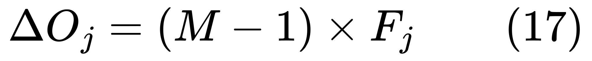
<!-- $\Delta O_j = (M - 1) \times F_j \qquad (17)$ -->

**In plain language**: the marginal return of giving the LLM to person $j$ is proportional to that person's existing force. A 10x engineer who gains a 3x multiplier produces 30 units of additional output. A 1.5x engineer with the same multiplier produces 4.5 units. The delta between those returns is enormous, and it widens as $M$ grows. Per equation (4a), high-force individuals also extract a higher effective $M$ from the same tool — they place sharper questions before the mirror and get sharper reflections back. The rational allocation strategy is to concentrate the multiplier on your strongest people first. Uniform distribution is equitable but leaves the largest returns on the table.

### The Legibility Crisis

One of the core functions of engineering management is assessment — knowing who can handle what, who's growing, who's struggling, who can be trusted with critical-path work. That assessment has historically relied on observable output: code quality, design document clarity, debugging speed, the questions someone asks in architecture reviews. The presentation multiplier $M_p$ corrupts nearly all of these signals.

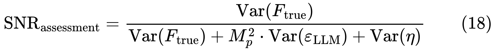
<!-- $\text{SNR}_{\text{assessment}} = \frac{\text{Var}(F_{\text{true}})}{\text{Var}(F_{\text{true}}) + M_p^2 \cdot \text{Var}(\varepsilon_{\text{LLM}}) + \text{Var}(\eta)} \qquad (18)$ -->

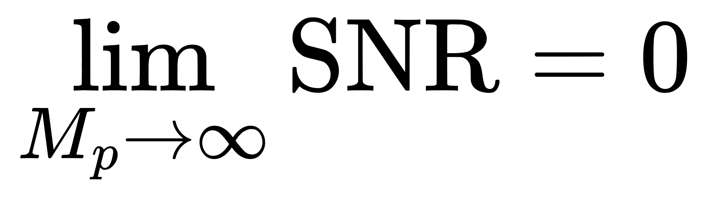
<!-- $\lim_{M_p \to \infty} \text{SNR} = 0$ -->

**In plain language**: the signal-to-noise ratio for assessing true capability through output artifacts approaches zero as the presentation multiplier grows. Note that $M_p$ — not $M_s$ — drives the collapse. The mirror polishes everyone's output identically along the presentation channel, collapsing the visible difference between deep understanding and shallow borrowing. The design doc might be LLM-polished. The code might be LLM-generated. The architecture questions in a review might be LLM-suggested. The map between artifact and ability has been scrambled. To assess true force, evaluate *substance* (where $M_s$ varies and $F$ matters) rather than *presentation* (where $M_p$ always dominates).

The consequences of misassessment are severe in both directions. Overestimate someone and you put them on critical-path work they can't handle — but the failure won't surface until the LLM-generated scaffolding encounters a problem requiring real understanding. Underestimate someone and you lose them to a competitor. The cohort discontinuity makes this worse: pre-LLM engineers have legible track records built before LLMs existed. Post-LLM engineers have never produced a body of work without LLM assistance. There is no baseline to compare against.

### Goodhart's Trap

Once organizations recognize the legibility crisis (equation 18) and try to measure force directly — through live coding exercises, architectural interviews, or structured assessments — Goodhart's Law activates: when a measure becomes a target, it ceases to be a good measure.

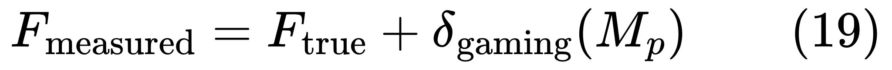
<!-- $F_{\text{measured}} = F_{\text{true}} + \delta_{\text{gaming}}(M_p) \qquad (19)$ -->

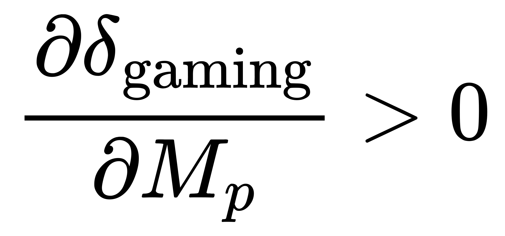
<!-- $\frac{\partial \delta_{\text{gaming}}}{\partial M_p} > 0$ -->

**In plain language**: the amount by which people can inflate their measured force by using LLMs to game the assessment grows with the presentation multiplier $M_p$. Engineers will use LLMs to prepare for force-assessment exercises, to polish design docs, to simulate architectural sophistication in interviews. The LLM becomes simultaneously the thing that makes force important (equation 1), the thing that makes force hard to measure (equation 18), and the tool people use to game the measurement (equation 19). The mirror makes everyone look good; Goodhart's Law means everyone *uses* the mirror to look good when being assessed. The metric fails precisely when it matters most.

The leaders who navigate this will shift assessment from output inspection to *process observation* — watching how someone thinks live, in real time, without the mirror. What questions do they ask? How do they react when the LLM's answer is subtly wrong? That's where real force becomes visible.

### The Decision Bottleneck

When creation cost approaches zero (per equation 7), a constraint that was historically buried deep in the organizational stack rises to the surface: the speed at which the organization can decide *what to build*. Execution used to buffer decision-making — you had weeks or months of build time during which you could refine your thinking, course-correct, gather feedback. When build time compresses from months to days, that buffer vanishes.

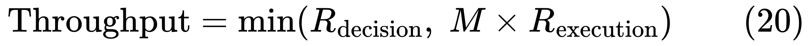
<!-- $\text{Throughput} = \min(R_{\text{decision}},\; M \times R_{\text{execution}}) \qquad (20)$ -->

**In plain language**: the total output of an organization is limited by whichever is slower: the speed of deciding what to build, or the speed of building it. Pre-LLM, execution was almost always the bottleneck. Post-LLM, as $M$ grows, decision-making becomes the constraint.

The opportunity cost of indecision also scales with the multiplier:

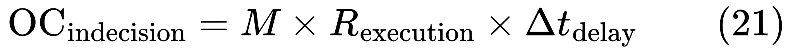
<!-- $\text{OC}_{\text{indecision}} = M \times R_{\text{execution}} \times \Delta t_{\text{delay}} \qquad (21)$ -->

**In plain language**: every hour spent debating what to build wastes $M$ times more potential output than it did before. An organization that takes two weeks to align on a feature spec is now burning five to ten times more idle execution capacity than it was pre-LLM. The companies that win won't be the ones with the best engineers or the best AI tools. They'll be the ones that can *decide what to build* fastest and with the highest accuracy. Strategic clarity becomes the binding constraint — a fundamentally different organizational capability than what most tech companies have optimized for.

---

## The Erosion of Competitive Moats

When the multiplier is available to everyone — when every company can subscribe to the same models, the same APIs, the same tooling — execution-based competitive advantages erode. The advantage can no longer be "we have more engineers" or "we ship faster." It reduces to something simpler and harder to buy: the difference in force between workforces.

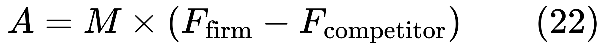
<!-- $A = M \times (F_{\text{firm}} - F_{\text{competitor}}) \qquad (22)$ -->

**In plain language**: when both you and your competitor have the same mirror, the only remaining competitive advantage is the difference in force between your workforces. "We have 500 engineers" stops being a moat and starts being overhead. The advantage reduces to force density — not how many people you have, but how capable they are per capita.

The moat shifts from "we built it" to "we understood the problem deeply enough to build the *right* thing" — judgment and decision speed (equation 20), not execution capacity.

The paradox: the force multiplier devalues what it multiplies and increases the value of everything upstream.

---

## The Meaning Problem

Engineers are people, and intrinsic motivation $f_{\text{mot}}$ is a component of force in equation (1). In the Cobb-Douglas form, its decay has structural consequences — it enters as $f_{\text{mot}}^{w_{\text{mot}}}$, which pulls down the *entire* force product, not just the motivation slice:

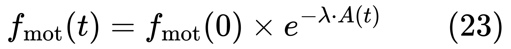
<!-- $f_{\text{mot}}(t) = f_{\text{mot}}(0) \times e^{-\lambda \cdot A(t)} \qquad (23)$ -->

Where $A(t)$ is accumulated autonomy loss. This feeds back into equation (11) through the multiplicative structure of equation (1): declining $f_{\text{mot}}$ reduces $F$, which reduces the $\gamma E F$ term, which shifts the balance toward atrophy, which further reduces $F$. The feedback is mediated by the Cobb-Douglas form.

**In plain language**: a demotivated expert doesn't produce "slightly less." They lose the engagement that made their judgment sharp. The highest-force individuals may be most sensitive to this loss, and their departure degrades force supply at the top — where the evaluation bottleneck (equation 7) and the F→M transfer (next section) can least afford it.

---

## The Transfer: When Force Flows Into the Model

Throughout the framework, $F$ and $M$ have been treated as coupled but with the coupling deferred. Now we formalize it. Force flows into the model — through fine-tuning, Reinforcement Learning from Human Feedback (RLHF), evaluation data, retrieval-augmented knowledge bases, and the accumulated training signal of billions of interactions. The mirror isn't just reflecting. It's *recording*.

### The Transfer Function

Every time a senior engineer's code review preferences train a code-review model, every time an expert's evaluation judgments become RLHF signal, every time an organization builds a retrieval system around its best practitioners' documentation — force is flowing from $F$ into $M$. The rate of this flow can be formalized:

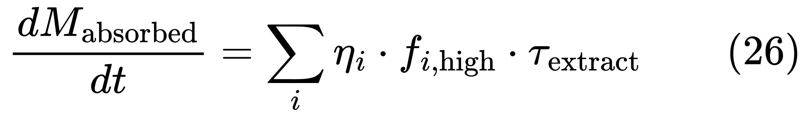
<!-- $\frac{dM_{\text{absorbed}}}{dt} = \sum_i \eta_i \cdot f_{i,\text{high}} \cdot \tau_{\text{extract}} \qquad (26)$ -->

Where $\eta_i$ is the transfer efficiency for force component $i$ — the fraction of each layer that can be encoded into model weights. This varies by layer, connecting directly to equation (1a):

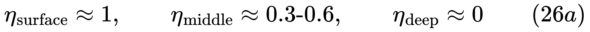
<!-- $\eta_{\text{surface}} \approx 1, \qquad \eta_{\text{middle}} \approx 0.3\text{-}0.6, \qquad \eta_{\text{deep}} \approx 0 \qquad (26a)$ -->

**In plain language**: the rate at which the model absorbs human expertise is the sum across all force layers of (how transferable that layer is) × (how much force the expert has in that layer) × (how much time is spent on extraction activities). The surface layer transfers almost completely — standard patterns, API behaviors, common failure modes. The middle layer transfers partially — the model can learn *some* evaluative patterns and preferences. The deep layer barely transfers at all — contextual judgment, the sense of when rules don't apply, taste in genuine ambiguity. This knowledge is relational and situational in ways that resist encoding.

This transfer has a ceiling:

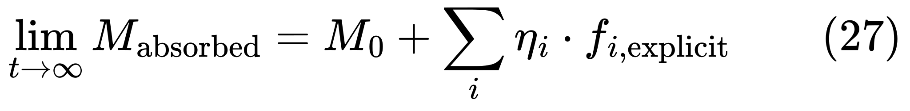
<!-- $\lim_{t \to \infty} M_{\text{absorbed}} = M_0 + \sum_i \eta_i \cdot f_{i,\text{explicit}} \qquad (27)$ -->

**In plain language**: no matter how long the transfer runs, the model converges to a maximum that includes all the explicit, articulable knowledge of the experts — and none of the tacit residual. The model can absorb what experts can articulate. It cannot absorb what they cannot. The transfer captures what was least durable anyway (surface) and leaves behind what was most irreplaceable (deep).

### The Three-Way Resource Competition

Equation (7a) established that high-force individuals face a paradox: needed for creation *and* evaluation. The F→M transfer introduces a third competing demand on these same scarce people — teaching the model.

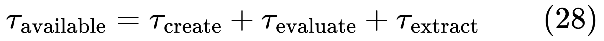
<!-- $\tau_{\text{available}} = \tau_{\text{create}} + \tau_{\text{evaluate}} + \tau_{\text{extract}} \qquad (28)$ -->

**In plain language**: the total working time of a high-force individual is now split three ways: time spent building (where the multiplier on their output is highest), time spent reviewing others' LLM-augmented work (where they're the bottleneck-clearing evaluator), and time spent teaching the model (creating training data, doing RLHF evaluations, building knowledge systems). Every hour spent on one is an hour not spent on the others. Organizations now face a three-way optimization with no slack.

### The Bus Factor Illusion

Organizations pursuing F→M transfer often frame it as risk mitigation: "We can't have critical knowledge locked in one person's head. Let's encode it in the model." This sounds prudent. But it rests on a false equivalence between what the model captured and what the expert knew.

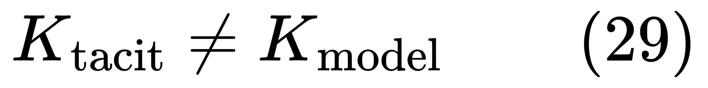
<!-- $K_{\text{tacit}} \neq K_{\text{model}} \qquad (29)$ -->

**In plain language**: what's in the model is $K_{\text{explicit}}$ — the articulable, documentable portion of the expert's knowledge. What's in the tacit stock is $K_{\text{tacit}}$ — the contextual, relational, situational judgment that resists encoding. These are different knowledge *types*, not different amounts of the same type. The transfer doesn't reduce $\delta$ (the decay rate in equation 12) — it only creates the illusion that $K_{\text{tacit}}$ no longer needs active transmission. Before the transfer, the organization knew it had a bus factor problem and might have taken steps to mitigate it. After the transfer, it believes it has solved it. It has solved only the legible portion and created a false confidence that masks the tacit residual.

### The Paradox of Successful Transfer

Here is perhaps the deepest consequence of the F→M coupling. The deeper the transfer succeeds — the more capability the model absorbs — the more it undermines the conditions for maintaining the human force it depends on. Successful transfer raises $F^*$ (equation 14) by increasing $M_{\text{absorbed}}$ in the numerator:

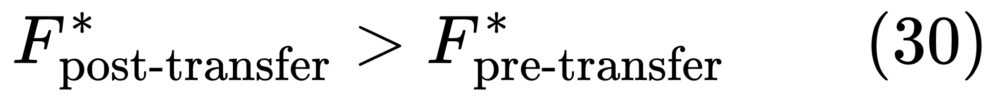
<!-- $F^*_{\text{post-transfer}} > F^*_{\text{pre-transfer}} \qquad (30)$ -->

**In plain language**: a successful knowledge transfer to the model can *raise* the threshold below which force atrophy becomes self-reinforcing. More engineers fall below $F^*$ not because they got weaker, but because the threshold moved upward. They *were* above $F^*$ when the model was a simple amplifier. They fall below it when the model becomes a competent-seeming colleague, because the behavioral shift — less struggle, less deliberate engagement — pushes them into the atrophy basin. The *better* the transfer works, the more it undermines conditions for maintaining human force. A partially successful transfer might be *safer* than a very successful one.

### The Data Quality Spiral

The loops close. The mirror's quality depends on what has been reflected into it — and the workforce that generates that reflection is the same workforce being degraded by the atrophy dynamics of equation (11).

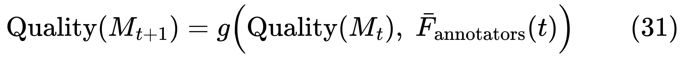
<!-- $\text{Quality}(M_{t+1}) = g\!\left(\text{Quality}(M_t),\; \bar{F}_{\text{annotators}}(t)\right) \qquad (31)$ -->

**In plain language**: the next generation of the model is only as good as the current generation plus the quality of human judgment feeding into its training pipeline. If the average force of the people generating training signal ($\bar{F}_{\text{annotators}}$) is declining — as equations (15b) and (16) predict — then model quality improvement decelerates or reverses. The mirror's fidelity degrades not because of a flaw in the training methodology, but because the *human signal* that the methodology depends on has been hollowed out.

This is the strongest argument for why $M(t)$ may not grow exponentially (equation 25). The worst outcome: a workforce that has atrophied in reliance on a strong $M$, combined with an $M$ that is no longer strong.

---

## The Multiplier is Growing

Throughout this framework, $M$ has been treated as static within any given analysis. But $M$ is itself a function of time — each model generation is meaningfully more capable than the last, and this growth interacts with every dynamic the framework has identified.

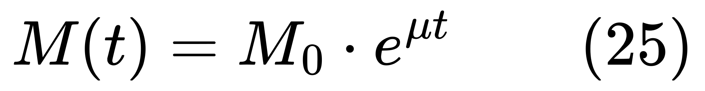
<!-- $M(t) = M_0 \cdot e^{\mu t} \qquad (25)$ -->

**In plain language**: the LLM's capability grows exponentially over time — each model generation is meaningfully more powerful than the last. The growth rate $\mu$ is subject to the data quality constraint of equation (31): if the human signal feeding training pipelines degrades, the exponent may slow or stall. But until that constraint binds, $M$ accelerates. Most dynamics are *convex* in $M$:

- Variance (equation 4) scales as $M^2$
- The epistemic gap (equation 10) scales as $M_p / (M_s \cdot F_i)$, worsening as $M_p$ grows
- The evaluation bottleneck (equation 7) tightens as $M$ increases creation speed
- The tacit knowledge threshold (equation 13) is crossed earlier
- The force-atrophy drag (equation 11) increases via $\beta R$, because more powerful models make the mirror more flattering
- The tipping point (equation 14) rises as $M_{\text{absorbed}}$ grows with better models
- The cohort discontinuity deepens — more powerful LLMs smooth over more friction, reducing $S_{\text{available}}(c)$ in equation (32)
- The opportunity cost of indecision (equation 21) scales linearly with $M$

The problems compound *faster* as the technology improves. And the F→M transfer may eventually make this self-limiting — but only *after* the force supply has already degraded.

---

## The Sovereignty Question

The framework has a geopolitical dimension that falls directly out of equations (3) and (1). If LLMs are multipliers and force is human capital, then a nation's return on AI investment is bounded by its existing talent base — and its continued access to the multiplier itself. Equation (3) established that the provider's training priorities reshape which skills have economic value. At the national level, this creates a dependency that most policy discussions have not yet grappled with.

![E\[\text{national capability}\] = \sum_{i \in \text{workforce}} F_i \times M \times P(\text{access}) \qquad (24)](math/display-48.svg)
<!-- $E[\text{national capability}] = \sum_{i \in \text{workforce}} F_i \times M \times P(\text{access}) \qquad (24)$ -->

<!-- $\sum_{i} F_i \times 1 \geq \text{minimum viable capability} \qquad (24a)$ -->

**In plain language**: a nation's expected technical capability (equation 24) is the sum of its workforce's force, amplified by the multiplier, discounted by the probability that access to the multiplier continues. If the multiplier is provided by a foreign entity subject to sanctions or regulation, $P(\text{access}) < 1$. Equation (24a) is the sovereign resilience test: the workforce must be viable *without the multiplier*. If $F$ has atrophied while relying on a foreign $M$, the nation fails this test precisely when it matters most — when access is cut.

The atrophy dynamic, the cohort discontinuity, and the F→M transfer each threaten (24a) from a different angle. If a country's workforce transfers expertise into foreign-owned models (equation 26), intellectual capital moves offshore. Access depends on $P(\text{access})$ — which the nation doesn't control. Countries that underinvest in education but expect AI to close the gap are making a category error: equation (1) says you cannot multiply what isn't there. The mirror metaphor makes it visceral: giving a nation of low-force workers access to a powerful mirror creates flattering reflections of shallow input, not capability.

---

## The Counter-Argument: LLMs as Floor-Raisers

The objection: LLMs raise the floor. A junior produces 3 instead of 1. A senior produces 30 instead of 10. The ratio is unchanged.

The problem is that equations (15a) and (15b) describe *trajectories*. The floor-raising is correct at $t = 0$. But the tipping point (14), hysteresis (14a), and cohort discontinuity (32) mean the derivatives diverge. The floor was raised at introduction. It may erode underneath the people standing on it.

The counter-argument isn't wrong. It's incomplete. The floor-raising is immediate and visible. The divergence is delayed and invisible until it's structural.

---

## The Inequality Accelerant

Across every level — individuals, teams, firms, industries, nations — the force multiplier amplifies existing capability differences and accelerates their divergence:

<!-- $\frac{d}{dt}(F_H - F_L) > 0 \quad \text{and} \quad \frac{d^2}{dt^2}(F_H - F_L) > 0 \qquad (16, 16a)$ -->

The cohort discontinuity adds a generational step-down. The F→M transfer adds a terminal question: does a new equilibrium emerge?

### Terminal Dynamics

The coupled system — $M$ growing but dependent on $F$ for training quality, $F$ decaying but dependent on $M$ for its rate of change — has identifiable regimes. Qualitatively, equations (11), (25), and (31) together describe three possible trajectories:

**Virtuous regime**: High $F$ is maintained (through deliberate pipeline protection and struggle-based learning). $F$ generates high-quality training signal. $M$ improves. The improved $M$ amplifies high-$F$ output. Both $F$ and $M$ grow, reinforcing each other.

**Managed decline**: $F$ atrophies moderately. Training signal quality degrades slowly. $M$ growth decelerates but remains positive. A new, lower equilibrium is reached where $M$ compensates partially for reduced $F$. The system is functional but permanently dependent on the multiplier and fragile under novel stress.

**Collapse spiral**: $F$ atrophies severely. Training signal quality degrades enough to stall or reverse $M$ growth (equation 31 bites hard). But $F$ has already been reduced in reliance on the strong $M$ that no longer obtains. Both $F$ and $M$ decline, reinforcing each other. No stable equilibrium exists in this regime.

Which trajectory obtains depends on whether interventions preserving the $\alpha S$ and $\gamma E F$ terms in equation (11) are implemented before the data quality spiral (equation 31) begins to bind. The time to intervene is before the spiral starts, not after.

The uncomfortable conclusion: a technology widely perceived as democratizing may be the most powerful inequality amplifier in the history of knowledge work. Access is equal. Force is not. And equations (1) through (32) show, with some rigor, that it's force — not access — that determines outcomes.

---

## So What Do We Do?

The framework narrows the solution space. Any intervention addressing one loop without accounting for its connections will produce temporary relief followed by downstream failure. Any serious strategy must address the system.

**Understand what you're looking at.** Teach users the LLM is a mirror, not a window. The substance channel ($M_s$) scales with what you bring. The presentation channel ($M_p$) always flatters. When you know you're looking at a reflection, you ask: "is this right, or does it just *look* right?" That question activates the $\gamma E F$ growth term rather than the $\beta R$ decay term in equation (11).

**Use the mirror for correction, not admiration.** Frame LLM use as *diagnostic* — ask it to critique your design, not write it. Find flaws in your argument, not make it for you. Use the reflection to see your own thinking from the outside, not to replace your thinking with the reflection.

**Protect the force pipeline, especially the middle layer.** Equations (11a-c) show that surface-layer loss is benign and deep-layer loss is slow. The critical battleground is the middle layer — judgment, taste, evaluation capability. The cohort discontinuity (equation 32) means this requires *environmental redesign*: deliberately reintroducing productive struggle into development pathways that the LLM has smoothed over. This is not nostalgia for difficulty. It's engineering: equation (12b) shows how the pipeline breaks, equation (13) shows when the break is irreversible, and equation (14a) shows that force lost through atrophy is harder to rebuild than it was to build originally.

**Assess substance, not presentation.** The legibility crisis (equation 18) is driven by $M_p$, not $M_s$. Assessment methods that evaluate presentation (polished design docs, fluent code) will fail because $M_p$ always polishes. Methods that evaluate substance — live problem-solving, real-time reasoning, observable reactions when the mirror shows something subtly wrong — are resistant to the presentation channel and measure what actually matters. Equation (19) warns that whatever assessment you choose will be gamed via $M_p$. Design for that.

**Transfer deliberately, not inadvertently.** The F→M transfer (equations 26-31) is happening whether managed or not. Strategic transfer acknowledges equation (26a): transfer efficiency varies by layer, with the tacit/deep layer resisting. Never confuse transferred knowledge with retained capability — equation (29) is the key inequality. Protect the quality of training signal as critical infrastructure (equation 31).

**Decide faster.** Equation (20) identifies decision speed as the binding constraint. The competitive advantage is judgment about *what to build*, not execution capacity.

**Watch both $M(t)$ and $F(t)$.** Track force at the layer level (equations 11a-c), by cohort (equation 32), and in the aggregate. The terminal dynamics analysis shows three possible trajectories. Which one obtains is not predetermined — it depends on choices made now, while the pre-LLM cohort still carries deep force and the data quality spiral has not yet begun to bite.

Build the force. The multiplication takes care of itself.

---

## Open Questions and Testable Predictions

The framework generates several lines of inquiry that it identifies but does not resolve. Each is stated with enough precision to be actionable.

### Mirror Distortion and Conformity Pressure

The framework treats the mirror as faithful — it reflects what you bring. But the mirror is warped by its training data. It reflects well what the data covered densely and reflects poorly what the data covered sparsely. This creates a selection pressure: practitioners are implicitly incentivized to develop force in well-reflected domains (where the mirror helps most) and away from poorly-reflected domains. Over time, the workforce's force distribution shifts toward the training data's center of mass. Novel, frontier, and unconventional thinking gets less support and thus less investment. The mirror may exert a *conformity pressure* with no precedent in knowledge work.

**Testable prediction:** engineers working in domains well-covered by LLM training data will show faster skill development and higher LLM-augmented productivity than those in niche domains, controlling for baseline force. Over time, workforce specialization will converge toward the training data's center.

### Force as a Commons

The data quality spiral (equation 31) means aggregate workforce force has properties of a common-pool resource. Each individual's atrophy marginally degrades the mirror for everyone through degraded training signal. No individual has sufficient incentive to maintain their force for the sake of mirror quality. This is a tragedy of the commons. The literature on commons governance — particularly Ostrom's institutional analysis — offers frameworks for designing monitoring mechanisms, community norms, and incentive structures to prevent degradation. What institutional designs could preserve the training signal commons?

### Competitive Dynamics of Inter-Firm Transfer

If Firm A's best engineers contribute RLHF signal to Provider X, and Provider X's improved model helps Firm B (a competitor), Firm A has subsidized its competitor's productivity. This free-rider problem predicts that rational firms will underinvest in contributing high-quality training signal, even when globally optimal. This may explain the emergence of proprietary fine-tuning and private model hosting — firms attempting to capture transfer benefits internally. The framework predicts accelerating vertical integration of model training by firms with high-force workforces.

### Self-Observation as a Force Component

The mirror enables a capability that doesn't exist without it: seeing your own thinking from the outside at speed. When you articulate a problem to an LLM, you externalize cognition. When the LLM reflects it back — restructured, reorganized — you see your own reasoning from a perspective you can't normally access. This may constitute a genuinely new force component $f_{\text{externalization}}$ — the only component *uniquely enhanced* by the LLM rather than merely amplified. Its properties, development trajectory, and interaction with other force components are unexplored.

### The Education System Redesign Problem

The cohort discontinuity (equation 32) implies that effective post-LLM technical education must include deliberate friction (maintaining $\alpha S$), mirror-literacy (understanding that the LLM reflects, not generates), unassisted assessment (measuring $F_{\text{true}}$ rather than $F_{\text{true}} + \delta_{\text{gaming}}$), and carefully sequenced exposure (using LLMs for self-observation only after sufficient force exists to support $\gamma E F$). The framework provides theoretical constraints for evaluating proposed curricula.

### Team Composition Optimization

The multiplicative force model (equation 1) suggests that teams with complementary force components — where each member's strengths cover another's zero-components — could produce higher aggregate output than teams of uniformly moderate engineers. The evaluation bottleneck (equation 7) requires high-force evaluators. Tacit knowledge transmission (equation 12a) requires shared work between seniors and juniors. The optimization would balance creation capacity, evaluation throughput, knowledge transmission, and component complementarity. This is a constrained optimization problem tractable enough to produce actionable org-design recommendations.

### The Phase Diagram

The coupled system of equations (11), (25), and (31) — $F$ depending on $M$, $M$ depending on $F$, both evolving over time — has phase-plane dynamics that the terminal dynamics section describes qualitatively. A formal phase-plane analysis, plotting $M(t)$ against $\bar{F}(t)$ with feedback arrows, would reveal whether the virtuous, managed-decline, and collapse trajectories correspond to distinct basins of attraction, and what the boundaries between them look like. This would answer the framework's terminal question with mathematical precision.

### Empirical Predictions

The framework generates falsifiable predictions that can be tested against data:

1. **Output variance increases post-LLM adoption** (equation 4). Measurable within teams as standard deviation of code quality metrics, defect rates, or peer-review scores.
2. **Labor market premium for judgment-heavy roles increases relative to execution-heavy roles** (equation 6). Measurable in compensation data by role type over time.
3. **Post-LLM cohorts show lower unassisted performance than pre-LLM cohorts at equivalent career stage** (equation 32). Measurable through assessment without LLM access, controlling for experience level.
4. **Organizations with higher LLM adoption show declining performance on novel, out-of-distribution challenges** (layered decay — deep force eroding). Measurable through incident response times, novel-problem resolution rates.
5. **High-force engineers extract measurably higher effective $M$ from the same tool** (equation 4a). Measurable by comparing LLM-augmented output quality across engineers stratified by unassisted capability.
6. **Evaluation bottleneck becomes the binding constraint on deployment velocity** (equation 7). Measurable as the ratio of code review wait time to code generation time, which should increase post-LLM adoption.

The framework is strong enough to make these specific, non-obvious predictions. It should be held accountable to them.

---

## Equation Index

| Eq. | Expression | Section | Description |
|-----|-----------|---------|-------------|
| (1) | $O = M \times \prod f_i^{w_i}$ | Force is Not a Number | Base model: output = multiplier × force (Cobb-Douglas) |
| (1a) | $M_{\text{eff}}^{\text{surface}} \gg M_{\text{eff}}^{\text{middle}} > M_{\text{eff}}^{\text{deep}} \approx 1$ | Layered Structure | LLM substitution varies by force layer |
| (2) | $O = \sum_d M_s(d) \times F(d)$ | Variable Multiplier | Output across domains with variable substance multiplier |
| (3) | $\partial V_s / \partial I_p = (\partial M_s / \partial I_p) \times \bar{F}_s$ | Variable Multiplier | Provider investment reshapes skill market value |
| (4) | $\text{Var}(O) = M^2 \cdot \text{Var}(F)$ | Variance Amplifier | Output variance scales as square of multiplier |
| (4a) | $\text{Var}(O) > M^2 \cdot \text{Var}(F)$ | Variance Amplifier | Lower bound when M correlates with F |
| (5) | $\Delta O = M(F_H - F_L)$ | Variance Amplifier | Absolute output gap scales with M |
| (6) | $V(F)$ piecewise | Barbell Effect | Labor market splits into three tiers |
| (7) | Throughput $= \text{Budget}_{\text{eval}} / C_{\text{eval}}$ | Creation-Evaluation | Evaluation becomes the binding constraint |
| (7a) | $F_{\text{high}} \to \text{eval}$ | Creation-Evaluation | Best creators redeployed as evaluators |
| (8) | $F_{\text{dir}} = \sum w_i f_i$, some $f_i < 0$ | Negative Force | Additive form permits negative force |
| (9) | $D = M \|F_{\text{neg}}\| \tau$ | Negative Force | Damage scales with multiplier |
| (10) | $\Delta_{\text{epistemic}} \propto M_p / (M_s \cdot F_i)$ | Epistemic Corruption | Gap driven by presentation/substance mismatch |
| (11) | $dF/dt = \alpha S + \gamma E F - \beta R - \sigma M_{\text{abs}}$ | Atrophy Problem | Force dynamics (canonical form with transfer term) |
| (11a) | $df_{\text{surf}}/dt = -\beta_s R$ | Layered Decay | Surface layer: fast decay, LLM substitutes fully |
| (11b) | $df_{\text{mid}}/dt = \alpha_m S + \gamma_m E f_{\text{mid}} - \beta_m R$ | Layered Decay | Middle layer: tipping point operates here |
| (11c) | $df_{\text{deep}}/dt = \alpha_d S - \beta_d R$, $\beta_d \ll \beta_s$ | Layered Decay | Deep layer: slow dynamics, no LLM-assisted growth |
| (12) | $K(t+1) = K(t)(1-\delta) + T(t)$ | Tacit Knowledge | Organizational knowledge stock |
| (12a) | $T = \phi \cdot W \cdot F_{\text{senior}}$ | Tacit Knowledge | Transmission = shared work × senior force |
| (12b) | $W = W_0 e^{-\psi M}$ | Tacit Knowledge | Shared work decays exponentially with M |
| (13) | $T(t) < \delta K(t)$ | Tacit Knowledge | Pipeline break condition |
| (14) | $F^* = (\beta R + \sigma M_{\text{abs}}) / (\gamma E)$ | Tipping Point | Bifurcation (includes transfer-induced shift) |
| (14a) | $\|dF/dt\|_{\text{decay}} > \|dF/dt\|_{\text{recovery}}$ | Tipping Point | Hysteresis: recovery harder than decay |
| (15a) | $dF_H/dt = \alpha S_0 + \gamma M F_H$ | Accelerating Gap | High-force trajectory (compounding) |
| (15b) | $dF_L/dt = \max(\alpha S_0 - \beta M,\; -\kappa F_L)$ | Accelerating Gap | Low-force trajectory (bounded decay) |
| (16) | $d(F_H - F_L)/dt > 0$ | Accelerating Gap | Gap widens |
| (16a) | $d^2(F_H - F_L)/dt^2 > 0$ | Accelerating Gap | Gap accelerates |
| (17) | $\Delta O_j = (M-1) F_j$ | ROI Paradox | Marginal return proportional to force |
| (18) | SNR $\to 0$ as $M_p \to \infty$ | Legibility Crisis | Presentation channel collapses assessment signal |
| (19) | $F_{\text{meas}} = F_{\text{true}} + \delta(M_p)$ | Goodhart's Trap | Gaming scales with presentation multiplier |
| (20) | Thrpt $= \min(R_{\text{dec}}, M R_{\text{exec}})$ | Decision Bottleneck | Decision speed becomes binding |
| (21) | OC $= M R_{\text{exec}} \Delta t$ | Decision Bottleneck | Indecision cost scales with M |
| (22) | $A = M(F_{\text{firm}} - F_{\text{comp}})$ | Competitive Moats | Advantage = force differential × M |
| (23) | $f_{\text{mot}} = f_{\text{mot}}(0) e^{-\lambda A(t)}$ | Meaning Problem | Motivation decays; enters (1) multiplicatively |
| (24) | $E[\text{cap}] = \sum F_i M \cdot P(\text{access})$ | Sovereignty | National capability discounted by access risk |
| (24a) | $\sum F_i \geq \text{min viable}$ | Sovereignty | Sovereign resilience without multiplier |
| (25) | $M(t) = M_0 e^{\mu t}$ | M is Growing | Multiplier grows; dynamics convex in M |
| (26) | $dM_{\text{abs}}/dt = \sum_i \eta_i f_{i,\text{high}} \tau_{\text{ext}}$ | F→M Transfer | Transfer rate, component-level |
| (26a) | $\eta_{\text{surf}} \approx 1, \eta_{\text{mid}} \approx 0.3\text{-}0.6, \eta_{\text{deep}} \approx 0$ | F→M Transfer | Transfer efficiency by layer |
| (27) | $\lim M_{\text{abs}} = M_0 + \sum \eta_i f_{i,\text{explicit}}$ | F→M Transfer | Ceiling: explicit transfers, tacit doesn't |
| (28) | $\tau = \tau_{\text{create}} + \tau_{\text{eval}} + \tau_{\text{extract}}$ | F→M Transfer | Three-way resource competition |
| (29) | $K_{\text{tacit}} \neq K_{\text{model}}$ | F→M Transfer | Transferred ≠ retained |
| (30) | $F^*_{\text{post}} > F^*_{\text{pre}}$ | F→M Transfer | Successful transfer raises tipping point |
| (31) | Quality($M_{t+1}$) $= g($Quality$(M_t), \bar{F}_{\text{ann}})$ | F→M Transfer | Data quality spiral |
| (32) | $F_{\text{init}}(c) = F_{\text{max}}(S_{\text{avail}}(c) / S_{\text{pre}})^\rho$ | Cohort Discontinuity | Force ceiling bounded by available struggle |
